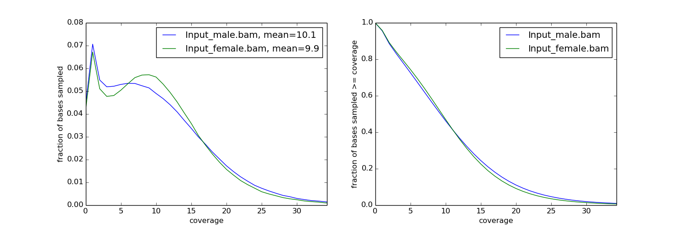

.. _api:

deepTools API example
=====================

The following is a short overview of the most useful methods and classes
from deepTools.
Complete information can be found in the following links: :ref:`genindex` and :ref:`modindex`

Finding read coverage over a region
-----------------------------------

With deepTools, the read coverage over multiple genomic regions and multiple files can be computed quite quickly using multiple processors.
First, we start with a simple example that is later expanded upon to demonstrate
the use of multipe processors.
In this example we compute the coverage of reads over a small region for bins of 50bp. For this we need the :class:`deeptools.countReadsPerBin` class.

.. code:: python

    import deeptools.countReadsPerBin as crpb

We also need a BAM file containing the aligned reads.
The BAM file must be indexed to allow quick access to reads
falling into the regions of interest.

.. code:: python

    bam_file = "file.bam"

Now, the ``CountReadsPerBin`` object can be initialized.
The first argument to the constructor is a list of BAM files,
which in this case is just one file.
We are going to use a ``binLength`` of 50 bases, with subsequent bins adjacent
(i.e., the ``stepSize`` between bins is also 50 bases). Overlapping bin 
coverages can be used by setting a ``stepSize`` smaller than ``binLength``.

.. code:: python

    cr = crpb.CountReadsPerBin([bam_file], binLength=50, stepSize=50)

Now, we can compute the coverage over a region in chromosome 2 from position 0
to 1000.

.. code:: python

    cr.count_reads_in_region('chr2L', 0, 1000)

.. parsed-literal::

    (array([[ 2.],
           [ 3.],
           [ 1.],
           [ 2.],
           [ 3.],
           [ 2.],
           [ 4.],
           [ 3.],
           [ 2.],
           [ 3.],
           [ 4.],
           [ 6.],
           [ 4.],
           [ 2.],
           [ 2.],
           [ 1.]]), '')

The result is a tuple with the first element a numpy array with one row per bin and one column per bam file. Since only one BAM file was used, there is only one column. If a file name for saving the raw data had been specificied, then the temporary file name used for this would appear in the second item of the tuple.

Filtering reads
---------------

If reads should be filtered, the relevant options simply
need to be passed to the constructor. In the following code, the reads are filtered
such that only those with a mapping quality of at least 20 and not aligned to the
reverse strand are kept (samFlag_exclude=16, where 16 is the value for reverse reads, see
the [SAM Flag Calculator](http://broadinstitute.github.io/picard/explain-flags.html)
for more info).
Furthermore, duplicated reads are ignored.

.. code:: python

    cr = crpb.CountReadsPerBin([bam_file], binLength=50, stepSize=50,
                               minMappingQuality=20,
                               samFlag_exclude=16,
                               ignoreDuplicates=True
                               )
    cr.count_reads_in_region('chr2L', 1000000, 1001000)

.. parsed-literal::

    (array([[ 1.],
           [ 1.],
           [ 0.],
           [ 0.],
           [ 0.],
           [ 0.],
           [ 2.],
           [ 3.],
           [ 1.],
           [ 0.],
           [ 1.],
           [ 2.],
           [ 0.],
           [ 0.],
           [ 1.],
           [ 2.],
           [ 1.],
           [ 0.],
           [ 0.],
           [ 0.]]), '')

Sampling the genome
-------------------

Instead of adjacent bins, as in the previous cases, a genome can
simply be sampled. This is useful to estimate some values,
like depth of sequencing, without having to look at the complete genome. In the following example,
10,000 positions of size 1 base are going to be queried from three bam files to compute the average depth of sequencing.
For this, we set the `numberOfSamples` parameter in the object constructor.

The `run()` method is used instead of `count_reads_in_region` to provide efficient sampling over the entire genome.

.. code:: python

    cr = crpb.CountReadsPerBin([bam_file1, bam_file2, bam_file3],
                               binLength=1, numberOfSamples=10000,
                               numberOfProcessors=10)
    sequencing_depth = cr.run()
    print sequencing_depth.mean(axis=0)

.. parsed-literal::
    [  1.98923924   2.43743744  22.90102603]

The `run()` method splits the computation over 10 processors and collates
the results. When the parameter `numberOfSamples` is used, the regions selected
for the computation of the coverage are not random. Instead, the genome is split into 'number-of-samples'
equal parts and the start of each part is queried for its coverage. You can also compute coverage over selected regions by inputting a BED file.

Now it is possible to make some diagnostic plots from the results:

.. code:: python

    fig, axs = plt.subplots(1, 2, figsize=(15,5))
    # plot coverage
    for col in res.T:
        axs[0].plot(np.bincount(col.astype(int)).astype(float)/total_sites)
        csum = np.bincount(col.astype(int))[::-1].cumsum()
        axs[1].plot(csum.astype(float)[::-1] / csum.max())
    axs[0].set_xlabel('coverage')
    axs[0].set_ylabel('fraction of bases sampled')
    # plot cumulative coverage

    axs[1].set_xlabel('coverage')
    axs[1].set_ylabel('fraction of bases sampled >= coverage')

Computing the FRiP score
------------------------

The FRiP score is defined as the fraction of reads that fall into a peak and is 
often used as a measure of ChIP-seq quality. For this example, we
need a BED file containing the peak regions. Such files are
usually computed using a peak caller. Also, two bam files are
going to be used, corresponding to two biological replicates.

.. code:: python

    bed_files = ["peaks.bed"]
    cr = countReadsPerBin.CountReadsPerBin([bam_file1, bam_file2],
                                            bedFile=bed_files,
                                            numberOfProcessors=10)
    reads_at_peaks = cr.run()
    print reads_at_peaks

.. parsed-literal::

    array([[ 322.,  248.],
           [ 231.,  182.],
           [ 112.,  422.],
           ..., 
           [ 120.,   76.],
           [ 235.,  341.],
           [ 246.,  265.]])

The result is a numpy array with a row for each peak region and a column for each BAM file.

.. code:: python

    reads_at_peaks.shape

.. parsed-literal::

    (6295, 2)

Now, the total number of reads per peaks per bam file is computed:

.. code:: python

    total = reads_at_peaks.sum(axis=0)

Next, we need to find the total number of mapped reads in each of the bam files. For
this we use the pysam module.

.. code:: python

    import pysam
    bam1 = pysam.AlignmentFile(bam_file1)
    bam2 = pysam.AlignmentFile(bam_file2)

Now, `bam1.mapped` and `bam2.mapped` contain the total number of mapped
reads in each of the bam files, respectively.

Finally, we can compute the FRiP score:

.. code:: python

    frip1 = float(total[0]) / bam1.mapped
    frip2 = float(total[1]) / bam2.mapped
    print frip1, frip2

.. parsed-literal::

    0.170030741997, 0.216740390353

Using mapReduce to sample paired-end fragment lengths
------------------------------------------------------

deepTools internally uses a map-reduce strategy, in which a computation is split into smaller
parts that are sent to different processors. The output from the different processors is subsequently collated. The following
example is based on the code available for `bamPEFragmentSize.py`

Here, we retrieve the reads from a BAM file and collect the
fragment length. Reads are retrieved using pysam, and the `read` object returned
contains the `template_length` attribute, which is the number of bases from the
leftmost to the rightmost mapped base in the read pair.

First, we will create a function that can collect fragment lengths over a genomic
position from a BAM file. As we will later call this function using
mapReduce, the function accepts only one argument, namely 
a tuple with the parameters: chromosome name, start position, end position, and BAM file name.

.. code:: python

    import pysam
    import numpy as np
    def get_fragment_length(args):
        chrom, start, end, bam_file_name = args
        bam = pysam.AlignmentFile(bam_file_name)
        f_lens_list = []
        for fetch_start in range(start, end, 1000000):
            # simply get the reads over a region of 10000 bases
            fetch_end = min(end, fetch_start + 10000)

            f_lens_list.append(np.array([abs(read.template_length)
                                  for read in bam.fetch(chrom, fetch_start, fetch_end)
                                  if read.is_proper_pair and read.is_read1]))

        # concatenate all results
        return np.concatenate(f_lens_list)

Now, we can use `mapReduce` to call this function and compute fragment lengths
over the whole genome. mapReduce needs to know the chromosome sizes, which
can be easily retrieved from the BAM file. Furthermore, it needs to know
the size of the region(s) sent to each processor. For this
example, a region of 10 million bases is sent to each processor using the `genomeChunkLength` parameter.
In other words, each processor executes the same `get_fragment_length` function to collect data over
different 10 million base regions. The arguments to mapReduce are the list of arguments sent to the function, besides
the first obligatory three (chrom start, end). In this case only one extra argument is passed
to the function, the BAM file name. The next two positional arguments are the name of the function to call
(`get_fragment_length`) and the chromosome sizes.

.. code:: python

    import deeptools.mapReduce
    bam = pysam.AlignmentFile(bamFile)
    chroms_sizes = list(zip(bam.references, bam.lengths))

    result = mapReduce.mapReduce([bam_file_name],
                                 get_fragment_length,
                                 chroms_sizes,
                                 genomeChunkLength=10000000,
                                 numberOfProcessors=20,
                                 verbose=True)

    fragment_lengths =  np.concatenate(result)

    print("mean fragment length {}".format(fragment_lengths.mean()))
    print("median fragment length {}".format(np.median(fragment_lengths)))

.. parsed-literal::

    0.170030741997, 0.216740390353

Indices and tables
------------------

* :ref:`genindex`
* :ref:`modindex`
* :ref:`search`
