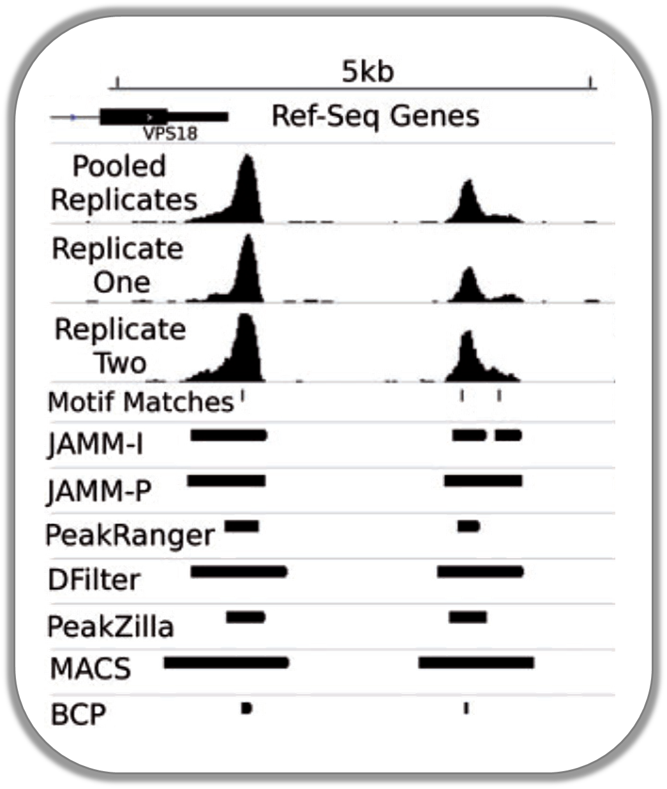

Gallery of deepTools plots
===========================

.. contents:: Published example plots
    :local:
	
We're trying to collect a wide variety of plots generated using deepTools.
For the plots that we created ourselves, we try to point out the options that were used to create 
each image, so perhaps these can serve as inspiration for you.

Normalized ChIP-seq signals and peak regions
--------------------------------------------

This image was published by `Ibrahim et al., 2014
(NAR) <http://bioinformatics.oxfordjournals.org/content/early/2014/09/26/bioinformatics.btu568>`__.
They used deepTools to generate extended reads per kilobase per million
reads at 10 base resolution and visualized the resulting coverage files in
`IGV <dx.doi.org/10.1093/bib/bbs017>`__.

DNase accessibility at enhancers in murine ES cells
---------------------------------------------------

The following image demonstrates that enhancer regions are typically
small stretches of highly accessible chromatin (more information on
enhancers can be found, for example,
`here <http://dx.doi.org/doi:10.1038/nature07829>`__). In the heatmap,
yellow and blue tiles indicate a large numbers of reads that were
sequenced (indicative of open chromatin) and black spots indicate
missing data points. An appropriate labeling of the y-axis was
neglected.

.. image:: ../images/gallery/hm_DNase.png

**Fast Facts:**

* `computeMatrix` mode: reference-point
* *regions file*: BED file with typical enhancer regions from `Whyte et al., 2013 <http://dx.doi.org/10.1016/j.cell.2013.03.035>`__ (download `here <https://raw.github.com/deeptools/deepTools/master/gallery/Whyte_TypicalEnhancers_ESC.bed>`__)
* *signal file*: bigWig file with `DNase signal from UCSC <http://hgdownload.cse.ucsc.edu/goldenPath/mm9/encodeDCC/wgEncodeUwDnase/wgEncodeUwDnaseEscj7S129ME0SigRep1.bigWig>`_
* *heatmap cosmetics*: labels, titles, heatmap height

**Command:**

::

    $ computeMatrix reference-point \
     -S DNase_mouse.bigwig \
     -R Whyte_TypicalEnhancers_ESC.bed \
     --referencePoint center \
     -a 2000 -b 2000 \ ## regions before and after the enhancer centers
     -out matrix_Enhancers_DNase_ESC.tab.gz 

    $ plotHeatmap \
     -m matrix_Enhancers_DNase_ESC.tab.gz\
     -out hm_DNase_ESC.png \
     --heatmapHeight 15  \
     --refPointLabel enh.center \
     --regionsLabel enhancers \
     --plotTitle 'DNase signal' \

TATA box enrichments around the TSS of mouse genes
--------------------------------------------------

Using the `TRAP <http://www.mybiosoftware.com/sequence-analysis/3894>`__
suite, we produced a bigWig file that contained TRAP scores for the
well-known TATA box motif along the mouse genome. The TRAP score is a
measure for the strength of a protein-DNA interaction at a given DNA
sequence; the higher the score, the closer the motif is to the consensus
motif sequence. The following heatmap demonstrates that:

-  TATA-like motifs occur quite frequently
-  there is an obvious clustering of TATA motifs slightly upstream of
   the TSS of many mouse genes
-  there are many genes that do not contain TATA-like motifs at their
   promoter

Note that the heatmap shows *all* mouse RefSeq genes, so ca. 15,000
genes!

.. image:: ../images/gallery/hm_TATApsem.png

**Fast Facts:**

* `computeMatrix mode`: reference-point
* *regions file*: BED file with all mouse genes (from UCSC table browser)
* *signal file*: bigWig file of TATA psem scores
* *heatmap cosmetics*: color scheme, labels, titles, heatmap height, only showing heatmap + colorbar 

**Command:**

::

    $ computeMatrix reference-point \
     -S TATA_01_pssm.bw \
     -R RefSeq_genes.bed \
     --referencePoint TSS \
     -a 100 -b 100 \
     --binSize 5 \

    $ plotHeatmap \
     -m matrix_Genes_TATA.tab.gz  \
     -out hm_allGenes_TATA.png \
     --colorMap hot_r \
     --missingDataColor .4 \
     --heatmapHeight 7 \
     --plotTitle 'TATA motif' \
     --whatToShow 'heatmap and colorbar' \
     --sortRegions ascend

Visualizing the GC content for mouse and fly genes
--------------------------------------------------

It is well known that different species have different genome GC
contents. Here, we used two bigWig files where the GC content was
calculated for 50 base windows along the genome of mice and flies and
the resulting scores visualized for gene regions.

The images nicely illustrate the completely opposite GC distributions in
flies and mice: while the gene starts of mammalian genomes are enriched
for Gs and Cs, fly promoters show depletion of GC content.

.. image:: ../images/gallery/hm_GC.png

+----------------------+--------------------------------------------------------------------------------------+
| Fast Facts           |                                                                                      |
+======================+======================================================================================+
| computeMatrix mode   | scale-regions                                                                        |
+----------------------+--------------------------------------------------------------------------------------+
| regions files        | BED files with mouse and fly genes (from UCSC table browser)                         |
+----------------------+--------------------------------------------------------------------------------------+
| signal file          | bigwig files with GC content                                                         |
+----------------------+--------------------------------------------------------------------------------------+
| heatmap cosmetics    | color scheme, labels, titles, color for missing data was set to white, heatmap height|
+----------------------+--------------------------------------------------------------------------------------+

Fly and mouse genes were scaled to different sizes due to the different
median sizes of the two species' genes (genes of *D.melanogaster*
contain many fewer introns and are considerably shorter than mammalian
genes). Thus, computeMatrix had to be run with slightly different
parameters while the plotHeatmap commands were virtually identical
(except for the labels).

::

    $ computeMatrix scale-regions \
     -S GCcontent_Mm9_50_5.bw \
     -R RefSeq_genes_uniqNM.bed \
     -bs 50 
     -m 10000 -b 3000 -a 3000 \ 
     -out matrix_GCcont_Mm9_scaledGenes.tab.gz \
     --skipZeros \
     --missingDataAsZero

    $ computeMatrix scale-regions \
     -S GCcontent_Dm3_50_5.bw \
     -R Dm530.genes.bed \ 
     -bs 50
     -m 3000 -b 1000 -a 1000 \
     -out matrix_GCcont_Dm3_scaledGenes.tab.gz \
     --skipZeros --missingDataAsZero

    $ plotHeatmap \
     -m matrix_GCcont_Dm3_scaledGenes.tab.gz \
     -out hm_GCcont_Dm3_scaledGenes.png \
     --colorMap YlGnBu \
     --regionsLabel 'fly genes' \
     --heatmapHeight 15 \
     --plotTitle 'GC content fly' &

    $ plotHeatmap \
     -m matrix_GCcont_Mm9_scaledGenes.tab.gz \
     -out hm_GCcont_Mm9_scaledGenes.png \
     --colorMap YlGnBu \
     --regionsLabel 'mouse genes' \
     --heatmapHeight 15 \
     --plotTitle 'GC content mouse' &

CpG methylation around murine transcription start sites in two different cell types
-----------------------------------------------------------------------------------

In addition to the methylation of histone tails, the cytosines 
can also be methylated (for more information on CpG methylation,
read
`here <http://www.nature.com/scitable/topicpage/the-role-of-methylation-in-gene-expression-1070>`__).
In mammalian genomes, most CpGs are methylated unless they are in
gene promoters that need to be kept unmethylated to allow full
transcriptional activity. In the following heatmaps, we used genes 
expressed primarily in ES cells and checked the
percentages of methylated cytosines around their transcription start
sites. The blue signal indicates that very few methylated cytosines are
found. When you compare the CpG methylation signal between ES cells and
neuronal progenitor (NP) cells, you can see that the majority of genes remain unmethylated,
but the general amount of CpG methylation around the TSS increases, as
indicated by the stronger red signal and the slight elevation of the CpG
methylation signal in the summary plot. This supports the notion that
genes stored in the BED file indeed tend to be more expressed in ES
than in NP cells.

This image was taken from `Chelmicki & Dündar et al. (2014),
eLife <http://elifesciences.org/content/3/e02024>`__.

.. image:: ../images/gallery/hm_CpG.png

+----------------------+---------------------------------------------------------------------------------------------------------------------------------------------------------------------------------------------------+
| Fast Facts           |                                                                                                                                                                                                   |
+======================+===================================================================================================================================================================================================+
| computeMatrix mode   | reference-point                                                                                                                                                                                   |
+----------------------+---------------------------------------------------------------------------------------------------------------------------------------------------------------------------------------------------+
| regions files        | :ref:`BED <bed>` file mouse genes expressed in ES cells                                                                                                                                           |
+----------------------+---------------------------------------------------------------------------------------------------------------------------------------------------------------------------------------------------+
| signal file          | :ref:`bigWig <bigwig>` files with fraction of methylated cytosins (from `Stadler et al., 2011 <http://dx.doi.org/10.1038/nature10716>`__)                                                         |
+----------------------+---------------------------------------------------------------------------------------------------------------------------------------------------------------------------------------------------+
| heatmap cosmetics    | color scheme, labels, titles, color for missing data was set to customized color, y-axis of profiles were changed, heatmap height                                                                 |
+----------------------+---------------------------------------------------------------------------------------------------------------------------------------------------------------------------------------------------+

The commands for the bigWig files from the ES and NP cells 
were the same:

::

    $ computeMatrix reference-point \
     -S GSE30202_ES_CpGmeth.bw \
     -R activeGenes_ESConly.bed \
     --referencePoint TSS \
     -a 2000 -b 2000 \
     -out matrix_Genes_ES_CpGmeth.tab.gz

    $ plotHeatmap \
     -m matrix_Genes_ES_CpGmeth.tab.gz \
     -out hm_activeESCGenes_CpG_ES_indSort.png \
     --colorMap jet \
     --missingDataColor "#FFF6EB" \
     --heatmapHeight 15 \
     --yMin 0 --yMax 100 \
     --plotTitle 'ES cells' \
     --regionsLabel 'genes active in ESC' 

Histone marks for genes of the mosquito *Anopheles gambiae*
-----------------------------------------------------------

This figure was taken from `Gómez-Díaz et al. (2014): Insights into the
epigenomic landscape of the human malaria vector *Anopheles gambiae*.
From Genet
Aug15;5:277 <http://www.ncbi.nlm.nih.gov/pmc/articles/PMC4133732/>`__.
It shows the distribution of H3K27Me3 (left) and H3K27Ac (right) over
gene features in *A. gambiae* midguts. The enrichment or
depletion is shown relative to chromatin input. The regions in the map
comprise gene bodies flanked by a segment of 200 bases at the 5′ end of
TSSs and TTSs. Average profile across gene regions ±200 bases for each
histone modification are shown on top.

.. image:: ../images/gallery/hm_histonesGomez.png

Signals of repressive chromatin marks, their enzymes and repeat element conservation scores
-------------------------------------------------------------------------------------------

This image is from `Bulut-Karsliogu and De La Rosa-Velázquez et al.
(2014), Mol
Cell. <http://www.sciencedirect.com/science/article/pii/S1097276514004535>`__
The heatmaps depict various signal types for unscaled peak regions of
proteins and histone marks associated with repressed chromatin. The
peaks were separated into those containing long interspersed elements
(LINEs) on the forward and reverse strand. The signals include
normalized ChIP-seq signals for H3K9Me3, Suv39h1, Suv39h2, Eset, and
HP1alpha-EGFP, followed by LINE and ERV content and repeat conservation
scores.

.. image:: ../images/gallery/hm_Bulut.png

