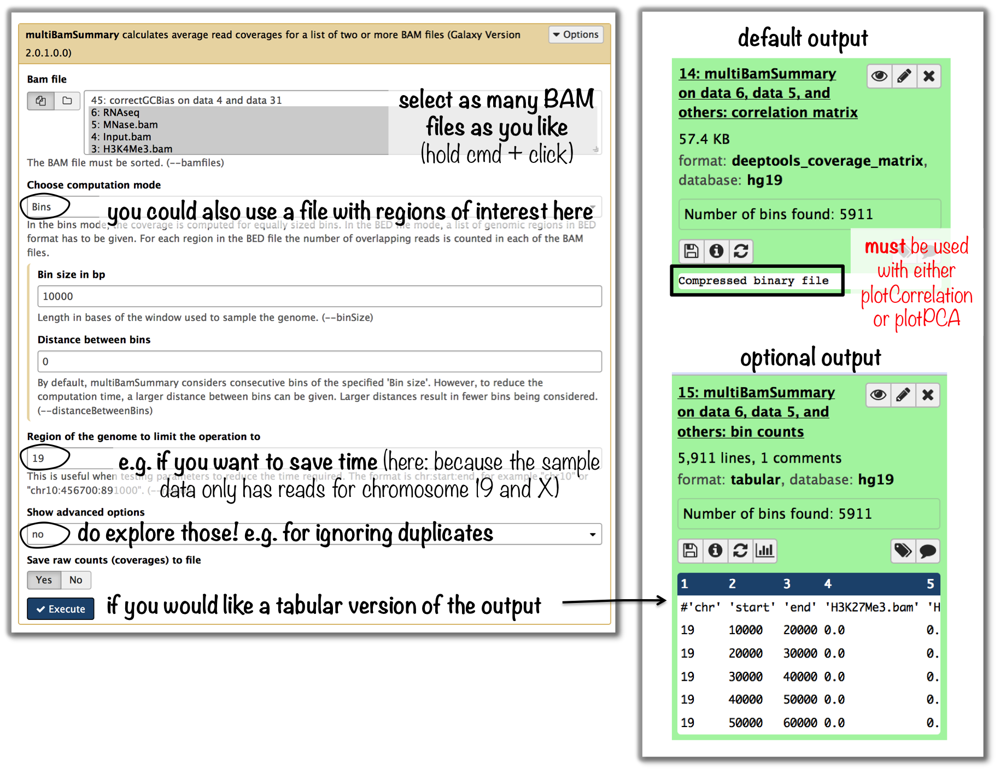
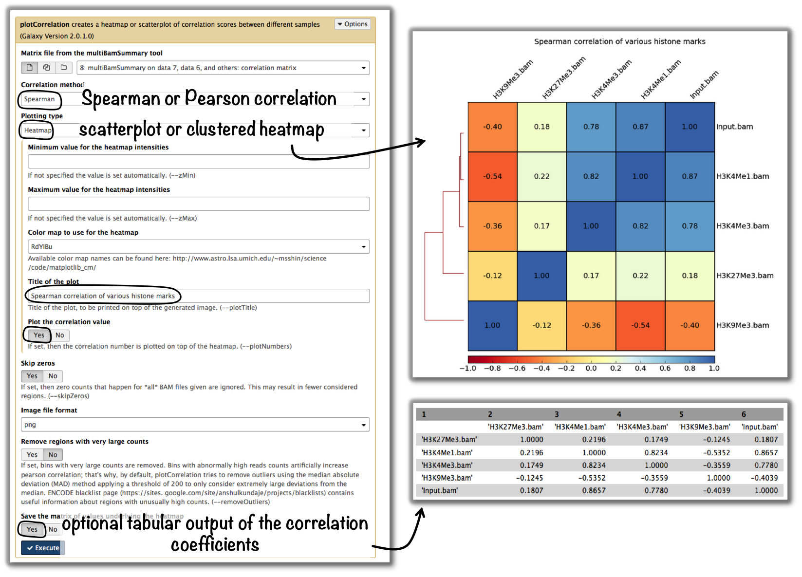
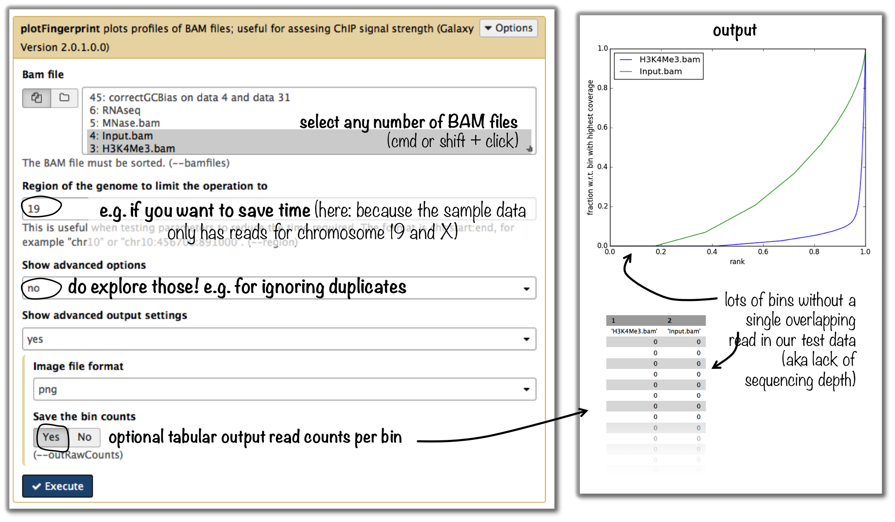

Step-by-step protocols
========================

This section should give you an overview of how to do many common tasks. We're using **screenshots from Galaxy** here.
If you're using the command-line version you can easily follow the given examples since the vast majority of parameters is either indicated in Galaxy, too. Otherwise, just type the program name and the help option (e.g. ``/deepTools/bin/bamCoverage --help``), which will show you all the parameters and options available. Alternatively, you can follow the respective link to the tool documentation here on readthedocs.

.. note:: For support or questions please post to `Biostars <http://biostars.org>`__. For bug reports and feature requests please open an issue `<on github <http://github.com/deeptools/deeptools>`__.

All protocols assume that you have uploaded your files into a Galaxy instance with a deepTools installation, e.g., `deepTools Galaxy <http://deeptools.ie-freiburg.mpg.de>`_. If you need help to get started with Galaxy in general, e.g. to upload your data, see :doc:`help_galaxy_intro` and :doc:`help_galaxy_dataup`.

.. tip:: If you would like to try out the protocols with **sample data**, go to `deepTools Galaxy <http://deeptools.ie-freiburg.mpg.de>`__  --> "Shared Data"  --> "Data Libraries"  --> "deepTools Test Files". Simply select BED/BAM/bigWig files and click, "to History". You can also download the test data sets to your computer by clicking "Download" at the top.

.. contents:: How to do...?
    :local:

-----------------------------------

QC and data processing
-----------------------

I have downloaded/received a BAM file - how do I generate a file I can look at in a genome browser?
^^^^^^^^^^^^^^^^^^^^^^^^^^^^^^^^^^^^^^^^^^^^^^^^^^^^^^^^^^^^^^^^^^^^^^^^^^^^^^^^^^^^^^^^^^^^^^^^^^^^^

* tool: :doc:`tools/bamCoverage`
* input: your :ref:`BAM` file with aligned reads

Of course, you could also look at your BAM file in the genome browser.
However, generating a bigWig file of read coverages will drastically reduce the size of the file, it also allows you to normalize the coverage to 1x sequencing depth, which makes a visual comparison of multiple files more feasible.

.. image:: ../images/GalHow_bamCoverage.png

-----------------------------------------

How can I assess the reproducibility of my sequencing replicates?
^^^^^^^^^^^^^^^^^^^^^^^^^^^^^^^^^^^^^^^^^^^^^^^^^^^^^^^^^^^^^^^^^^^^^^^

Typically, you're going to be interested in the correlation of the read coverages for different replicates and different samples. What you want to see is that replicates should correlate better than non-replicates.
The `ENCODE consortium recommends <http://genome.ucsc.edu/ENCODE/protocols/dataStandards/ENCODE_RNAseq_Standards_V1.0.pdf>`_ that *for messenger RNA,
(...) biological replicates [should] display 0.9 correlation for transcripts/features*. For more information about correlation calculations, see the background description for :doc:`tools/plotCorrelation`.

* tools: :doc:`tools/multiBamSummary` followed by :doc:`tools/plotCorrelation`
* input: BAM files
    - you can compare as many samples as you want, though the more you use the longer the computation will take

.. tip:: If you would like to do a similar analysis based on bigWig files, use the tool ``multiBigwigSummary`` instead.

-----------------------------------------

How do I know whether my sample is GC biased? And if it is, how do I correct for it?
^^^^^^^^^^^^^^^^^^^^^^^^^^^^^^^^^^^^^^^^^^^^^^^^^^^^^^^^^^^^^^^^^^^^^^^^^^^^^^^^^^^^^^^^^^^^^^^^^^^^^^^^^^^^^^^^^^^^^^^^^^^^^^^^^^^^^^^^^^^^^^

* input: :ref:`BAM` file 
* use the tool :doc:`tools/computeGCBias` on that BAM file (default settings, just **make sure your reference genome and genome size are matching**)

.. image:: ../images/GalHow_computeGCbias.png

* have a look at the image that is produced and compare it to the examples :ref:`here <computeGCBias_example_image>`
* if your sample shows an almost linear increase in exp/obs coverage (on the log scale of the lower plot), then you should consider correcting the GC bias - *if* you think that the biological interpretation of this data would otherwise be compromised (e.g. by comparing it to another sample that does not have an inherent GC bias)

    + the GC bias can be corrected with the tool :doc:`tools/correctGCBias` using the second output of the computeGCbias tool that you had to run anyway

.. image:: ../images/GalHow_correctGCbias.png

.. warning:: ``correctGCbias`` will add reads to otherwise depleted regions (typically GC-poor regions), that means that you should **not** remove duplicates in any downstream analyses based on the GC-corrected BAM file. We therefore recommend removing duplicates before doing the correction so that only those duplicate reads are kept that were produced by the GC correction procedure.

-----------------------------------------

How do I get an input-normalized ChIP-seq coverage file?
^^^^^^^^^^^^^^^^^^^^^^^^^^^^^^^^^^^^^^^^^^^^^^^^^^^^^^^^^^^^^^^^^^^^^^^

* input: you need two BAM files, one for the input and one for the ChIP-seq experiment
* tool: :doc:`tools/bamCompare` with ChIP = treatment, input = control sample

.. image:: ../images/GalHow_bamCompare.png

-----------------------------------------

How can I compare the ChIP strength for different ChIP experiments?
^^^^^^^^^^^^^^^^^^^^^^^^^^^^^^^^^^^^^^^^^^^^^^^^^^^^^^^^^^^^^^^^^^^^^^^

* tool: :doc:`tools/plotFingerprint`
* input: as many BAM files of ChIP-seq samples as you'd like to compare (it is helpful to include the input control to see what a hopefully non-enriched sample looks like)

.. tip:: For more details on the interpretation of the plot, see :doc:`tools/plotFingerprint` or select the tool within the deepTools Galaxy and scroll down for more information.

-----------------------------------------

Heatmaps and summary plots
---------------------------

How do I get a (clustered) heatmap of sequencing-depth-normalized read coverages around the transcription start site of all genes?
^^^^^^^^^^^^^^^^^^^^^^^^^^^^^^^^^^^^^^^^^^^^^^^^^^^^^^^^^^^^^^^^^^^^^^^^^^^^^^^^^^^^^^^^^^^^^^^^^^^^^^^^^^^^^^^^^^^^^^^^^^^^^^^^^^^^^^^^^^^^^^

* tools: :doc:`tools/computeMatrix`, then :doc:`tools/plotHeatmap`
* inputs:
    * 1 :ref:`bigWig` file of normalized read coverages (e.g. the output of :doc:`tools/bamCoverage` or :doc:`tools/bamCompare`)
    * 1 :ref:`BED` or INTERVAL file of genes, e.g. obtained through Galaxy via "Get Data" --> "UCSC main table browser" --> group: "Genes and Gene Predictions" --> (e.g.) "RefSeqGenes" --> send to Galaxy (see screenshots below)

.. image:: ../images/GalHow_clustHM01.png

* use :doc:`tools/computeMatrix` with the bigWig file and the BED file
* indicate ``reference-point`` (and whatever other option you would like to tune, see screenshot below)

.. image:: ../images/GalHow_clustHM02.png

* use the output from :doc:`tools/computeMatrix` with :doc:`tools/plotHeatmap`
    * if you would like to cluster the signals, choose ``k-means clustering`` (last option of "advanced options") with a reasonable number of clusters (usually between 2 to 7)

.. image:: ../images/GalHow_clustHM03.png

-------------------------------------------------------------------

How can I compare the average signal for X-specific and autosomal genes for 2 or more different sequencing experiments?
^^^^^^^^^^^^^^^^^^^^^^^^^^^^^^^^^^^^^^^^^^^^^^^^^^^^^^^^^^^^^^^^^^^^^^^^^^^^^^^^^^^^^^^^^^^^^^^^^^^^^^^^^^^^^^^^^^^^^^^^^^^^^^^^^^^^^^^^^^^^^^

Make sure you're familiar with computeMatrix and plotProfile before using this protocol.

* tools:
    * Filter data on any column using simple expressions
    * computeMatrix
    * plotProfile
    * (plotting the summary plots for multiple samples)

* inputs:
    * several bigWig files (one for each sequencing experiment you would like to compare)
    * two BED files, one with X-chromosomal and one with autosomal genes

How to obtain a BED file for X chromosomal and autosomal genes each
~~~~~~~~~~~~~~~~~~~~~~~~~~~~~~~~~~~~~~~~~~~~~~~~~~~~~~~~~~~~~~~~~~~

1. download a full list of genes via "Get Data" --> "UCSC main table browser" --> group:"Genes and Gene Predictions" --> tracks: (e.g.) "RefSeqGenes" --> send to Galaxy

2. filter the list twice using the tool **"Filter data on any column using simple expressions"** 

    - first use the expression: c1=="chrX" to filter the list of all genes --> this will generate a list of X-linked genes
    - then re-run the filtering, now with c1!="chrX", which will generate a list of genes that do not belong to chromosome X (!= indicates "not matching")

Compute the average values for X and autosomal genes 
~~~~~~~~~~~~~~~~~~~~~~~~~~~~~~~~~~~~~~~~~~~~~~~~~~~~

* use :doc:`tools/computeMatrix` for all of the signal files (bigWig format) at once

    * supply both filtered BED files (click on "Add new regions to plot" once) and label them
    * indicate the corresponding signal files

* now use :doc:`tools/plotProfile` on the resulting file

    * important: display the "advanced output options" and select "save the data underlying the average profile" --> this will generate a table in addition to the summary plot images

.. image:: ../images/GalHow_profiles_XvsA02.png
    :target: ../images/GalHow_profiles_XvsA02.png
