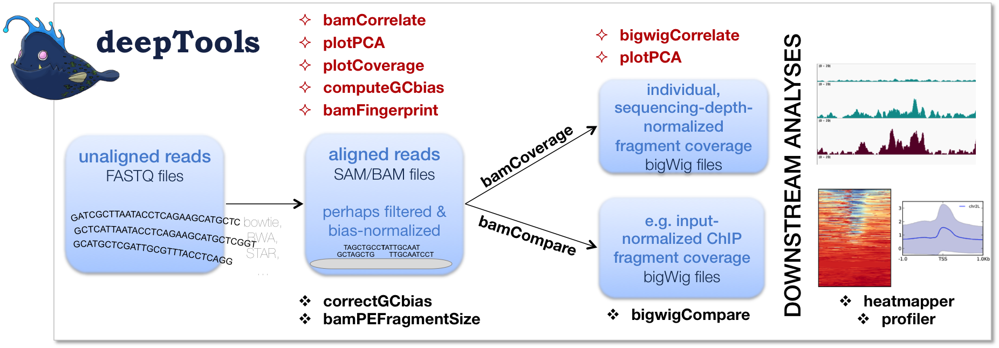
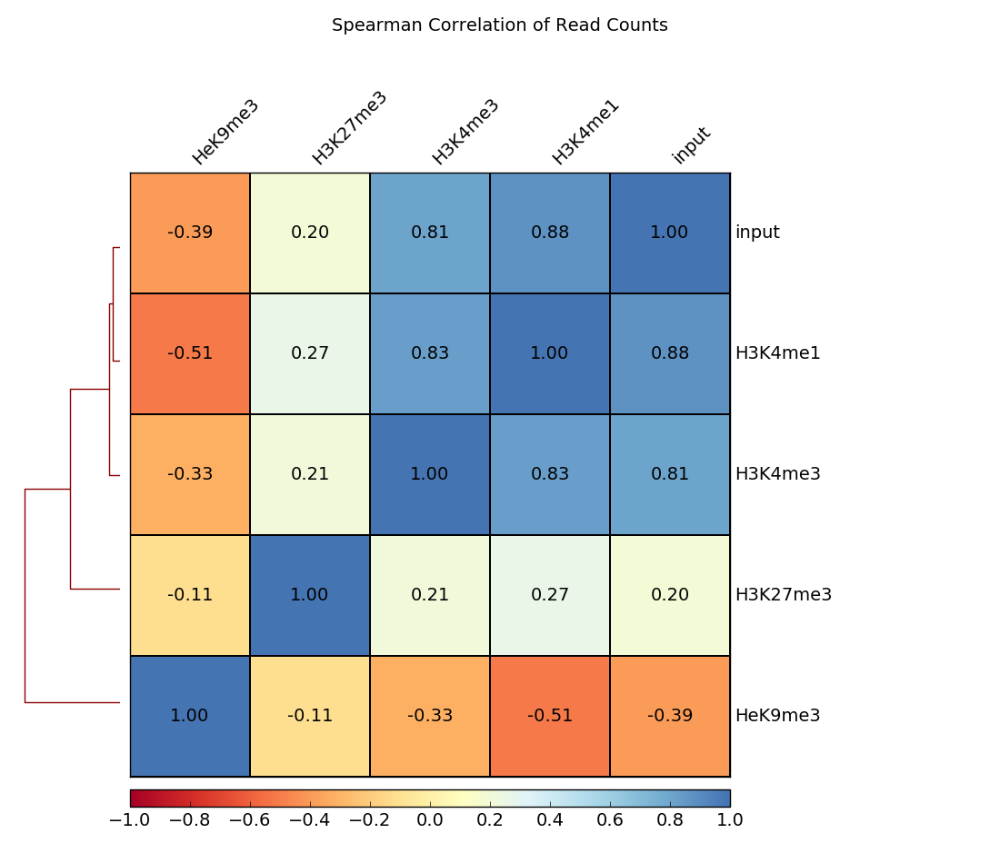

Example usage
=============

.. contents:: 
    :local:
.. toctree::
   :maxdepth: 1

   example_step_by_step
   example_gallery

How we use deepTools for ChIP-seq analyses 
-------------------------------------------

To get a feeling for what deepTools can do, we'd like to give you a brief glimpse into how we typically use deepTools for ChIP-seq analyses. For more detailed exampes and descriptions of the tools, simply follow the respective links.

.. note:: While some tools, such as :doc:`tools/plotFingerprint`, specifically address ChIP-seq-issues, the majority of tools is widely applicable to deep-sequencing data, including RNA-seq.

As shown in the flow chart above, our work usually begins with one or
more :ref:`FASTQ <fastq>`
file(s) of deeply-sequenced samples. After preliminary quality control using
`FASTQC <http://www.bioinformatics.babraham.ac.uk/projects/fastqc/>`__,
we align the reads to the reference genome, e.g., using
`bowtie2 <http://bowtie-bio.sourceforge.net/bowtie2/manual.shtml>`__.
The standard output of bowtie2 (and other mapping tools) is in the form of sorted and indexed :ref:`BAM` files
that provide the common input and starting point for all subsequent deepTools analyses. 
We then use deepTools to assess the quality of the aligned reads:

1. **Correlation between BAM files** (:doc:`tools/multiBamSummary` and :doc:`tools/plotCorrelation`).
   Together, these two modules perform a very basic test to see whether
   the sequenced and aligned reads meet your expectations. We use this
   check to assess reproducibility - either between replicates
   and/or between different experiments that might have used the same
   antibody or the same cell type, etc. For instance, replicates should
   correlate better than differently treated samples. 
   
   .. tip:: You can also assess the correlation of :ref:`bigWig` files using :doc:`tools/multiBigwigSummary`.

2. **Coverage check** (:doc:`tools/plotCoverage`). To see how many bp in the genome are actually covered by (a good number) of sequencing reads, we use :doc:`tools/plotCoverage` which generates two diagnostic plots that help us decide whether we need to sequence deeper or not. The option ``--ignoreDuplicates`` is particularly useful here!

.. image:: ../images/test_plots/ExamplePlotCoverage.png
    :width: 70%
    
For paired-end samples, we often additionally check whether the fragment sizes are more or less what we would expected based on the library preparation. The module :doc:`tools/bamPEFragmentSize` can be used for that.
    
.. image:: ../images/test_plots/fragmentSize.png
    :width: 60%

3. **GC-bias check** (:doc:`tools/computeGCBias`). Many sequencing protocols
   require several rounds of PCR-based DNA amplification, which often introduces notable bias, due to many DNA polymerases preferentially amplifying GC-rich templates. Depending on the sample (preparation), the GC-bias can vary    significantly and we routinely check its extent. When we need to compare files with different GC biases, we use the :doc:`tools/correctGCBias` module.
   See the paper by `Benjamini and Speed <http://nar.oxfordjournals.org/content/40/10/e72>`__ for many insights into this problem.
   
.. image:: ../images/test_plots/ExampleCorrectGCBias.png
    :width: 50%
   
4. **Assessing the ChIP strength**. We do this quality control step to get a
   feeling for the signal-to-noise ratio in samples from ChIP-seq
   experiments. It is based on the insights published by `Diaz et
   al. <http://www.degruyter.com/view/j/sagmb.2012.11.issue-3/1544-6115.1750/1544-6115.1750.xml>`_

.. image:: ../images/test_plots/fingerprints.png
    :width: 70%

Once we're satisfied with the basic quality checks, we normally **convert**
the large :ref:`BAM <bam>` files into a leaner data format, typically
:ref:`bigWig <bigwig>`.
bigWig files have several advantages over BAM files, mainly stemming
from their significantly decreased size:

-  useful for data sharing and storage
-  intuitive visualization in Genome Browsers (e.g.
   `IGV <http://www.broadinstitute.org/igv/>`__)
-  more efficient downstream analyses are possible

The deepTools modules :doc:`tools/bamCompare` and :doc:`tools/bamCoverage` not only allow for simple conversion of BAM to bigWig (or :ref:`bedGraph` for that matter), but also for normalization, such that different samples can be compared  despite differences in their sequencing depth.

Finally, once all the converted files have passed our visual inspections (e.g., using the `Integrative Genomics Viewer <https://www.broadinstitute.org/igv/>`_), the fun
of downstream analysis with :doc:`tools/computeMatrix`, :doc:`tools/plotHeatmap` and :doc:`tools/plotProfile` can begin! 
