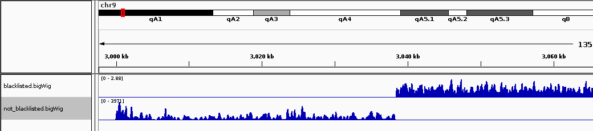
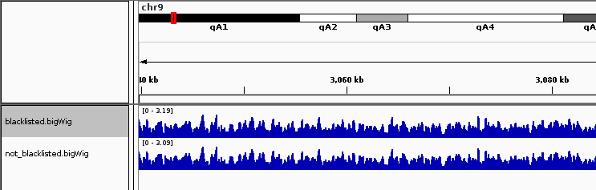

Blacklist Regions
=================

There are many sources of bias in ChIPseq experiments. Among the most prevalent of these is signal arising from "blacklist" regions (see `Carroll et al. <http://www.ncbi.nlm.nih.gov/pmc/articles/PMC3989762/>`__ and the references therein for historical context). Blacklisted regions show notably enriched signal across many ChIP experiment types (e.g., regardless of what is being IPed or the experimental conditions). Including these regions can lead not only to false-positive peaks, but can also throw off between-sample normalization. An example of this is found below:

The region on chromosome 9 starting around position 3 million marks the start of an annotated satellite repeat. As this region contains vastly more reads than expected, slight differences in enrichment here between samples can cause errors in between-sample scaling, thereby masking signal in non-repetitive regions. This can be seen in the IGV screenshot below, where the blacklisted region is just off the side of the screen.

Note that the signal outside of the blacklisted region is slightly depressed due to the blacklisted region. Using the `--blackListFileName` option available throughout deepTools. The subtraction of these regions is accounted for in all normalizations.

.. note:: Some programs, such as ``bamCoverage``, can use the number of reads in a file to estimate coverage for the purposes of normalization. Reads in blacklisted regions are subtracted for this purpose, but do note that the number of reads in blacklisted regions is computed by counting the number of reads fully contained within each region. Consequently, if you use regions that are overlapping, it's possible to double count the number of reads that will be blacklisted and thereby decrease the reliability of the normalization. As of version 2.5.5, deepTools will print a warning and quit if there are overlapping blacklist regions. It will also issue a warning if any of them are closer than 1kb, as this is unlikely to be biologically reasonable (in practice it will likely underestimate the number of reads and regions that actually SHOULD be blacklisted).
