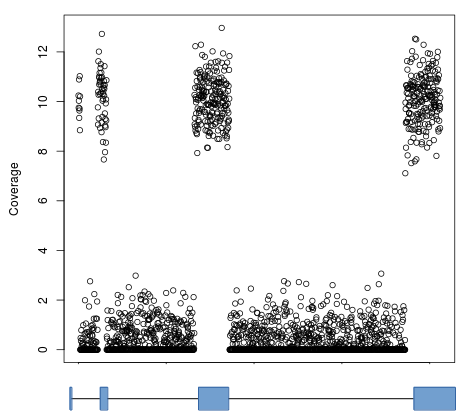
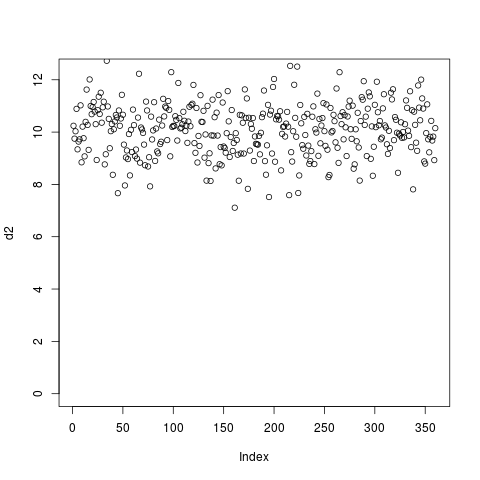

Metagene analyses
=================

By default, `computeMatrix` uses the signal over entire contiguous regions (e.g., transcripts) for computing its output. While this is typically quite useful, in case such as RNAseq the results are less than ideal. Take, for example, the gene model and coverage profile below:

If clustering were done using such blocky coverage then the results would be biased by the number of exons and their positions. Instead, it's normally desired to ignore intronic regions and instead use only the signal in exons (denoted by blocks in the gene model). This can be accomlished by using the `--metagene` option in `computeMatrix` and supplying a BED12 or GTF file as a set of regions:

Note that for GTF files the regions used to define exons can be easily modified. For example, for RiboSeq samples it's preferable to use annotated coding regions, so specifying `--exonID CDS`. Likewise, entire genes can be used rather than transcripts by specifying `--transcriptID gene --transcript_id_designator gene_id`.
