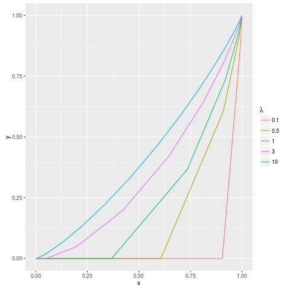
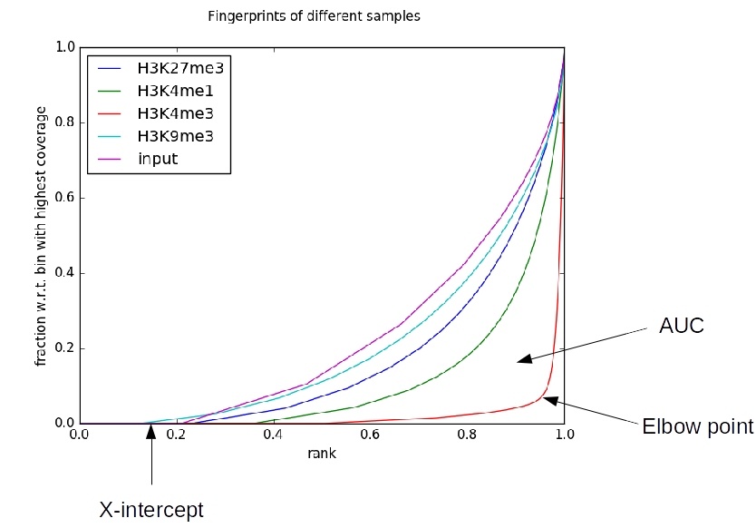

plotFingerprint QC metrics
==========================

As of version 2.4.0, plotFingerprint can optionally output a number of metrics useful for assisting the interpretation of fingerprint plots. A number of these metrics require a matched input sample, which can be specified by ``--JSDsample``.

Sequencing-depth dependence
---------------------------

An important caveat with all of the QC metrics, except "Synthetic JS distance", is that sequencing depth plays a roll in the background assumption of what a good value is. This is visually demonstrated below, where the various curves represent what a perfectly behaved input sample should look like with a variety of average sequencing depths ("lambda").

This plot is equivalent to those generated by ``plotFingerprint``, with the axes labeled differently. Note that with low coverage, the background expectation is less a diagonal line from the lower-left to the upper-right and more of a convex curve or, at very low coverage, a straight line with a given X-intercept. For this reason, a number of "Synthetic" metrics are produced for each sample. These represent the metrics for artificial plotFingerprint results like those above. These are useful for putting the results you observe for your samples into perspective. For example, your elbow point of 0.95 for a ChIP sample might not be so impressive if, because of low sequencing depth, an input sample would be expected to have an elbow point of 0.85.

The metrics
-----------

.. note:: There are many QC metrics, of which we find the "JS distance" the most useful!

- AUC: The "area under the curve", with a maximum value of 0.5. Lower values generally indicate higher and more focal enrichment.

- Synthetic AUC: The expected area under the curve of a perfectly behaved input sample having the same mean sequencing depth of a given sample. This is useful to put the observed AUC into perspective.
- X-intercept: The point (on the X-axis) at which the curve is not 0. This is approximately the percentage of the genome that was not sequenced in a particular sample. Ideally, this value will be near 0. In practice, however, this can be quite high, due to things like low sequencing depth (see above) or extremely high enrichment resulting in peaks sponging up all of the available reads.
- Synthetic X-intercept: The expected X-intercept of a perfectly behaved input sample having the same mean sequencing depth of a given sample. This is useful to put the observed X-intercept into perspective.
- Elbow Point: The elbow point attempts to measure the position at which the line turns upward. In practice, this is the point at which the plotted line is furthest from the line from the lower-left to the upper-right corner of the graph (equivalent to a perfect input sample with infinite coverage). The point returned is the position on the X-axis of this elbow point and higher values indicate more enrichment.
- Synthetic Elbow Point: The expected elbow point of a perfectly behaved input sample having the same mean sequencing depth of a given sample. This is useful to put the observed elbow point into perspective.
- JS distance: This is the Jensen-Shannon distance between a given sample and that specified by ``--JSDsample`` and is based on work from Sitanshu Gakkhar. The Jensen-Shannon divergence is defined as follows:

.. math::
    \begin{align}
    JSD(P \parallel Q) = \frac{1}{2} D_{KL}(P \parallel M) + \frac{1}{2} D_{KL}(Q \parallel M) \\
    M = \frac{1}{2} (P + Q) \\
    D_{KL}({X} \parallel {Y}) = \sum_{i} X_i log\Big(\frac{X_i}{Y_i}\Big)
    \end{align}

Here, ``D`` is the Kullback-Leibler divergence. ``P`` and ``Q`` are the probability mass functions underlying the lines in the plots. The JS distance is the square root of the JS divergence shown above. Higher values indicate greater difference between the two curves, with minimum and maximum values of 0 and 1, respectively.

- Synthetic JS distance: As shown above, the expected distribution of a perfect input sample is dependent on its sequencing depth, meaning that if a sample and its matched control have very different depths then the JS distance between them is misleading. Consequently, rather than displaying the JS distance between two samples, this metric shows the JS distance between a given sample and a perfect input sample with the same coverage depth (i.e., the plot generated from the Poisson probability mass function with lambda equal to the mean coverage in the sample). Ideally, this metric and that above will be very similar, but may not be if sequencing depth is very different (in which case, this metric is likely more reliable). Note also that this metric is printed even for the sample indicated by the ``--JSDsample`` option, which is useful to assess the level of bias present in the input sample, which should ideally have coverage with a Poisson distribution.
- % genome enriched: This is a metric originating from the `CHANCE <http://dx.doi.org/10.1186/gb-2012-13-10-r98>`__ tool. This is computed by first finding the elbow point (essentially as described above), and then computing 1 minus that. This then represents the approximate percentage of the genome enriched in signal (e.g., bound by a transcription factor or having a certain histone modification).
- diff. enrichment: The differential enrichment between a given sample and that indicated by ``--JSDsample`` at the elbow point. This is also a metric introduced by the CHANCE tool. Higher percentages are generally better.
- CHANCE divergence: The divergence metric introduced by the CHANCE tools (and seemingly undocumented). In many ways, this is similar to the JS distance metric. The computation starts with the values at the elbow point of a given sample (``P``) and the sample given by ``--JSDsample`` (``Q``). Given ``P`` and ``Q``, the "CHANCE divergence" is calculated as follows:

.. math::
    \begin{align}
    CHANCE divergence = \sqrt{\frac{1}{2} (binRelEntropy(P, M) + binRelEntropy(Q, M))} \\
    M = \frac{1}{2} (P + Q) \\
    binRelEntropy(X, Y) = X log_2 \Big(\frac{X}{Y}\Big) + (1 - X) log_2 \Big(\frac{1 - X}{1 - Y} \Big)
    \end{align}

The ``binRelEntropy`` function is similar to a mixture of binary entropy and Kullback-Leibler divergence. Note that if ``X`` is 0, the ``X * log2(X/Y)`` is 0. Similarly, if ``X`` is 1, then ``(1 - X) * log2((1 - X) / (1 - Y))`` is 0.
