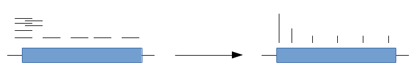

Offsetting signal to a given position
=====================================

A growing number of experiment types need to be analyzed by focusing the signal from each alignment at a single point. As an example, RiboSeq alignments tend to be offset such that the signal pause is centered around the translation start site, an offset of around 12. Alternatively, in GROseq experiments, the pause around the TSS becomes centered by using the 1st base of each read. This can be accomplished within `bamCoverage` using the `--Offset` option. A visual example is below:

The alignments shown above overlap a transcript, denoted as a blue box, which in this case represents only the coding sequence. If the alignments are from a RiboSeq experiment then the signal from each alignment should be set at the ~12th base of each alignment. The section on the right denotes the resulting signal intensity, with the expected large peak at the translation start site.
