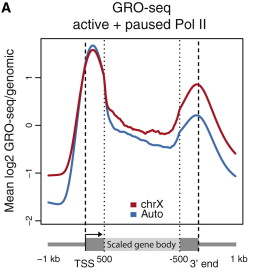

Unscaled regions
================

Some experiments aim to quantify the distribution of pausing of factors, such as PolII, throughout gene or transcript bodies. PolII and many other factors, show pausing (i.e., accumulation of signal) near the start/end of transcripts. As scaling is normally performed to make all regions the same length, the breadth of the paused region could be scaled differently in each transcript. This would, in turn, cause biases during clustering or other analyses. In such cases, the `--unscaled5prime` and `--unscaled3prime` options in `computeMatrix` can be used. These will prevent regions at one or both end of transcripts (or other regions) to not be excluded from scaling, thereby allowing raw signal profiles to be compared across transcripts. An example of this from `Ferrari et al. 2013 <http://www.sciencedirect.com/science/article/pii/S2211124713005603>`__ is shown below:

