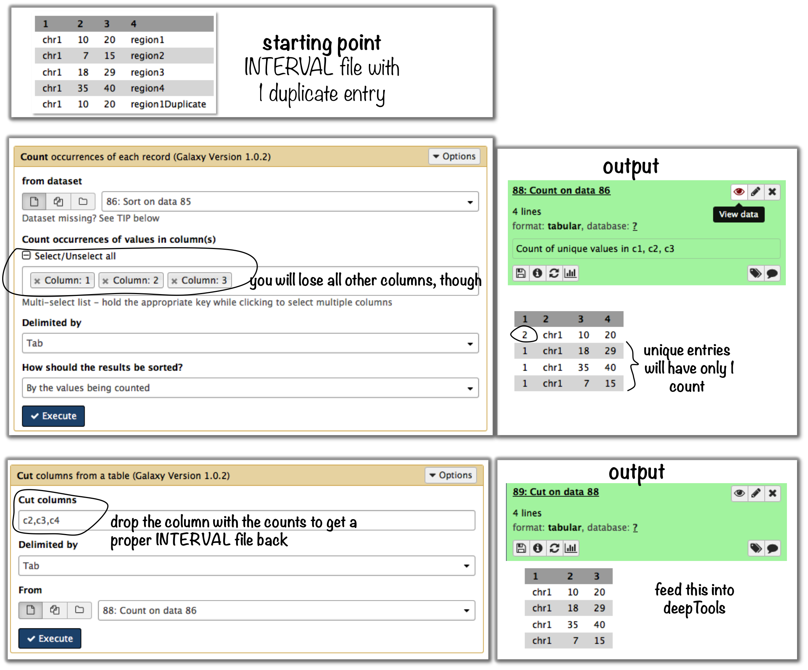
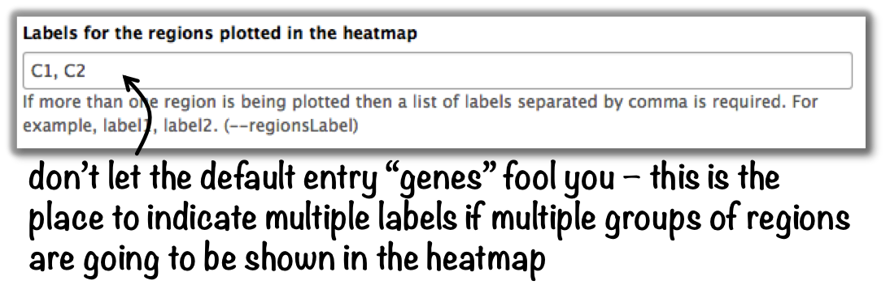

General FAQ
===========

.. tip:: For support or questions please post to `Biostars <http://biostars.org>`__. For bug reports and feature requests please open an issue `<on github <http://github.com/deeptools/deeptools>`__.

.. Note:: We also have a :doc:`help_faq_galaxy` with questions that are more specific to Galaxy rather than deepTools usage.

.. contents:: 
    :local:

    
--------------------------------------------------

How does deepTools handle data from paired-end sequencing?
^^^^^^^^^^^^^^^^^^^^^^^^^^^^^^^^^^^^^^^^^^^^^^^^^^^^^^^^^^
Generally, all the modules working on :ref:`BAM` files (``multiBamSummary``, ``bamCoverage``, ``bamCompare``, ``plotFingerprint``, ``computeGCBias``) automatically recognize paired-end sequencing data and will use the fragment size based on the distance between read pairs.
You can by-pass the typical fragment handling on mate pairs with the option ``--doNotExtendPairedEnds`` (can be found under "advanced options" in Galaxy).

--------------------------------------------------

How can I test a tool with little computation time? 
^^^^^^^^^^^^^^^^^^^^^^^^^^^^^^^^^^^^^^^^^^^^^^^^^^^
When you're playing around with the tools to see what kinds of results they will produce, you can limit the operation to one chromosome or a specific region to save time. In Galaxy, you will find this under "advanced output options" --> "Region of the genome to limit the operation to". The command line option is called ``--region (CHR:START:END)``.

The following tools currently have this option:

* :doc:`tools/multiBamSummary`
* :doc:`tools/plotFingerprint`
* :doc:`tools/computeGCBias`, :doc:`tools/correctGCBias`
* :doc:`tools/bamCoverage`, :doc:`tools/bamCompare`

It works as follows: first, the *entire* genome represented in the :ref:`BAM <bam>` file will be regarded and sampled, *then* all the regions or sampled bins that do not overlap the region indicated by the user will be discarded.

.. note:: You can limit the operation to only **one** chromosome (or **one** specific locus on a chromosome) at a time. If you would like to limit the operation to more than one region, see the answer to the next question.

-------------------------------------------------------

Can I specify more than one chromosome in the ``--regions`` option?
^^^^^^^^^^^^^^^^^^^^^^^^^^^^^^^^^^^^^^^^^^^^^^^^^^^^^^^^^^^^^^^^^^^

The short answer is: no.

Several programs allow specifying a specific regions. 
For these, the input must be in the format of ``chr:start:end``, for example "chr10" or "chr10:456700:891000".

For these programs, it is **not possible** to indicate more than one region, e.g. chr10, chr11 - **this will not work**! Here are some ideas for workarounds if you none-the-less need to do this:

General workaround
~~~~~~~~~~~~~~~~~~

Since all the tools that have the ``--region`` option work on :ref:`BAM` files, you could *filter your reads* prior to running the program, e.g. using ``intersectBed`` with ``--abam`` or ``samtools view``. Then use the resulting (smaller) BAM file with the deepTools program of your choice.

.. code:: 

    $ samtools view -b -L regionsOfInterest.bed Reads.bam > ReadsOverlappingWithRegionsOfInterest.bam

or

.. code::

    $ intersectBed -abam Reads.bam -b regionsOfInterest.bed > ReadsOverlappingWithRegionsOfInterest.bam

Build-in solutions
~~~~~~~~~~~~~~~~~~~~

``computeGCBias`` and ``multiBamSummary`` offer build-in solutions so that you do not need to resort to tools outside of deepTools.
 
:doc:`tools/multiBamSummary` has two modes, ``bins`` and ``BED``.
    If you make use of the ``BED`` mode, you can supply a :ref:`BED` file of regions that you would like to limit the operation to. This will do the same thing as in the general workaround mentioned above.

:doc:`tools/computeGCBias` has a ``--filterOut`` option.
     If you to create a BED file that contains all the regions you are **not** interested in, you can then supply this file to ``computeGCBias --filterOut Regions_to_be_ignored.bed`` and those regions will subsequently be ignored.

------------------------------------------------

When should I exclude regions from ``computeGCBias``?
^^^^^^^^^^^^^^^^^^^^^^^^^^^^^^^^^^^^^^^^^^^^^^^^^^^^^^^^
.. note:: In general, we recommend to only correct for GC bias (using :doc:`tools/computeGCBias` followed by :doc:`tools/correctGCBias`) if the majority of the genome (e.g., for mouse and human genomes the region between 30-60%) is GC-biased *and* you want to compare this sample with another sample that is not GC-biased.

Sometimes, a certain GC bias is expected, for example for ChIP samples of H3K4Me3 in mammalian samples where GC-rich promoters are expected to be enriched. To not confound the GC bias caused by the library preparation with the inherent, expected GC-bias, we incorporated the possibility to supply a file of regions to ``computeGCBias`` that will be excluded from the GC bias calculation. This file should typically contain those regions that one expects to be significantly enriched. This allows the tool to focus on background regions.

---------------------------------------------------

When should I use ``bamCoverage`` or ``bamCompare``?
^^^^^^^^^^^^^^^^^^^^^^^^^^^^^^^^^^^^^^^^^^^^^^^^^^^^

Both tools produce :ref:`bigWig` files, i.e. they translate the read-centered information from a :ref:`BAM` file into scores for genomic regions of a fixed size. The only difference is the *number of BAM files* that the tools use as input: while :doc:`tools/bamCoverage` will only take one BAM file and produce a coverage file that is mostly normalized for sequencing depth, :doc:`tools/bamCompare` will take *two* :ref:`BAM` files that can be compared with each other using several mathematical operations.

``bamCompare`` will always normalize for sequencing depth like ``bamCoverage``, but then it will perform additional calculations depending on what the user chose, for example:

* ChIP vs. :ref:`input <terminology>`
    obtain a :ref:`bigWig` file of log2ratios(ChIP/input)
* treatment vs. control
    obtain a :ref:`bigWig` file of *differences* (treatment - control)
* replicate 1 and replicate 2
    obtain a :ref:`bigWig` file where the values from two :ref:`BAM` files are summed up (replicate 1 + replicate 2) 

-----------------------------------------------------

What should I pay attention to when dealing with RNA-seq data?
^^^^^^^^^^^^^^^^^^^^^^^^^^^^^^^^^^^^^^^^^^^^^^^^^^^^^^^^^^^^^^

By default, deepTools (**since version 2**) makes use of the information stored in the so-called CIGAR string of the alignment file (`SAM/BAM specification
<https://samtools.github.io/hts-specs/SAMv1.pdf>`_). The CIGAR tells precisely to which bases of the reference a read maps - and, accordingly, which bases are skipped in the case of reads that span introns. These so-called split reads are natively handled by all modules of deepTools 2.0.

.. warning:: It is generally **not** recommended to activate the deepTools parameter ``--extendReads`` for RNA-seq data.

    This is because there is no verified information on the fragment alignment outside the actual read sequence. A simple extension of a read over uncovered parts would probably be wrong for a lot of fragments! Activating the read extension also **deactivates** the utilization of the CIGAR.

---------------------------------------------------------------------------

How does computeMatrix handle overlapping genome regions?
^^^^^^^^^^^^^^^^^^^^^^^^^^^^^^^^^^^^^^^^^^^^^^^^^^^^^^^^^

If the :ref:`bed` file supplied to :doc:`tools/computeMatrix` contains regions that overlap but they will just be taken as is. If you would like to prevent this, then clean the :ref:`BED` file before using ``computeMatrix``. There are several methods for modifying your BED file.

Let's say your file looks like this::

    $ cat testBed.bed
    chr1	10	20	region1
    chr1	7	15	region2
    chr1	18	29	region3
    chr1	35	40	region4
    chr1	10	20	region1Duplicate
    

Galaxy-based work around
~~~~~~~~~~~~~~~~~~~~~~~~~~~

To eliminate entries with *identical* genome coordinates, first use the tool "Count" and then filter out all entries that are present more than once.




Command line-based work arounds
~~~~~~~~~~~~~~~~~~~~~~~~~~~~~~~~

* if you just want to eliminate *identical* entries (here: region1 and region1Duplicate), use ``sort`` and ``uniq`` in the shell (note that the label of the identical regions is different - as ``uniq`` can only ignore fields at the beginning of a file, use ``rev`` to revert the sorted file, then ``uniq`` with ignoring the first field (which is now the name column) and then revert back::

    $ sort -k1,1 -k2,2n testBed.bed | rev | uniq -f1 | rev
    chr1	10	20	region1
    chr1	7	15	region2
    chr1	18	29	region3
    chr1	35	40	region4

* if you would like to *merge all overlapping regions* into one big one, use the ``mergeBed`` from the BEDtools suite:

  * again, the BED file must be sorted first
  * ``-n`` and ``-nms`` tell ``mergeBed`` to output the number of overlapping regions and the names of them
  * in the resulting file, regions 1, 2 and 3 are merged
    ::

      $ sort -k1,1 -k2,2n testBed.bed | mergeBed -i stdin -n -nms 
      chr1	7	29	region2;region1;region1Duplicate;region3	4
      chr1	35	40	region4	1

* if you would like to *keep only regions that do not overlap* with any other region in the same BED file, use the same ``mergeBed`` routine but subsequently filter out those regions where several regions were merged.

  * the ``awk`` command will check the last field of each line (``$NF``) and will print the original line (``$0``) only if the last field contained a number smaller than 2
    ::

      $ sort -k1,1 -k2,2n testBed.bed | mergeBed -i stdin -n -nms | awk '$NF < 2 {print $0}'
      chr1	35	40	region4	1

-----------------------------------------------------------------------------

Why does the maximum value in the heatmap not equal the maximum value in the matrix?
^^^^^^^^^^^^^^^^^^^^^^^^^^^^^^^^^^^^^^^^^^^^^^^^^^^^^^^^^^^^^^^^^^^^^^^^^^^^^^^^^^^^^^^^

Additional processing, such as outlier removal, is done on the matrix prior to plotting the heatmap. We've found this beneficial in most cases. You can override this by manually setting ``--zMax`` and/or ```--zMin``, respectively.

-----------------------------------------------------------------------------

The heatmap I generated looks very "coarse", I would like a much more fine-grained image. 
^^^^^^^^^^^^^^^^^^^^^^^^^^^^^^^^^^^^^^^^^^^^^^^^^^^^^^^^^^^^^^^^^^^^^^^^^^^^^^^^^^^^^^^^^

* decrease the *bin size* when generating the matrix using :doc:`computeMatrix <tools/computeMatrix>`

In Galaxy:
    * go to "advanced options" --> "Length, in base pairs, of the non-overlapping :ref:`bin <terminology>` for averaging the score over the regions length" --> define a smaller value, e.g. 50 or 25 bp
    * make sure that you used a sufficiently small :ref:`bin <terminology>` size when calculating the :ref:`bigWig` file, though (if generated with deepTools, you can check the option "bin size")

-----------------------------------------------------------------------------

How can I change the automatic labels of the clusters in a k-means clustered heatmap?
^^^^^^^^^^^^^^^^^^^^^^^^^^^^^^^^^^^^^^^^^^^^^^^^^^^^^^^^^^^^^^^^^^^^^^^^^^^^^^^^^^^^^

Each cluster is treated exactly the same way as different groups of regions. Therefore, you can use the same option to define the labels of the final heatmap:

In Galaxy:
    plotHeatmap --> "Advanced output options" --> "Labels for the regions plotted in the heatmap".

If you indicated 2 clusters for k-means clustering, enter here: C1, C2, --> instead of the full default label ("cluster 1"), the heatmap will be labeled with the abbreviations.



In the command line, use the ``--regionsLabel`` option to define the customized names for the regions.

------------------------------------------------------------------------------

How can I manually specify several groups of regions (instead of clustering)?
^^^^^^^^^^^^^^^^^^^^^^^^^^^^^^^^^^^^^^^^^^^^^^^^^^^^^^^^^^^^^^^^^^^^^^^^^^^^^
Simply specify multiple BED files (e.g., genes.bed, exons.bed and introns.bed). This works both in Galaxy and on the command line.

------------------------------------------------------------------------------

What do I have to pay attention to when working with a draft version of a genome?
^^^^^^^^^^^^^^^^^^^^^^^^^^^^^^^^^^^^^^^^^^^^^^^^^^^^^^^^^^^^^^^^^^^^^^^^^^^^^^^^^

If your genome isn't included in our standard dataset then you'll need the following:

1. **Effective genome size** - this is mostly needed for :doc:`bamCoverage <tools/bamCoverage>` and :doc:`bamCompare <tools/bamCompare>`, see :ref:`below <effgenomesize>` for details
2. **Reference genome sequence in 2bit format** - this is needed for :doc:`computeGCBias <tools/computeGCBias>`, see :ref:`2bit <2bit>` for details

-------------------------------------------------------------------------------

.. _effgenomesize:

How do I calculate the effective genome size for an organism that's not in your list?
^^^^^^^^^^^^^^^^^^^^^^^^^^^^^^^^^^^^^^^^^^^^^^^^^^^^^^^^^^^^^^^^^^^^^^^^^^^^^^^^^^^^^
At the moment we do not provide a tool for this purpose, so you'll have to find a solution outside of deepTools for the time being.

The "real" effective genome size is the part of the genome that is *uniquely mappable*. This means that the value will depend on the genome properties (how many repetitive elements, quality of the assembly etc.) and the length of the sequenced reads as 100 million 36-bp-reads might cover less than 100 million 100-bp-reads.

We currently have these options for you:

1. Use an :ref:`GEM <GEM>`
2. Use :ref:`faCount <faCount>` (only if you let reads be aligned non-uniquely, too!)
3. Use :ref:`bamCoverage <mapp_bamCov>`
4. Use :ref:`genomeCoverageBed <mapp_genomeCov>`

.. _GEM:

Use ``GEM``
~~~~~~~~~~~~~~~~~~~~~~

There is a tool that promises to calculate the mappability for any genome given the read length (k-mer length): `GEM-Mappability Calculator <http://algorithms.cnag.cat/wiki/Man:gem-mappability#Mappability.2Falignability>`_ . According to this reply `here <https://groups.google.com/forum/#!topic/macs-announcement/-iIDkVwenn8>`_, you can calculate the effective genome size after running this program by counting the numbers of "!" which stands for uniquely mappable regions. 

.. _faCount:

Use ``faCount``
~~~~~~~~~~~~~~~

If you are using ``bowtie2``, which reports *multimappers* (i.e., *non-uniquely* mapped reads) as a default setting, you can use **faCount from UCSC tools** to report the total number of bases as well as the number of bases that are missing from the genome assembly indicated by 'N'. The effective genome size would then be the total number of base pairs minus the total number of 'N'.
Here's an example output of ``faCount`` on *D. melanogaster* genome version dm3::

    $ UCSCtools/faCount dm3.fa
    #seq		len		A	C	G	 T	 N	 cpg
    chr2L		23011544	6699731	4811687	4815192	 6684734 200	 926264
    chr2LHet	368872		90881	58504	57899	 90588	 71000	 10958
    chr2R		21146708	6007371	4576037	4574750	 5988450 100	 917644
    chr2RHet	3288761		828553	537840	 529242	 826306	 566820	 99227
    chr3L		24543557	7113242	5153576	 5141498 7135141 100	 995078
    chr3LHet	2555491		725986	473888	 479000	 737434	139183	 89647
    chr3R		27905053	7979156	5995211	 5980227 7950459 0	 1186894
    chr3RHet	2517507		678829	447155	 446597	 691725	 253201	 84175
    chr4		1351857		430227	238155	 242039	 441336	 100	 43274
    chrU		10049037	2511952	1672330	 1672987 2510979 1680789 335241
    chrUextra	29004656	7732998	5109465	 5084891 7614402 3462900 986216
    chrX		22422827	6409325	4742952	 4748415 6432035 90100	 959534
    chrXHet		204112		61961	40017	 41813	 60321	0	 754
    chrYHet		347038		74566	45769	 47582	 74889	104232	 8441
    chrM		19517		8152	2003	 1479	 7883	0	 132
    total		168736537	47352930 33904589 33863611 47246682 6368725 6650479

In this example:
Total no. bp = 168,736,537
Total no. 'N' = 6,368,725

.. warning:: This method only works if multimappers are randomly assigned to their possible locations (in such cases the effective genome size is simply the number of non-N bases).

.. _mapp_bamCov:

Use ``bamCoverage``
~~~~~~~~~~~~~~~~~~~~

If you have a sample where you expect the genome to be covered completely, e.g. from genome sequencing, a very trivial solution is to use :doc:`tools/bamCoverage` with a bin size of 1 bp and the ``--outFileFormat`` option set to 'bedgraph'. You can then count the number of non-Zero bins (bases) which will indicate the mappable genome size for this specific sample.

.. _mapp_genomeCov:

Use ``genomeCoverageBed``
~~~~~~~~~~~~~~~~~~~~~~~~~~~~

``genomeCoverageBed`` from the BEDtools suite can be used to calculate the number of bases in the genome for which 0 overlapping reads can be found.
As described on the `BEDtools website <http://bedtools.readthedocs.org/en/latest/content/tools/genomecov.html>`__ (go to genomeCov description), you need:

* a file with the chromosome sizes of your sample's organism
* a position-sorted BAM file

.. code::

    $ bedtools genomecov -ibam sortedBAMfile.bam -g genome.size

---------------------------------------------------------------------------

Where can I download the 2bit genome files required for ``computeGCBias``?
^^^^^^^^^^^^^^^^^^^^^^^^^^^^^^^^^^^^^^^^^^^^^^^^^^^^^^^^^^^^^^^^^^^^^^^^^^

The 2bit files of most genomes can be found `here <http://hgdownload.cse.ucsc.edu/gbdb/>`__.
Search for the .2bit ending. Otherwise, **fasta files can be converted to 2bit** using the UCSC program
faToTwoBit (available for different platforms from `UCSC here <http://hgdownload.cse.ucsc.edu/admin/exe/>`__).


