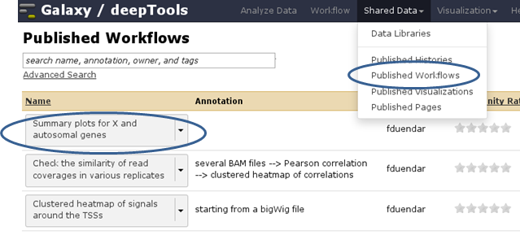
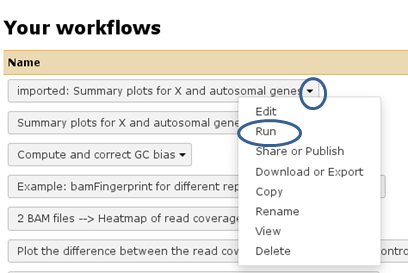
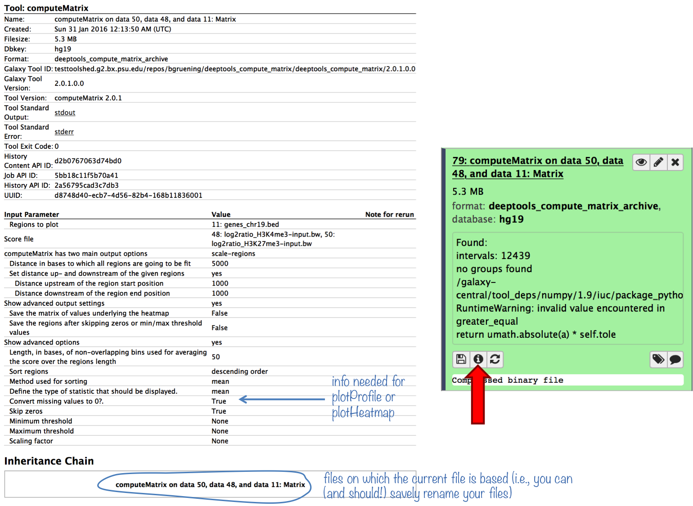
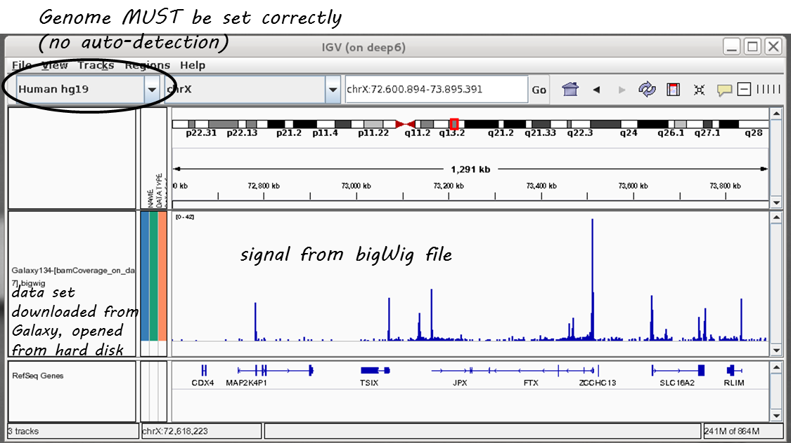
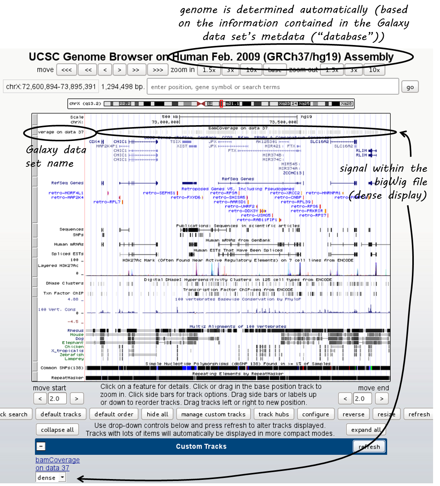

Galaxy-related FAQ
===================

.. contents:: 
    :local:

I've reached my quota - what can I do to save some space?
^^^^^^^^^^^^^^^^^^^^^^^^^^^^^^^^^^^^^^^^^^^^^^^^^^^^^^^^^^^^
1. make sure that all the data sets you deleted are **permanently** eliminated from our disks: go to the history option button and select "Purge deleted data sets", then hit the "refresh" button on top of your history panel
2. download all data sets for which you've completed the analysis, then remove the data sets (click on the "x" and then **make sure they're purged** (see above)).

----------------------------------------------------------------------

Copying from one history to another doesn't work for me - the data set simply doesn't show up in the target history!
^^^^^^^^^^^^^^^^^^^^^^^^^^^^^^^^^^^^^^^^^^^^^^^^^^^^^^^^^^^^^^^^^^^^^^^^^^^^^^^^^^^^^^^^^^^^^^^^^^^^^^^^^^^^^^^^^^^^

Once you've copied a data set from one history to another, check two things:
    * do you see the destination history in your history panel, i.e. does the title of the current history panel match the name of the destination history you selected in the main frame?
    * hit the refresh button

.. image:: ../images/Gal_historyReload.png

----------------------------------------------------------------------

How can I use a published workflow?
^^^^^^^^^^^^^^^^^^^^^^^^^^^^^^^^^^^^^^^^^^^^^^^^^^^^^^^^^^^^

You **must register** if you want to use the workflows within `deepTools Galaxy <http://deeptools.ie-freiburg.mpg.de>`__. ("User" --> "Register" - all you have to supply is an email address). Make sure to read the Terms of Use, though!

You can find workflows that are public or specifically shared with you by another user via "Shared Data" --> "Published Workflows". Click on the triangle next to the workflow you're interested in and select "import".

A green box should appear, there you select "start using this workflow", which should lead you to your own workflow menu (that you can always access via the top menu "Workflow"). Here, you should now see a workflow labeled "imported: ....". If you want to use the workflow right away, click on the triangle and select "Run". The workflow should now be available within the Galaxy main data frame and should be waiting for your input.

----------------------------------------------------------------------

I would like to use one of your workflows - not in the deepTools Galaxy, but in the local Galaxy instance provided by my institute. Is that possible?
^^^^^^^^^^^^^^^^^^^^^^^^^^^^^^^^^^^^^^^^^^^^^^^^^^^^^^^^^^^^^^^^^^^^^^^^^^^^^^^^^^^^^^^^^^^^^^^^^^^^^^^^^^^^^^^^^^^^^^^^^^^^^^^^^^^^^^^^^^^^^^^^^^^^^^

Yes, it is possible. The only requirement is that your local Galaxy has a recent installation of deepTools.

Go to the workflows, click on the ones you're interested in and go to "Download". This will save the workflows into .ga files on your computer. Now go to your local Galaxy installation and login. Go to the workflow menu and select "import workflow" (top right hand corner of the page). Click on "Browse" and select the saved workflow. If you have the same tool versions installed in your local Galaxy, these workflows should work right away.

----------------------------------------------------------------------

``plotProfile`` says that one option will only work if "computeMatrix was run with --missingDataAsZero". How can I find out whether I ran ``computeMatrix`` that way?
^^^^^^^^^^^^^^^^^^^^^^^^^^^^^^^^^^^^^^^^^^^^^^^^^^^^^^^^^^^^^^^^^^^^^^^^^^^^^^^^^^^^^^^^^^^^^^^^^^^^^^^^^^^^^^^^^^^^^^^^^^^^^^^^^^^^^^^^^^^^^^^^^^^^^^^^^^^^^^^^^^^^^^^^^^^^

Galaxy keeps track of everything you do. To see which options you chose to generate a specific data set, simply click on the "info" button.

----------------------------------------------------------------------

How can I have a look at the continuous read coverages from bigWig files? Which genome browser do you recommend?
^^^^^^^^^^^^^^^^^^^^^^^^^^^^^^^^^^^^^^^^^^^^^^^^^^^^^^^^^^^^^^^^^^^^^^^^^^^^^^^^^^^^^^^^^^^^^^^^^^^^^^^^^^^^^^^^

There are 2 popular genome browsers for visualizing continuous data: `UCSC <http://genome.ucsc.edu/cgi-bin/hgGateway?redirect=manual&source=genome-euro.ucsc.edu>`__ and `IGV <http://www.broadinstitute.org/igv/>`__.

IGV (recommended)
~~~~~~~~~~~~~~~~~~~

We recommend downloading `IGV <http://www.broadinstitute.org/igv/>`__, which is free for academic use. IGV itself needs an up-to-date Java installation and a considerable amount of RAM. It's usage is rather intuitive and the display can be easily customized. In addition, you can download genome-wide annotation data that can be displayed together with your own data.

To display data in IGV, do the following:

1. Go to http://www.broadinstitute.org/igv/, register and download IGV
2. Unpack the IGV archive and change to the extracted IGV folder
3. Use the ``igv.bat`` (Windows), ``igv.sh`` (Linux) or ``igv.command`` (OSX) to start IGV (for more information please read the included ``readme.txt`` file or the IGV documentation).
4. Choose the genome version of the file(s) you would like to visualize (e.g. dm3) **THIS IS THE MOST IMPORTANT STEP!** IGV will not detect the genome version automatically, i.e. if you select mm9 but your file is based on human data, it will still be displayed without an error message (but with the wrong positions, obviously!)
5. Go to your deepTools Galaxy server (http://deeptools.ie-freiburg.mpg.de/) and navigate to your data set of choice
6. Click on your data set so that you see its details like in the screenshot below (**Keep in mind that not all datasets can be visualized in IGV or UCSC.** We recommend to use :ref:`bigwig` or :ref:`bed` files for visualization.)

.. image:: ../images/Gal_FAQ_IGV_dataset.png

Now click on **"display with IGV local"** to visualize your data set in IGV that should already be running on your computer.

.. Note:: "display with IGV Web current" can be used if you do not have an installed IGV. It will start an IGV web start version. **We do *not* recommend that option**.

Here's a screenshot of a typical bigWig file display:

For more information, check out the `IGV documentation <http://www.broadinstitute.org/software/igv/UserGuide>`__.

UCSC
~~~~~~~~

There is a direct link from within deepTools Galaxy to stream a data set to UCSC. You can find it in the data set tiles: "display at UCSC", like here:

.. image:: ../images/Gal_FAQ_UCSC_dataset.png

Click on "main" and the UCSC browser should open within a new window, displaying the data set that you chose.
The default setting for bigWig files is the "dense" display that looks like a heatmap.

If you would like to display the continuous profile in a "valley-mountain" fashion like the one shown in the IGV screenshot, go to the drop-down menu underneath your custom track and choose "full".

UCSC has large amounts of public data that you can display which you can find by scrolling down the page, beyond your custom track entry. For more information on how to use the UCSC Genome Browser, go `here <https://genome.ucsc.edu/goldenPath/help/hgTracksHelp.html>`__.

**Known issues with UCSC**

* **chromosome naming**: UCSC expects chromosome names to be indicated in the format "chr"Number, e.g. chr1. If you mapped your reads to a non-UCSC-standard genome, chances are that chromosomes are labeled just with their number. bigWig files generated from these BAM files will not be recognized by UCSC, i.e. you will see the data set name, but no signal.
* **no upload of bigWig files from your hard drive**: to minimize the computational strains, UCSC relies on streaming bigWig files (i.e. there's no need to load the entire file at once, the browser will always just load the data for the specific region a user is looking at).

----------------------------------------------------------------------

What's the best way to integrate the deepTools results with other downstream analyses (outside of Galaxy)?
^^^^^^^^^^^^^^^^^^^^^^^^^^^^^^^^^^^^^^^^^^^^^^^^^^^^^^^^^^^^^^^^^^^^^^^^^^^^^^^^^^^^^^^^^^^^^^^^^^^^^^^^^^^

You can **save all the data tables** underlying every image produced by deepTools, i.e. if you would like to plot the average profiles in a different way, you could download the corresponding data (after ticking the relevant option under "advanced output options") and import them into R, Excel, GraphPadPrism etc.

The descriptions of the tools within Galaxy will also contain details on how to save the data and what sort of format to expect.

----------------------------------------------------------------------

How can I determine basic parameters of a BAM file, such as the number of reads, read length, duplication rate and average DNA fragment length?
^^^^^^^^^^^^^^^^^^^^^^^^^^^^^^^^^^^^^^^^^^^^^^^^^^^^^^^^^^^^^^^^^^^^^^^^^^^^^^^^^^^^^^^^^^^^^^^^^^^^^^^^^^^^^^^^^^^^^^^^^^^^^^^^^^^^^^^^^^^^^^^^^^^^^

If you downloaded the :ref:`BAM` file from a public repository, chances are that those characteristics are in fact noted there.

If that's not the case, we recommend to have a look at the tool `FastQC <http://www.bioinformatics.babraham.ac.uk/projects/fastqc/>`_, which will return all of the above points (except the fragment size).
The fragment size distribution can be obtained using the deepTools' :doc:`tools/bamPEFragmentSize` (since deepTools 2.0).

