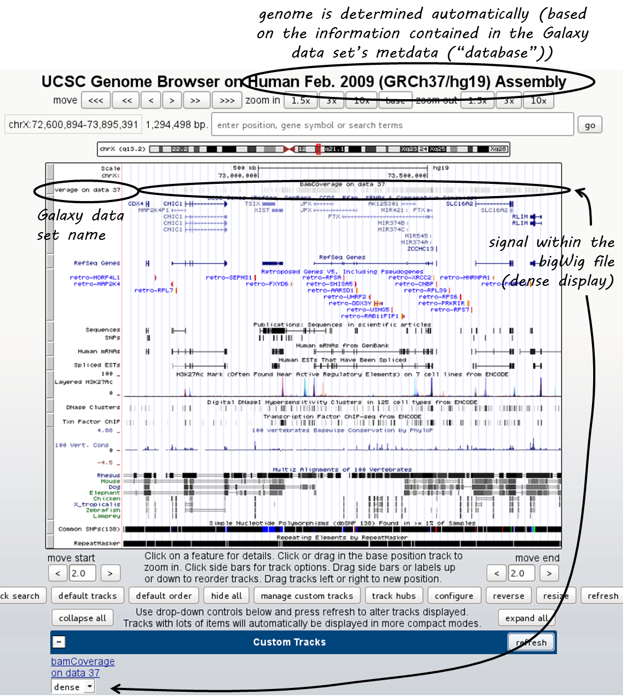

Galaxy-related FAQ
===================

The Galaxy Project is maintaining an impressive `FAQ collection <https://training.galaxyproject.org/training-material/faqs/galaxy/>`__ regarding usage of their platform.

Here we are only highlighting a few that deepTools users have happened to ask before.

.. contents:: 
    :local:

I've reached my quota - what can I do to save some space?
^^^^^^^^^^^^^^^^^^^^^^^^^^^^^^^^^^^^^^^^^^^^^^^^^^^^^^^^^^^^
See Galaxy FAQ: `How can I reduce quota usage ... <https://training.galaxyproject.org/training-material/faqs/galaxy/account_reduce_quota_usage.html>`__.

In addition, we recommend you to avoid multiple uploads of the same data to different histories.
The preferred way is to **copy** the data sets between histories instead, which will not consume extra quota. This Galaxy FAQ: `Copy a dataset between histories <https://training.galaxyproject.org/training-material/faqs/galaxy/histories_copy_dataset.html>`__ explains different ways of doing so.

----------------------------------------------------------------------

How can I find and use published deepTools workflows?
^^^^^^^^^^^^^^^^^^^^^^^^^^^^^^^^^^^^^^^^^^^^^^^^^^^^^^^^^^^^

`WorkflowHub <https://workflowhub.eu/>`__ and `Dockstore <https://dockstore.org>`__ are two excellent places to look for scientific workflows.

To search specifically for Galaxy workflows that make use of deepTools, you can use the following queries:

- on WorkflowHub: `<https://workflowhub.eu/workflows?filter%5Bquery%5D=deeptools&filter%5Bworkflow_type%5D=galaxy>`__
- on Dockstore: `<https://dockstore.org/search?descriptorType=gxformat2&entryType=workflows&search=deeptools>`__

.. Note:: Both WorkflowHub and Dockstore are general workflow registries on which anyone can deposit workflows.

   If you are looking for high-quality workflows pay attention to workflow authors and submitters to see if you recognize them.

   Within the Galaxy ecosystem the `Intergalactic Workflow Commission (IWC) <https://iwc.galaxyproject.org>`__ is an organization aiming at publishing workflows adhering to best-practices and standards in their field. They register their workflows at both Dockstore and WorkflowHub so IWC-submitted workflows can be one thing to look out for on these registries.

Once you have found a workflow you want to use, you can import it onto a Galaxy instance of your choice by following one of these instructions:

- Galaxy FAQ: `Import a workflow from WorkflowHub <https://training.galaxyproject.org/training-material/faqs/galaxy/workflows_run_wfh.html>`__
- Galaxy FAQ: `Import a workflow from Dockstore <https://training.galaxyproject.org/training-material/faqs/galaxy/workflows_run_ds.html>`__

This will import the workflow to your list of workflows. Note that it will also carry a little blue-white shield icon next to its name, which indicates that this is an original workflow version imported from a TRS server. If you ever modify the workflow with Galaxy’s workflow editor, it will lose this indicator.

You can then follow the Galaxy FAQ on `Running a workflow <https://training.galaxyproject.org/training-material/faqs/galaxy/workflows_run.html>`__ to use the imported workflow.

.. Note:: If you see error messages during the import or when trying to run the workflow, a likely reason is that the Galaxy server you are working on does not have all the tools installed that the workflow wants to use.

   If your workflow is from the IWC organization it should normally be usable on all major public Galaxy servers.

----------------------------------------------------------------------

``plotProfile`` says that one option will only work if "computeMatrix was run with --missingDataAsZero". How can I find out whether I ran ``computeMatrix`` that way?
^^^^^^^^^^^^^^^^^^^^^^^^^^^^^^^^^^^^^^^^^^^^^^^^^^^^^^^^^^^^^^^^^^^^^^^^^^^^^^^^^^^^^^^^^^^^^^^^^^^^^^^^^^^^^^^^^^^^^^^^^^^^^^^^^^^^^^^^^^^^^^^^^^^^^^^^^^^^^^^^^^^^^^^^^^^^

Galaxy keeps track of everything you do. To see which options you chose to generate a specific dataset, you can use Galaxy's `"Run Job Again" <https://training.galaxyproject.org/training-material/faqs/galaxy/tools_rerun.html>`__ functionality to restore the tool interface with the same settings that you configured to create any of your existing datasets.

Alternatively, you can click the ``(i)`` *Dataset Details* icon on the dataset in question, then check the *"Tool Parameters"* section of the resulting page.

----------------------------------------------------------------------

.. _galaxy-visualize:

How can I visualize bigWig/bed/bam datasets from Galaxy? Which genome browser do you recommend?
^^^^^^^^^^^^^^^^^^^^^^^^^^^^^^^^^^^^^^^^^^^^^^^^^^^^^^^^^^^^^^^^^^^^^^^^^^^^^^^^^^^^^^^^^^^^^^^^^^^^^^^^^^^^^^^^

There are 2 popular genome browsers that we recommend for visualizing positional genomic data along its corresponding reference genome: the `Integrative Genomics Viewer IGV <https://igv.org/>`__ and the `UCSC genome browser <https://genome.ucsc.edu/cgi-bin/hgGateway>`__.

IGV
~~~~

This is our recommendation unless you want to visualize your data in relation to the vast amount of annotation tracks available in the UCSC genome browser. This option requires a bit of setup on your local machine, but then provides a rather intuitive, yet flexible user interface.

To set up IGV for use on your computer, first follow our :ref:`general instructions <igv-setup>`.

Then to display data from any Galaxy server in your local IGV:

1. Make sure you have started IGV on your computer.

2. In Galaxy, expand the dataset that you would like to visualize by clicking on it.

3. (highly recommended) In the expanded view, make sure you have `set the dataset's reference genome/database (dbkey) <https://training.galaxyproject.org/training-material/faqs/galaxy/datasets_change_dbkey.html>`__ correctly.

   .. important:: Obviously it is of importance to visualize the data against the **correct** reference genome!
      Galaxy will use the genome/database information of the dataset to load what it assumes is the correct reference genome in IGV for you.
      If you haven't previously installed that genome, IGV will download it for you automatically.

      **Careful**: if the genome/database information is **not** set (i.e. Galaxy shows a ``?``) for your dataset, IGV will just use whatever reference genome it has loaded at the moment to visualize your data against!

4. Click on the *Visualize* icon attached to your dataset and select *"display with IGV (local)"* from the central panel (the *web_current* option, if shown, is not recommended).

5. Switch over to IGV and wait for Galaxy to complete the initial communication with IGV.

6. Check again that the expected reference genome has been selected in IGV, then start exploring your data just as you would for local data.

UCSC Genome Browser
~~~~~~~~~~~~~~~~~~~~

This option lets you visualize your data without any local setup. All data transfer happens only between the Galaxy server and the UCSC genome browser. The resulting web-based visualization may be less responsive and may not look as nice as the one using IGV, but you will have all annotation tracks stored at UCSC at your disposal to display them alongside your data.

The steps to display data from any Galaxy server in the UCSC genome browser are very similar to the ones described above for IGV:

1. In Galaxy, expand the dataset that you would like to visualize by clicking on it.
2. In the expanded view, make sure you have `set the dataset's reference genome/database (dbkey) <https://training.galaxyproject.org/training-material/faqs/galaxy/datasets_change_dbkey.html>`__ correctly.

   .. important:: Obviously it is of importance to visualize the data against the **correct** reference genome!
      Galaxy will use the genome/database information of the dataset to set what it assumes is the correct reference genome in the UCSC genome browser for you.

3. Click on the *Visualize* icon attached to your dataset and select *"display at UCSC (main)"* from the central panel.

   .. Tip:: If the option doesn't appear, verify that the dataset's  format is of a supported type (e.g. bigwig, bed or bam) and that its reference genome/database (dbkey) is set (see the previous  step).

4. Wait for Galaxy to complete the initial communication with the UCSC server.
5. Check again that the expected reference genome is mentioned in the title of the browser view, then start exploring your data.

The default setting for user-provided custom tracks in the UCSC genome browser is the "dense" display which looks like a heatmap for bigwig and bam data.

**Usage hints**

- If you would like to display bigwig data in a "valley-mountain" fashion or bam data as a stack of reads, go to the drop-down menu underneath your custom track and choose "full", then click *"Refresh"* in the section title or at the very bottom of the page.

- The UCSC genome browser remembers the state of your session from previous browser tabs.

  .. Tip:: This means that to view more than one dataset from Galaxy simultaneously, you can just go back to Galaxy and repeat the above steps.
     The new genome browser view will show the newly selected data alongside all previously configured tracks.

- UCSC has large amounts of public data that you can display together with your data.

  You can configure these public tracks by scrolling down the page, beyond your custom track section.

- The UCSC `genome browser user guide <https://genome.ucsc.edu/goldenPath/help/hgTracksHelp.html>`__ has a lot more information on what you can do with this tool.

- **Known issue with chromosome names**:

  The UCSC genome browser expects chromosome names to be indicated in the format *"chr<number>"*, e.g. chr1.
  If you mapped your reads to a non-UCSC-standard genome, chances are that chromosomes are labeled just with their number.
  Such data will not be recognized by the genome browser, i.e. you will see just the track name, but no signal.

----------------------------------------------------------------------

What's the best way to integrate the deepTools results with other downstream analyses (outside of Galaxy)?
^^^^^^^^^^^^^^^^^^^^^^^^^^^^^^^^^^^^^^^^^^^^^^^^^^^^^^^^^^^^^^^^^^^^^^^^^^^^^^^^^^^^^^^^^^^^^^^^^^^^^^^^^^^

You can **save all the data tables** underlying every image produced by deepTools, i.e. if you would like to plot the average profiles in a different way, you could download the corresponding data (after ticking the relevant option under "advanced output options") and import them into R, Excel, GraphPadPrism etc.

The descriptions of the tools within Galaxy will also contain details on how to save the data and what sort of format to expect.

----------------------------------------------------------------------

How can I determine basic parameters of a BAM file, such as the number of reads, read length, duplication rate and average DNA fragment length?
^^^^^^^^^^^^^^^^^^^^^^^^^^^^^^^^^^^^^^^^^^^^^^^^^^^^^^^^^^^^^^^^^^^^^^^^^^^^^^^^^^^^^^^^^^^^^^^^^^^^^^^^^^^^^^^^^^^^^^^^^^^^^^^^^^^^^^^^^^^^^^^^^^^^^

If you downloaded the :ref:`BAM` file from a public repository, chances are that those characteristics are in fact noted there.

If that's not the case, we recommend to have a look at the tool `FastQC <http://www.bioinformatics.babraham.ac.uk/projects/fastqc/>`_, which will return all of the above points (except the fragment size).
The fragment size distribution can be obtained using the deepTools' :doc:`tools/bamPEFragmentSize` (since deepTools 2.0).

