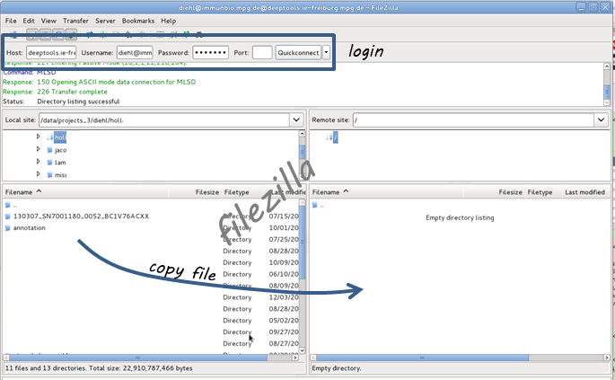
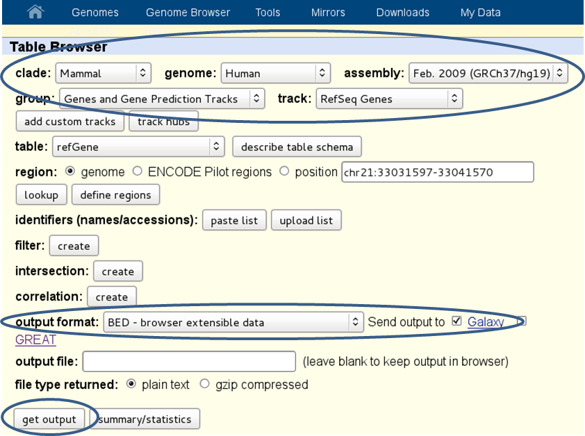
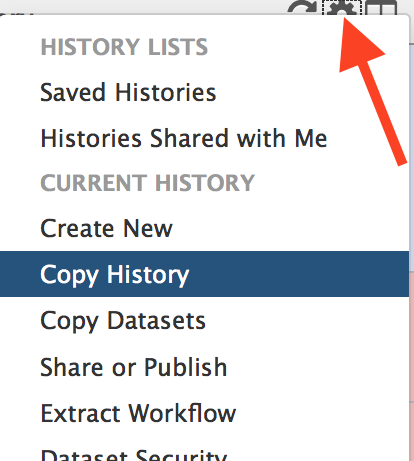

Data import into Galaxy
-------------------------

There are three main ways to populate your Galaxy history with data
files plus an additional one for sharing data within Galaxy.

.. contents:: 
    :local:

Upload files from your computer
^^^^^^^^^^^^^^^^^^^^^^^^^^^^^^^^^

The data upload of files **smaller than 2 GB** that lie on your computer is fairly straight-forward: click on the category "Get data" and choose the tool "Upload file".
Then select the file via the "Browse" button.

.. image:: ../images/Gal_DataUpload.png

For files **greater than 2GB**, there's the option to upload via an FTP server. If your data is available via an URL that links to an FTP server, you can simply
paste the URL in the empty text box.

If you do not have access to an FTP server, you can directly upload to
our Galaxy's FTP.

1. Register with deeptools.ie-freiburg.mpg.de (via “User” ⟶ “register”; registration requires an email address and is free of charge)
2. You will also need an FTP client, e.g. `filezilla <https://filezilla-project.org/>`__.
3. Then login to the **FTP client** using your **deepTools Galaxy user name and password** (host: deeptools.ie-freiburg.mpg.de). Down below you see a screenshot of what that looks like with filezilla.
4. Copy the file you wish to upload to the remote site (in filezilla, you can simply drag the file to the window on the right hand side)
5. Go back to `deepTools Galaxy <http://deeptools.ie-freiburg.mpg.de/>`__.
6. Click on the tool "Upload file" (⟶ "Files uploaded via FTP") - here, the files you just copied over via filezilla should appear. Select the files you want and hit “execute”. They will be moved from the FTP server to your history (i.e. they will be deleted from the FTP once the upload was successful).

Import data sets from the Galaxy data library
^^^^^^^^^^^^^^^^^^^^^^^^^^^^^^^^^^^^^^^^^^^^^^^

If you would like to play around with sample data, you can import files
that we have saved within the general data storage of the deepTools
Galaxy server. Everyone can import them into his or her own history,
they will not contribute to the user's disk quota.

You can reach the data library via "Shared Data" in the top menu, then
select "Data Libraries".

Within the Data Library you will find a folder called "Sample Data" that
contains data that we downloaded from the `Roadmap
project <http://www.roadmapepigenomics.org/data>`__ and
`UCSC <http://genome.ucsc.edu/>`__ 
More precisely, we donwloaded the [FASTQ][] files of various ChIP-seq samples and the corresponding input and mapped the reads to the human reference genome (version hg19) to obtain the [BAM][] files you see.
In addition, you will find bigWig files created using ``bamCoverage`` and some annotation files in BED format as well as RNA-seq data.

.. note:: To keep the file size smallish, all files contain data for chromosome 19 and chromosome X only!

.. image:: ../images/Gal_DataLib.png

Download annotation files from public data bases
^^^^^^^^^^^^^^^^^^^^^^^^^^^^^^^^^^^^^^^^^^^^^^^^^

In many cases you will want to query your sequencing data results for
known genome annotation, such as genes, exons, transcription start sites
etc. These information can be obtained via the two main sources of
genome annotation, `UCSC <http://genome.ucsc.edu/>`__ and `BioMart <http://www.biomart.org/>`__.

.. warning:: UCSC and BioMart cater to different ways of genome annotation, i.e. genes defined in UCSC might not correspond to the same regions in a gene file downloaded from BioMart. (For a brief overview over the issues of genome annotation, you can check out `Wikipedia <http://en.wikipedia.org/wiki/Genome_project>`_, if you always wanted to know much more about those issues, `this <http://www.ncbi.nlm.nih.gov/pubmed/22510764>`_ might be a good start.)

You can access the data stored at UCSC or BioMart conveniently through our Galaxy instance which will import the resulting files into your history. Just go to **"Get data"** ⟶ "UCSC" or "BioMart".

The majority of annotation files will probably be in [BED][] format, however, you can also find other data sets.
UCSC, for example, offers a wide range of data that you can browse via the "group" and "track" menus (for example, you could download the GC content of the genome as a signal file from UCSC via the "group" menu ("Mapping and Sequencing Tracks").

.. warning:: The download through this interface is limited to 100,000 lines per file which might not be sufficient for some mammalian data sets.

Here's a screenshot from downloading a BED-file of all RefSeq genes defined for the human genome (version hg19):

And here's how you would do it for the BioMart approach:

.. image:: ../images/Gal_biomart.png

.. tip:: Per default, **BioMart will not output a BED file** like UCSC does. It is therefore important that you make sure you get all the information you need (most likely: chromosome, gene start, gene end, ID, strand) via the "Attributes" section. You can click on the "Results" button at any time to check the format of the table that will be sent to Galaxy (Note that the strand information will be decoded as 1 for "forward" or "plus" strand and -1 for "reverse" or "minus" strand).

.. warning:: Be aware, that BED files from UCSC will have chromosomes labelled with “chr” while ENSEMBL usually returns just the number – this might lead to incompatibilities, i.e. when working with annotations from UCSC and ENSEMBL, you need to make sure to use the same naming!

Copy data sets between histories
^^^^^^^^^^^^^^^^^^^^^^^^^^^^^^^^^^^^^^^
 
If you have registered with deepTools Galaxy you can have more than one history.

In order to minimize the disk space you're occupying we strongly suggest to **copy** data sets between histories when you're using the same data set in different histories.

.. note:: Copying data sets is only possible for registered users.

Copying can easily be done via the History panel's ``option`` button ⟶ "Copy dataset". In the main frame, you should now be able to select the history you would like to copy from on the left hand side and the target history on the right hand side.

**More help**

.. hint:: If you encounter a failing data set (marked in red), please **send a bug report** via the Galaxy bug report button and we will get in touch if you indicate your email address.

+--------------------------------------------------------------------------------+-----------------------------------------------------------------+
| `http://wiki.galaxyproject.org/Learn <http://wiki.galaxyproject.org/Learn>`__  | Help for Galaxy usage in general                                |
+--------------------------------------------------------------------------------+-----------------------------------------------------------------+
| `deepTools Galaxy FAQs <Galaxy-related-FAQs>`__                                | Frequently encountered issues with our specific Galaxy instance |
+--------------------------------------------------------------------------------+-----------------------------------------------------------------+
| `Biostars <http://biostars.org>`__                                             | For issues not addressed in the FAQs                            |
+--------------------------------------------------------------------------------+-----------------------------------------------------------------+
