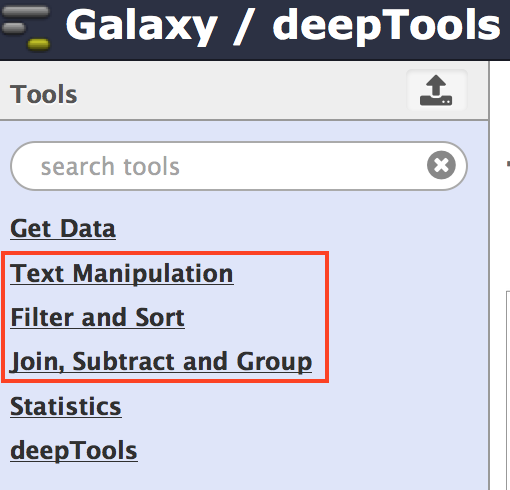
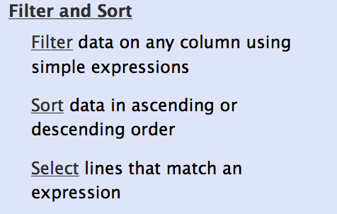
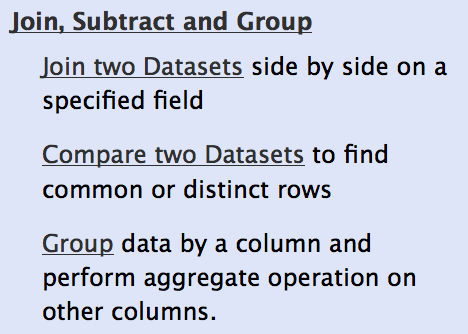
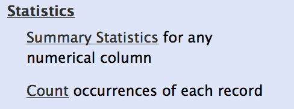

Which tools can I find in the deepTools Galaxy?
-----------------------------------------------

As mentioned before, each Galaxy installation can be tuned to the
individual interests.
Our goal is to provide a Galaxy that enables you to **quality check, process and normalize and subsequently visualize your data obtained by high-throughput DNA sequencing**.

.. tip:: If you do not know the difference between a BAM and a BED file, that's fine. You can read up on them in our :doc:`help_glossary`.

.. tip:: For more specific help, check our :doc:`help_faq_galaxy` and the :doc:`example_step_by_step`.

We provide the following kinds of tools:

.. contents:: 
    :local:

deepTools
^^^^^^^^^^

The most important category is called **"deepTools"** that contains all the main tools we have developed.

Tools for BAM and bigWig file processing
~~~~~~~~~~~~~~~~~~~~~~~~~~~~~~~~~~~~~~~~~

+------------------------+--------------------------------------------------------------------------------+
| ``multiBamCoverage``   | get read counts for the binned genome or user-specified regions                |
+------------------------+--------------------------------------------------------------------------------+
| ``multiBigwigSummary`` | calculate score summaries for the binned genome or user-specified regions      |
+------------------------+--------------------------------------------------------------------------------+
| ``correctGCBias``      | obtain a BAM file with reads distributed according to the genome's GC content  |
+------------------------+--------------------------------------------------------------------------------+
| ``bamCoverage``        | obtain the normalized read coverage of a single BAM file                       |
+------------------------+--------------------------------------------------------------------------------+
| ``bamCompare``         | normalize 2 BAM files to each other (e.g. log2ratio, difference)               |
+------------------------+--------------------------------------------------------------------------------+
| ``bigwigCompare``      | normalize the scores of two bigWig files to each other (e.g., ratios)          |
+------------------------+--------------------------------------------------------------------------------+
| ``computeMatrix``      | compute the values needed for heatmaps and summary plots                       |
+------------------------+--------------------------------------------------------------------------------+

Tools for QC of NGS data
~~~~~~~~~~~~~~~~~~~~~~~~~~~~~~~~~~~~~~~~~

+-----------------------+-------------------------------------------------------------------------------------------------------+
| ``plotCorrelation``   | calculate and visualize the pairwise Spearman or Pearson correlation of read counts (or other scores) |
+-----------------------+-------------------------------------------------------------------------------------------------------+
| ``plotPCA``           | perform PCA and visualize the results                                                                 |
+-----------------------+-------------------------------------------------------------------------------------------------------+
| ``plotFingerprint``   | assess the ChIP enrichment strength                                                                   |
+-----------------------+-------------------------------------------------------------------------------------------------------+
| ``bamPEFragmentSize`` | obtain the average fragment length for paired-end samples                                             |
+-----------------------+-------------------------------------------------------------------------------------------------------+
| ``computeGCBias``     | assess the GC bias by calculating the expected and observed GC distribution of aligned reads          |
+-----------------------+-------------------------------------------------------------------------------------------------------+
| ``plotCoverage``      | obtain the normalized read coverage of a single BAM file                                              |
+-----------------------+-------------------------------------------------------------------------------------------------------+

Heatmaps and summary plots
~~~~~~~~~~~~~~~~~~~~~~~~~~~~~~~~~~~~~~~~~

+-------------------+-------------------------------------------------------------------------------------------+
| ``plotHeatmap``   | visualize read counts or other scores in heatmaps with one row per genomic region         |
+-------------------+-------------------------------------------------------------------------------------------+
| ``plotProfile``   | visualize read counts or other scores using average profiles (e.g., meta-gene profiles)   |
+-------------------+-------------------------------------------------------------------------------------------+

For each tool, you can find example usages and tips within Galaxy once you select the tool.

In addition, you may want to check our pages about :doc:`example_usage`, particularly :doc:`example_step_by_step`.

Working with text files and tables
^^^^^^^^^^^^^^^^^^^^^^^^^^^^^^^^^^^

In addition to deepTools that were specifically developed for the handling of NGS data, we have incorporated several standard Galaxy tools that enable you to manipulate tab-separated files such as gene lists, peak lists, data matrices etc.

There are 3 main categories for:

Text manipulation
~~~~~~~~~~~~~~~~~~

Unlike Excel, where you can easily interact with your text and tables via the mouse, data manipulations within Galaxy are strictly based on commands.

If you feel like you would like to do something to certain *columns* of a data set, go through the tools of this category!

Example actions are:
* adding columns
* extracting columns
* pasting two files side by side
* selecting random lines
* etc.

A very useful tool of this category is called ``Trim``: if you need to **remove some characters from a column**, this tool's for you! (for example, sometimes you need to adjust the chromosome naming between two files from different source - using ``Trim``, you can remove the "chr" in front of the chromosome name)

Filter and Sort
~~~~~~~~~~~~~~~~

In addition to the common sorting and filtering, there's the very useful tool to ``select lines that match an expression``.
For example, using the expression ``c1=='chrM'`` will select all rows from a BED file with regions located on the mitochondrial chromosome.

Join, Subtract, Group
~~~~~~~~~~~~~~~~~~~~~

The tools of this category are very useful if you have several data sets that you would like to work with, e.g. by comparing them.

Basic arithmetics for tables
^^^^^^^^^^^^^^^^^^^^^^^^^^^^^

We offer some very basic mathematical operations on values stored with tables.
The ``Summary Statistics`` can be used to calculate the sum, mean, standard deviation and percentiles for a set of numbers, e.g. for values stored in a specific column.

Working with genomic intervals
^^^^^^^^^^^^^^^^^^^^^^^^^^^^^^^

Galaxy has 2 file formats to store lists of genomic regions:

INTERVAL
~~~~~~~~~

- tab-separated
- requirements:
    1. Column: chromosome
    2. Column: start position
    3. Column: end position
- all other columns can contain any value or character

BED
~~~~

- very similar to INTERVAL, but stricter when it comes to what is expected to be kept in which column:
    - 1. to 3. Column: same as INTERVAL
    - Column 4: name
    - Column 5: score
    - Column 6: strand

If you would like to work with several lists of genomic regions, e.g. generate a new list of regions that are found in two different files etc., there are two categories of tools dedicated to performing these tasks:

* Operate on genomic intervals
* BEDtools

Each tool's function is explained within Galaxy.
Do browse those tools as they will give you a very good glimpse of the scope of possible analyses!

Peak calling
^^^^^^^^^^^^^^

In ChIP-seq analysis, peak calling algorithms are essential downstream analysis tools to identify regions of significant enrichments (i.e. where the ChIP sample contained significantly more sequenced reads than the input control sample).
By now, there must be close to 100 programs out there (see `Wilbanks et
al. <http://www.plosone.org/article/info%3Adoi%2F10.1371%2Fjournal.pone.0011471>`_ for a comparison of peak calling programs).

In contrast to deepTools that were developed for handling and generating *continuous* genome-wide profiles, peak calling will result in a *list of genomic regions*. Have a look at the screenshot to understand the difference.

.. image:: ../images/Gal_peaksVsBigWigs.png

We have included the peak callers `MACS <http://www.ncbi.nlm.nih.gov/pubmed/22936215>`_ and `SICER <http://bioinformatics.oxfordjournals.org/content/25/15/1952.full>`_ within our Galaxy instance with MACS being the most popular peak calling algorithm for the identification of localized transcription factor binding sites while SICER was developed for diffuse ChIP-seq signals.

.. note:: MACS version 1.14 is quite different from MACS version 2.

**More help**

.. hint:: If you encounter a failing data set (marked in red), please **send a bug report** via the Galaxy bug report button and we will get in touch if you indicate your email address.

+-------------------------------------------------------------------------------+-----------------------------------------------------------------+
| `http://wiki.galaxyproject.org/Learn <http://wiki.galaxyproject.org/Learn>`_  | Help for Galaxy usage in general                                |
+-------------------------------------------------------------------------------+-----------------------------------------------------------------+
| `deepTools Galaxy FAQs <Galaxy-related-FAQs>`_                                | Frequently encountered issues with our specific Galaxy instance |
+-------------------------------------------------------------------------------+-----------------------------------------------------------------+
| deeptools@googlegroups.com                                                    | For issues not addressed in the FAQs                            |
+-------------------------------------------------------------------------------+-----------------------------------------------------------------+