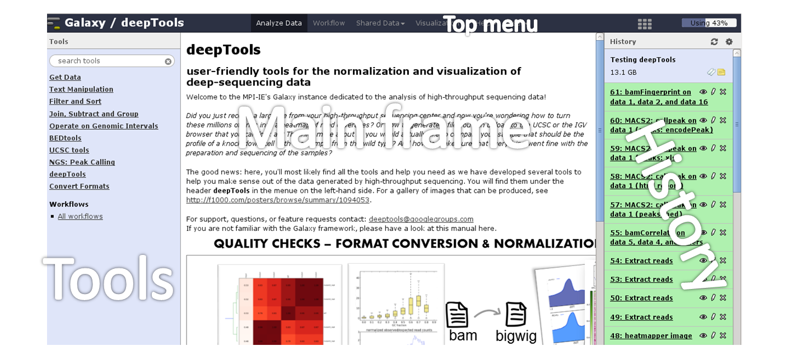
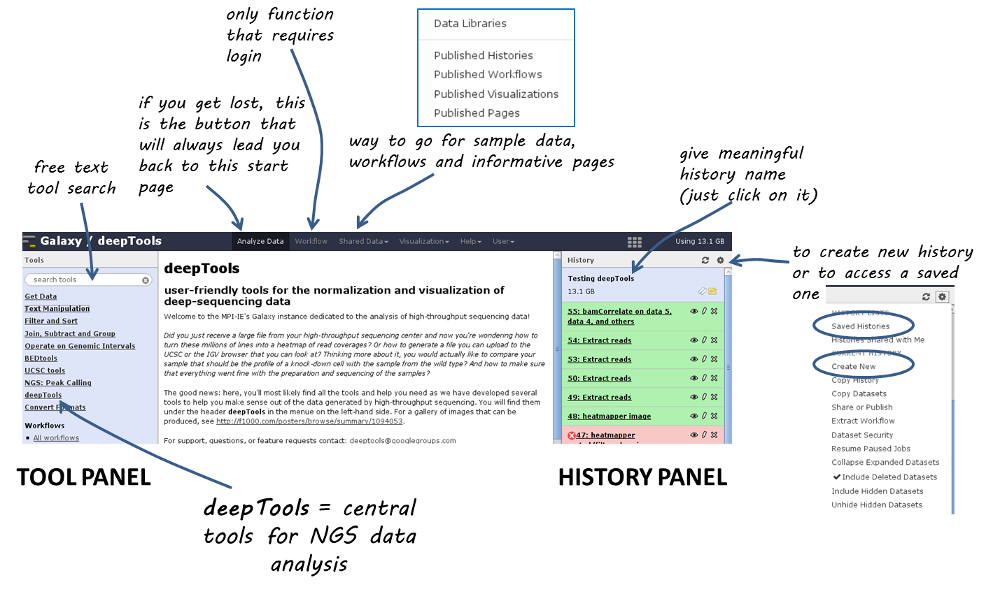

Using deepTools within Galaxy   
================================

`Galaxy <http://galaxyproject.org/>`_ is a tremendously useful platform developed by the Galaxy Team at Penn State and the Emory University. This platform is meant to offer access to a large variety of bioinformatics tools that can be used without computer programming experiences. That means, that the basic features of Galaxy will apply to every tool, i.e. every tool provided within a Galaxy framework will look very similar and will follow the concepts of Galaxy.

Our publicly available deepTools Galaxy instance can be found here:
`deeptools.ie-freiburg.mpg.de <http://deeptools.ie-freiburg.mpg.de/>`_.
This server also contains some additional tools that will enable users to analyse and visualize data from high-throughput sequencing experiments, starting from aligned reads. 

**Table of content**

.. contents:: 
    :local:

.. toctree::
   :maxdepth: 2

   help_galaxy_dataup

.. toctree::
   :maxdepth: 2
   
   help_galaxy_deeptools

Basic features of Galaxy
-------------------------

Galaxy is a web-based platform for data intensive, bioinformatics-dependent research and it is being developed by Penn State and John Hopkins University. The original Galaxy can be found `here <https://galaxyproject.org/>`_.

Since it is impossible to meet all bioinformatics needs -- that can range from evolutionary analysis to data from mass spectrometry to high-throughput DNA sequencing (and way beyond) -- with one single web server, many institutes have installed their own versions of the Galaxy platform tuned to their specific needs.

Our `deepTools Galaxy <http://deeptools.ie-freiburg.mpg.de/>`__ is such a specialized server dedicated to the analysis of high-throughput DNA sequencing data. The overall makeup of this web server, however, is the same as for any other Galaxy installation, so if you've used Galaxy before, you will learn to use deepTools in no time!

The start site
^^^^^^^^^^^^^^^

Here is a screenshot of what the start site will approximately look like: 

The start site contains 4 main features:

+-------------------+----------------------------------------------------------------------------------------------------------------------------+
| **Top menu**      | Your gateway away from the actual analysis part into other sections of Galaxy, e.g. **workflows** and **shared data**.     |
+-------------------+----------------------------------------------------------------------------------------------------------------------------+
| **Tool panel**    | *What can be done?* Find all tools installed in this Galaxy instance                                                       |
+-------------------+----------------------------------------------------------------------------------------------------------------------------+
| **Main frame**    | *What am I doing?* This is your main **working space** where input will be required from you once you've selected a tool.  |
+-------------------+----------------------------------------------------------------------------------------------------------------------------+
| **History panel** | *What did I do?* The history is like a **log book**: everything you ever did is recorded here.                             |
+-------------------+----------------------------------------------------------------------------------------------------------------------------+

For those visual learners, here's an annotated screenshot:

Details
^^^^^^^^^^^^^^^

In the default state of the tool panel you see the **tool categories**, e.g. "Get Data". If you click on them, you will see the **individual tools** belonging to each category, e.g. "Upload File from your computer", "UCSC Main table browser" and "Biomart central server" in case you clicked on "Get Data". To use a tool such as "Upload File from your computer", just click on it.

The **tool *search* panel** is extremely useful as it allows you to enter a key word (e.g. "bam") that will lead to all the tools mentioning the key word in the tool name.

Once you've uploaded any kind of data, you will find the history on the
right hand side filling up with green tiles.
Each tile corresponds to one data set that you either uploaded or created.
The data sets can be images, raw sequencing files, text files, tables - virtually anything.
The content of a data set *cannot* be modified - every time you want to change something *within* a data file (e.g. you would like to sort the values or add a line or cut a column), you will have to use a Galaxy tool that will lead to a *new* data set being produced.
This behaviour is often confusing for Galaxy novices (as histories tend to accumulate data sets very quickly), but it is necessary to enforce the strict policy of documenting *every modification* to a given data set.
Eventhough your history might be full of data sets with strange names, you will always be able to track back the source and evolution of each file.
Also, every data set can be downloaded to your computer individually.
Alternatively, you can *download* an entire history or *share* the history with another user.

Have a look at the following screenshot to get a feeling for how many information Galaxy keeps for you (which makes it very feasible to reproduce any analysis):

.. image:: ../images/Gal_screenshot_dataSet.png

Each data set can have 4 different states that are intuitively color-coded:

.. image:: ../images/Gal_screenshot_dataSetStates.png

Handling failed files
^^^^^^^^^^^^^^^^^^^^^^

 If you encounter a failed file after you've run a tool, please do the following steps (**in this order**):

         1. click on the center button on the lower left corner of the failed data set ``(i)``: did you chose the **correct data files**?
         2. if you're sure that you chose the correct files, hit the ``re-run button`` (blue arrow in the lower left corner) - check again whether your files had the **correct file format**. If you suspect that the format might be incorrectly assigned (e.g. a file that should be a BED file is labelled as a tabular file), click the ``edit button`` (the pencil) of the input data file - there you can change the corresponding attributes
         3. if you've checked your input data and the error is persisting, click on the ``green bug`` (lower left corner of the failed data set) and send the **bug report** to us. You do not need to indicate a valid email-address unless you would like us to get in touch with you once the issue is solved.

Workflows
^^^^^^^^^^

Workflows are Galaxy's equivalent of protocols.
This is a very useful feature as it allows users to *share their protocols and bioinformatic analyses* in a very easy and transparent way.
This is the graphical representation of a Galaxy workflow that can easily be modified via drag'n'drop within the workflows manual (you must be registered with deepTools Galaxy to be able to generate your own workflows or edit published ones).

.. image:: ../images/Gal_workflow.png

**More help**

.. hint:: If you encounter a failing data set (marked in red), please **send a bug report** via the Galaxy bug report button and we will get in touch if you indicate your email address.

+-------------------------------------------------------------------------------+-----------------------------------------------------------------+
| `http://wiki.galaxyproject.org/Learn <http://wiki.galaxyproject.org/Learn>`_  | Help for Galaxy usage in general                                |
+-------------------------------------------------------------------------------+-----------------------------------------------------------------+
| `deepTools Galaxy FAQs <Galaxy-related-FAQs>`_                                | Frequently encountered issues with our specific Galaxy instance |
+-------------------------------------------------------------------------------+-----------------------------------------------------------------+
| `Biostars <http://biostars.org>`__                                            | For issues not addressed in the FAQs                            |
+-------------------------------------------------------------------------------+-----------------------------------------------------------------+
