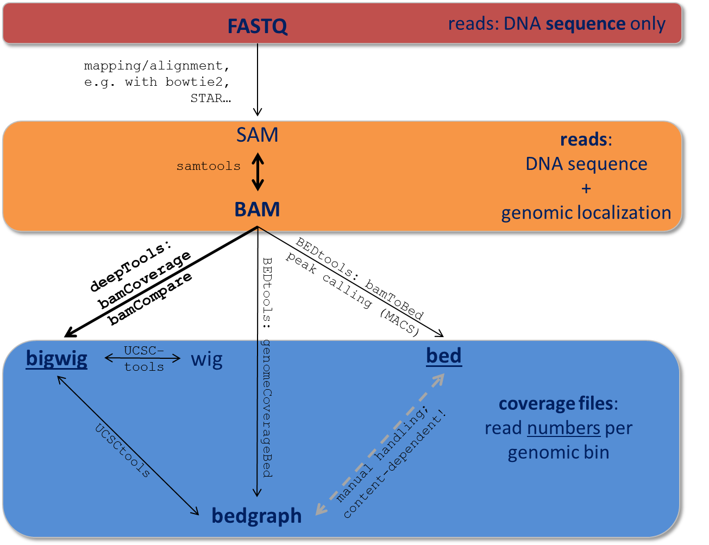
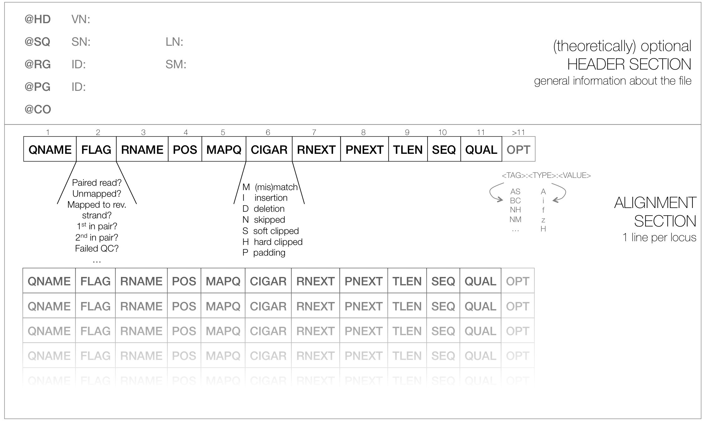

Glossary of NGS terms
=====================

Like most specialized fields, next-generation sequencing has inspired many an acronyms.
We are trying to keep track of those :ref:`abbreviations` that we heavily use.
Do make us aware if something is unclear by opening an issue on `github <http://github.com/deeptools/deeptools>`__

.. contents:: 
    :local:

.. _abbreviations:

Abbreviations
---------------

Reference genomes are usually referred to by their abbreviations, such as:

* hg19 = human genome, version 19
* mm9 = *Mus musculus* genome, version 9
* dm3 = *Drosophila melanogaster*, version 3
* ce10 = *Caenorhabditis elegans*, version 10

For a more comprehensive list of available reference genomes and their abbreviations,
see the `UCSC data base <http://hgdownload.soe.ucsc.edu/downloads.html>`__.
 
+---------------+------------------------------------------+-----------------------------------------------------------------------------------------------------------------------------------------------+
| Acronym       | full phrase                              | Synonyms/Explanation                                                                                                                          |
+===============+==========================================+===============================================================================================================================================+
| <ANYTHING>-seq| -sequencing                              |indicates that an experiment was completed by DNA sequencing using NGS                                                                         |
+---------------+------------------------------------------+-----------------------------------------------------------------------------------------------------------------------------------------------+
| ChIP-seq      | chromatin immunoprecipitation sequencing | NGS technique for detecting transcription factor binding sites and histone modifications (see entry *Input* for more information)             |
+---------------+------------------------------------------+-----------------------------------------------------------------------------------------------------------------------------------------------+
| DNase         | deoxyribonuclease I                      | DNase I digestion is used to determine active ("open") chromatin regions                                                                      |
+---------------+------------------------------------------+-----------------------------------------------------------------------------------------------------------------------------------------------+
| HTS           | high-throughput sequencing               | next-generation sequencing, massive parallel short read sequencing, deep sequencing                                                           |
+---------------+------------------------------------------+-----------------------------------------------------------------------------------------------------------------------------------------------+
| MNase         | micrococcal nuclease                     | MNase digestion is used to determine sites with nucleosomes                                                                                   |
+---------------+------------------------------------------+-----------------------------------------------------------------------------------------------------------------------------------------------+
| NGS           | next-generation sequencing               | high-throughput (DNA) sequencing, massive parallel short read sequencing, deep sequencing                                                     |
+---------------+------------------------------------------+-----------------------------------------------------------------------------------------------------------------------------------------------+
| RPGC          | reads per genomic content                | normalize reads to 1x sequencing depth, sequencing depth is defined as: (mapped reads x fragment length) / effective genome size              |
+---------------+------------------------------------------+-----------------------------------------------------------------------------------------------------------------------------------------------+
| RPKM          | reads per kilobase per million reads     | normalize read numbers: RPKM (per bin) = reads per bin / ( mapped reads (in millions) x bin length (kb))                                      |
+---------------+------------------------------------------+-----------------------------------------------------------------------------------------------------------------------------------------------+

For a review of popular \*-seq applications, see `Zentner and Henikoff <http://genomebiology.com/2012/13/10/250>`__.

.. _terminology:

NGS and generic terminology
---------------------------
The following are terms that may be new to some:

.. _bin:

bin
^^^

* synonyms: window, region
* A 'bin' is a subset of a larger grouping. Many calculations calculation are performed by first dividing the genome into small regions (bins), on which the calculations are actually performed.

.. _input:

Input
^^^^^^^^

* Control experiment typically done for ChIP-seq experiments 
* While ChIP-seq relies on antibodies to enrich for DNA fragments bound to a certain protein, the input sample should be processed exactly the same way, excluding the antibody. This allows one to account for biases introduced by sample handling and the general chromatin structure of the cells 

.. _read:

read
^^^^^^^^

* synonym: tag
* This term refers to the piece of DNA that is sequenced ("read") by the sequencers. We try to differentiate between "read" and "DNA fragment" as the fragments that are put into the sequencer tend to be in the range of 200-1000 bases, of which only the first 50 to 300 bases are typically sequenced. Most of the deepTools will not only take these reads into account, but also extend them to match the original DNA fragment size. (The original size will either be given by you or, if you used paired-end sequencing, be calculated from the distance between the two read mates).

.. _file formats:

File Formats
-------------------

Data obtained from next-generation sequencing data must be processed several times.
Most of the processing steps are aimed at extracting only that information
needed for a specific down-stream analysis, with redundant entries often discarded.
Therefore, **specific data formats are often associated with different steps of a data processing pipeline**.

Here, we just want to give very brief key descriptions of the file, for elaborate information we will link to external websites.
Be aware, that the file name sorting here is alphabetical, not according to their usage within an analysis pipeline that is depicted here:

Follow the links for more information on the different tool collections mentioned in the figure:

`samtools <http://www.htslib.org/>`__ |
`UCSCtools <http://hgdownload.cse.ucsc.edu/admin/exe/>`__ |
`BEDtools <http://bedtools.readthedocs.org/en/latest/>`__ |

.. _2bit:

2bit
^^^^^

* compressed, binary version of genome sequences that are often stored in :ref:`FASTA` 
* most genomes in 2bit format can be found `at UCSC <http://hgdownload.cse.ucsc.edu/gbdb/>`__
* :ref:`FASTA` files can be converted to 2bit using the UCSC programm *faToTwoBit*, which is available for different platforms at `UCSC <http://hgdownload.cse.ucsc.edu/admin/exe/>`__
* more information can be found `here <http://genome.ucsc.edu/FAQ/FAQformat.html#format7>`__

.. _BAM:

BAM
^^^^

* typical file extension: ``.bam``
* *binary* file format (complement to :ref:`SAM`)
* contains information about sequenced reads (typically) *after alignment* to a reference genome
* each line = 1 mapped read, with information about:
    *  its mapping quality (how likelihood that the reported alignment is correct)
    *  its sequencing quality (the probability that each base is correct)
    *  its sequence
    *  its location in the genome
    *  etc.
* highly recommended format for storing data
* to make a BAM file human-readable, one can, for example, use the program *samtools view* 
* for more information, see below for the definition of :ref:`SAM` files

.. _bed:

BED
^^^

* typical file extension: ``.bed``
* text file
* used for genomic intervals, e.g. genes, peak regions etc.
* the format can be found at `UCSC <http://genome.ucsc.edu/FAQ/FAQformat.html#format1>`__
* for deepTools, the first 3 columns are important: chromosome, start position of the region, end position of the genome
* do not confuse it with the :ref:`bedgraph` format (although they are related)
* example lines from a BED file of mouse genes (note that the start position is 0-based, the end-position 1-based, following UCSC conventions for BED files)::

    chr1    3204562 3661579 NM_001011874 Xkr4   -
    chr1    4481008 4486494 NM_011441    Sox17  -
    chr1    4763278 4775807 NM_001177658 Mrpl15 -
    chr1    4797973 4836816 NM_008866    Lypla1 +

.. _bedGraph:

bedGraph 
^^^^^^^^

* typical file extension: ``.bg``, ``.bedGraph``
* text file
* similar to BED file (not the same!), it can *only* contain 4 columns and the 4th column *must* be a score
* again, read the `UCSC description <https://genome.ucsc.edu/FAQ/FAQformat.html#format1.8>`__  for more details
* 4  example lines from a bedGraph file (like BED files following the UCSC convention, the start position is 0-based, the end-position 1-based in bedGraph files):

::

    chr1 10 20 1.5
    chr1 20 30 1.7
    chr1 30 40 2.0
    chr1 40 50 1.8

.. _bigWig:

bigWig 
^^^^^^

* typical file extension: ``.bw``, ``.bigwig``
* *binary* version of a :ref:`bedgraph` or ``wig`` file
* contains coordinates for an interval and an associated score
* the score can be anything, e.g. an average read coverage
* `UCSC description <https://genome.ucsc.edu/FAQ/FAQformat.html#format6.1>`__ for more details

.. _FASTA:

FASTA 
^^^^^^

* typical file extension: ``.fasta``
* text file, often gzipped (``.fasta.gz``)
* very simple format for **DNA/RNA** or **protein** sequences, this can be anything from small pieces of DNA or proteins to an entire genome (most likely, you will get the genome sequence of your organism of interest in fasta format)
* see the :ref:`2bit` file format entry for a compressed alternative
* example from `wikipedia <http://en.wikipedia.org/wiki/FASTA_format>`__ showing exactly one sequence:

::

    >gi|5524211|gb|AAD44166.1| cytochrome b [Elephas maximus maximus]
     LCLYTHIGRNIYYGSYLYSETWNTGIMLLLITMATAFMGYVLPWGQMSFWGATVITNLFSAIPYIGTNLV
     EWIWGGFSVDKATLNRFFAFHFILPFTMVALAGVHLTFLHETGSNNPLGLTSDSDKIPFHPYYTIKDFLG
     LLILILLLLLLALLSPDMLGDPDNHMPADPLNTPLHIKPEWYFLFAYAILRSVPNKLGGVLALFLSIVIL
     GLMPFLHTSKHRSMMLRPLSQALFWTLTMDLLTLTWIGSQPVEYPYTIIGQMASILYFSIILAFLPIAGX
     IENY

.. _FASTQ:

FASTQ
^^^^^

* typical file extension: ``.fastq``, ``.fq``
* text file, often gzipped (--> ``.fastq.gz``)
* contains raw read information -- 4 lines per read:
	 * read ID
	 * base calls
	 * additional information or empty line
	 * sequencing quality measures - 1 per base call
* note that there is no information about where in the genome the read originated from
* example from the `wikipedia page <http://en.wikipedia.org/wiki/Fastq>`__, which contains further information::

    @read001														# read ID
    GATTTGGGGTTCAAAGCAGTATCGATCAAATAGTAAATCCATTTGTTCAACTCACAGTTT	# read sequence
    +																# usually empty line
    !''*((((***+))%%%++)(%%%%).1***-+*''))**55CCF>>>>>>CCCCCCC65	# ASCII-encoded quality scores

* if you need to find out what type of ASCII-encoding your .fastq file contains, you can simply run `FastQC <http://www.bioinformatics.babraham.ac.uk/projects/fastqc/>`__ -- its summery file will tell you

.. _SAM:

SAM
^^^ 

* typical file extension: ``.sam``
* usually the result of an alignment of sequenced reads to a reference genome
* contains a short header section (entries are marked by @ signs) and an alignment section where each line corresponds to a single read (thus, there can be millions of these lines)

SAM header section
~~~~~~~~~~~~~~~~~~~

  * tab-delimited lines, beginning with @, followed by tag\:value pairs
  * *tag* = two-letter string that defines the content and the format of *value*
	
SAM alignment section
~~~~~~~~~~~~~~~~~~~~~~

  * each line contains information about its mapping quality, its sequence, its location in the genome etc.
    ::

        r001 163 chr1 7 30 8M2I4M1D3M = 37 39 TTAGATAAAGGATACTG *
        r002 0 chr1 9 30 3S6M1P1I4M * 0 0 AAAAGATAAGGATA *

  * the **flag in the second field** contains the answer to several yes/no assessments that are encoded in a single number
  * for more details on the flag, see `this thorough explanation <http://ppotato.wordpress.com/2010/08/25/samtool-bitwise-flag-paired-reads/>`__ or `this more technical explanation <http://blog.nextgenetics.net/?e=18>`__
  * the **CIGAR string in the 6th field** represents the types of operations that were needed in order to align the read to the specific genome location:

    * insertion
    * deletion (small deletions denoted with `D`, bigger deletions, e.g., for spliced reads, denoted with `N`)
    * clipping (deletion at the ends of a read)

.. warning::  Although the SAM/BAM format is rather meticulously defined and documented, whether an alignment program will produce a SAM/BAM file that adheres to these principles is completely up to the programmer. The mapping score, CIGAR string, and particularly, **all optional flags** (fields >11) are often **very differently defined depending on the program**. If you plan on filtering your data based on any of these criteria, make sure you know exactly how these entries were calculated and set!

