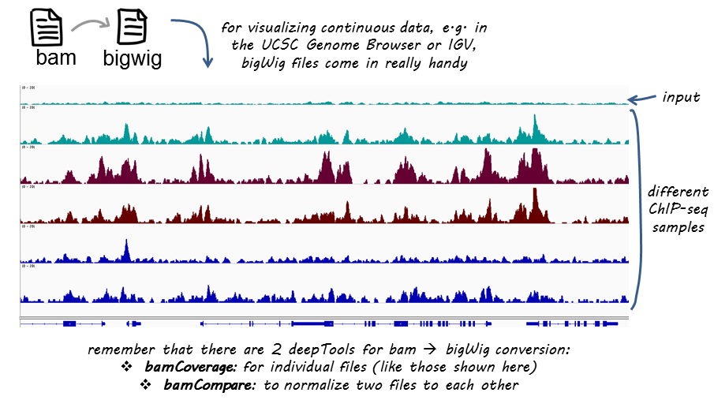

:orphan:

bamCompare
===========

``bamCompare`` can be used to generate a :ref:`bigWig` or :ref:`bedGraph` file based on **two BAM** files that are compared to each other while being simultaneously normalized for sequencing depth.

If you are not familiar with BAM, bedGraph and bigWig formats, you can read up on that in our :doc:`../help_glossary`

The basic algorithm works proceeds in two steps:

1. Per-sample scaling / depth Normalization:

   - If scaling is used (via the read counts method), appropriate scaling
     factors are determined to account for sequencing depth differences.
   - Optionally scaling can be turned off and individual samples normalized using the
     RPKM, BPM or CPM methods (or no normalization at all)

2. A per-bin calculation is performed after accounting for scaling:

   - The genome is transversed and the log2 ratio/ratio/difference/etc. for each bin of fixed width is computed.

.. argparse::
   :ref: deeptools.bamCompare2.parseArguments
   :prog: bamCompare
   :nodefault:

.. note:: As of deepTools 4.0.0, ``bamCompare`` uses a new Rust-backed core. ``--blackListFileName`` may be gzip-compressed and blacklist filtering is done at base-pair resolution rather than by rejecting whole genomic chunks. The SES scaling method and ``--ignoreDuplicates`` have both been removed; for duplicate removal use ``--samFlagExclude`` against a BAM file with duplicates marked. The previous pure-Python implementation is still available as ``bamCompare_old`` during the transition period, but will be removed in a future release.
