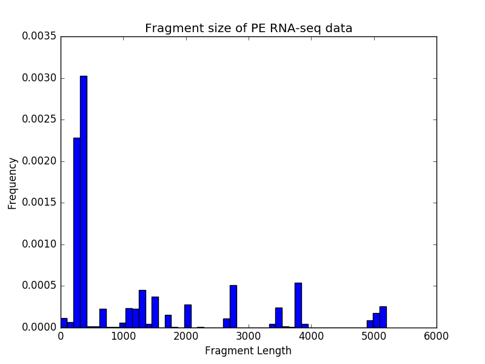

bamPEFragmentSize
=================

.. argparse::
   :ref: deeptools.bamPEFragmentSize.parse_arguments
   :prog: bamPEFragmentSize
   :nodefault:

Example usage
^^^^^^^^^^^^^^

.. code:: bash

    $ deepTools2.0/bin/bamPEFragmentSize \
    -hist fragmentSize.png \
    -T "Fragment size of PE RNA-seq data" \
    --maxFragmentLength 1000 \
    -b testFiles/RNAseq_sample1.bam testFiles/RNAseq_sample2.bam \
    testFiles/RNAseq_sample3.bam testFiles/RNAseq_sample4.bam \
    -samplesLabel sample1 sample2 sample3 sample4

## Output

.. code:: bash

    BAM file : testFiles/RNAseq_sample1.bam

    Sample size: 10815

    Fragment lengths:
    Min.: 0.0
    1st Qu.: 311.0
    Mean: 8960.68987517
    Median: 331.0
    3rd Qu.: 362.0
    Max.: 53574842.0
    Std: 572421.46625

    Read lengths:
    Min.: 20.0
    1st Qu.: 101.0
    Mean: 99.1621821544
    Median: 101.0
    3rd Qu.: 101.0
    Max.: 101.0
    Std: 9.16567362755

    BAM file : testFiles/RNAseq_sample2.bam

    Sample size: 6771

    Fragment lengths:
    Min.: 43.0
    1st Qu.: 148.0
    Mean: 176.465071629
    Median: 164.0
    3rd Qu.: 185.0
    Max.: 500.0
    Std: 53.733877263

    ......(output truncated)

If the ``--table`` option is specified, the summary statistics are additionally printed in a tabular format::

        Frag. Len. Min. Frag. Len. 1st. Qu.     Frag. Len. Mean Frag. Len. Median       Frag. Len. 3rd Qu.      Frag. Len. Max  Frag. Len. Std. Read Len. Min.  Read Len. 1st. Qu.      Read Len. Mean  Read Len. Median        Read Len. 3rd Qu.       Read Len. Max   Read Len. Std.
    bowtie2 test1.bam   241.0   241.5   244.666666667   242.0   246.5   251.0   4.49691252108   251.0   251.0   251.0   251.0   251.0   251.0   0.0

If the ``--outRawFragmentLengths`` option is provided, another history item will be produced, containing the raw data underlying the histogram. It has the following format::

    #bamPEFragmentSize
    Size        Occurrences     Sample
    241 1       bowtie2 test1.bam
    242 1       bowtie2 test1.bam
    251 1       bowtie2 test1.bam

The "Size" is the fragment (or read, for single-end datasets) size and "Occurrences" are the number of times reads/fragments with that length were observed. For easing downstream processing, the sample name is a
lso included on each row.

