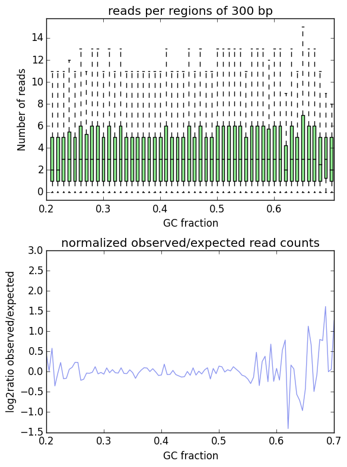
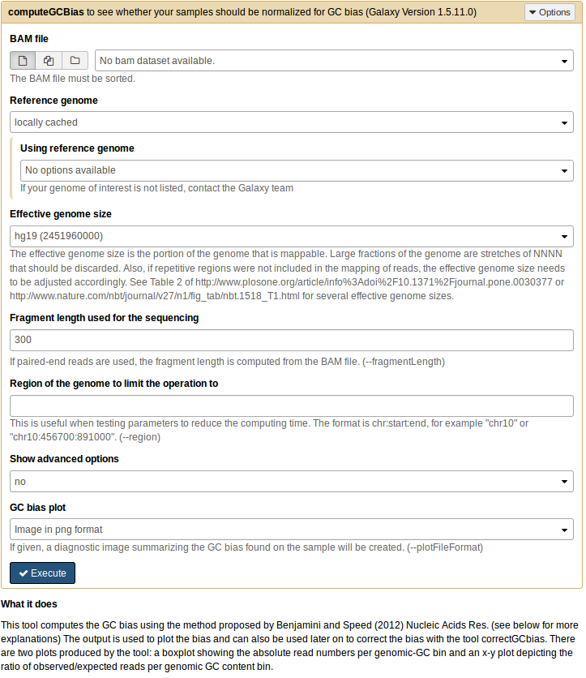

computeGCBias
=============

.. argparse::
   :ref: deeptools.computeGCBias.parse_arguments
   :prog: computeGCBias

   
Usage Example:
~~~~~~~~~~~~~~

::
	
   $ computeGCBias -b H3K27Me3.bam --effectiveGenomeSize 2695000000 
      --genome genome.2bit -l 200 -freq freq_test.txt 
      --region X --biasPlot test.gc.png

Example output plot:
~~~~~~~~~~~~~~~~~~~~

Galaxy
------

`computeGCBias` is also available in `deepTools Galaxy`_:

.. _deepTools Galaxy: http://deeptools2.ie-freiburg.mpg.de/
