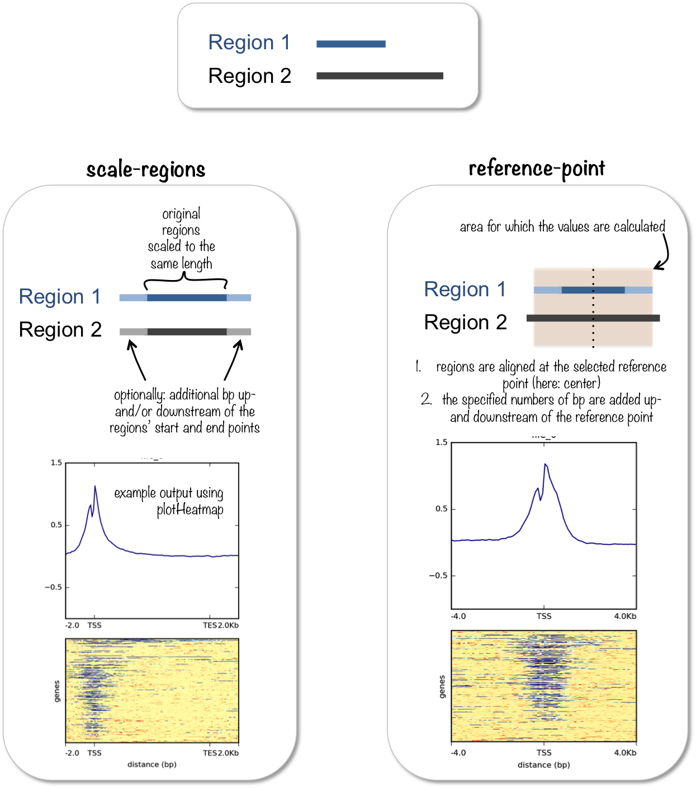
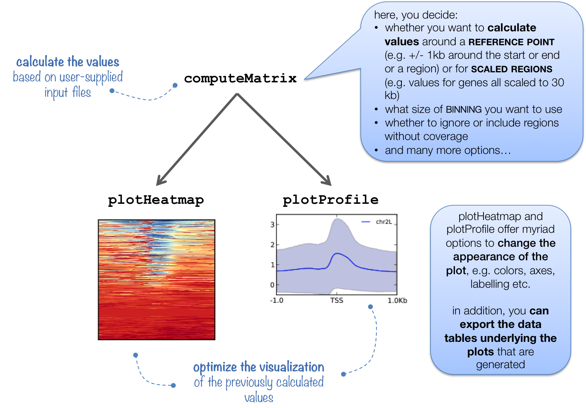

computeMatrix
=============

.. contents:: 
    :local:

.. argparse::
   :ref: deeptools.computeMatrix.parse_arguments
   :prog: computeMatrix
   :nodefault:

Details
^^^^^^^

``computeMatrix`` has two main modes of use:

* for computing the signal distribution **relative to a point** (``reference-point``), e.g., the beginning or end of each genomic region
* for computing the signal **over a set of regions** (``scale-regions``) where all regions are scaled to the same size

``computeMatrix`` is tightly connected to ``plotHeatmap`` and ``plotProfile``: it takes the values of all the signal files and all genomic regions that you would like to plot and computes the corresponding data matrix.

See :doc:`plotHeatmap` and :doc:`plotProfile` for example plots.

In addition to generating the intermediate, gzipped file for ``plotHeatmap`` and ``plotProfile``, ``computeMatrix`` can also be used to simply output the values underlying the heatmap or to **filter and sort BED files** using, for example, the ``--skipZeros`` and the ``--sortUsing`` parameters.

The following tables summarizes the kinds of optional outputs that are available with the three tools.

+-----------------------------------+--------------------------------+-------------------+-----------------+-----------------+
|  **optional output type**         | **command**                    | **computeMatrix** | **plotHeatmap** | **plotProfile** |
+-----------------------------------+--------------------------------+-------------------+-----------------+-----------------+
| values underlying the heatmap     | ``--outFileNameMatrix``        | yes               | yes             | no              |
+-----------------------------------+--------------------------------+-------------------+-----------------+-----------------+
| values underlying the profile     | ``--outFileNameData``          | no                | yes             | yes             |
+-----------------------------------+--------------------------------+-------------------+-----------------+-----------------+
| sorted and/or filtered regions    | ``--outFileSortedRegions``     | yes               | yes             | yes             |
+-----------------------------------+--------------------------------+-------------------+-----------------+-----------------+

.. tip:: ``computeMatrix`` can use multiple threads (``-p`` option), which significantly decreases the time for calculating the values.

.. attention::
   As of version 3.0, computeMatrix produces output with labels present for each sample. Matrices produced with that or later versions can not be used with older versions of ``plotHeatmap`` or any other deepTools program.

.. note::
   ``computeMatrix`` will properly handle strand information if your BED file includes that column (GTF files always include strand). For the ``--metagene`` option to work, you will need either a BED12 (including columns 11 and 12) or a GTF file as input. GFF is NOT the same as GTF format!

Examples
^^^^^^^^

The following examples should give you an idea of some of the most often used settings for ``computeMatrix``. As you can see, ``computeMatrix`` offers myriad tweaks and may turn out to be more useful to you than "just" to calculate heatmap matrices.

Example 1: single input files (reference-point mode)
~~~~~~~~~~~~~~~~~~~~~~~~~~~~~~~~~~~~~~~~~~~~~~~~~~~~~

Here, we start with a single :ref:`bigWig` and a single :ref:`BED` file, i.e., ``computeMatrix`` will:

1. take the beginning of the regions specified in the BED file
2. add the values indicated with ``--beforeRegionStartLength`` (``-b``) and ``--afterRegionStartLength`` (``-a``)
3. split the resulting region up into 50 bp bins (can be changed via (``--binSize``)
4. calculate the mean score based on the scores given in the bigWig file (the kind of score can be changed via ``--averageTypeBins``)
5. write out the values where each row corresponds to one region in the BED file (note that you can, for example, skip regions with zero coverage; sorting is also possible)

.. code:: bash

    $ computeMatrix reference-point \ # choose the mode
           --referencePoint TSS \ # alternatives: TES, center
           -b 3000 -a 10000 \ # define the region you are interested in
           -R testFiles/genes.bed \
           -S testFiles/log2ratio_H3K4Me3_chr19.bw  \
           --skipZeros \
           -o matrix1_H3K4me3_l2r_TSS.gz \ # to be used with plotHeatmap and plotProfile
           --outFileSortedRegions regions1_H3K4me3_l2r_genes.bed
           
Let's have a closer look at the regions' output:

.. code:: bash

    $ wc -l testFiles/genes.bed # original file
       18257 testFiles/genes.bed
    $ wc -l regions1_H3K4me3_l2r_genes.bed # file generated by computeMatrix
       12423 regions1_H3K4me3_l2r_genes.bed

As you can see, the number of regions is drastically reduced. The remaining genes happen to be the ones on chromosome 19 for which there was at least one overlapping read. This makes sense since the bigWig file used above only contained reads for chromosome 19.

.. code:: bash

    # the original file contained genes for chr.19 and chr.X
    $ cut -f 1 testFiles/genes.bed | sort | uniq -c 
        12439 19
        5818 X

    # the regions used for the computation of the matrix for the heatmap are all located on chr.19 due to the --skipZeros setting (see above)
    $ cut -f 1 regions1_H3K4me3_l2r_genes.bed | sort | uniq -c
        1 #genes
        12422 19

Example 2: multiple input files (scale-regions mode)
~~~~~~~~~~~~~~~~~~~~~~~~~~~~~~~~~~~~~~~~~~~~~~~~~~~~

.. code:: bash

    $ deepTools2.0/bin/computeMatrix scale-regions \
      -R genes_chr19_firstHalf.bed genes_chr19_secondHalf.bed \ # separate multiple files with spaces
      -S testFiles/log2ratio_*.bw  \ or use the wild card approach
      -b 3000 -a 3000 \
      --regionBodyLength 5000 \
      --skipZeros -o matrix2_multipleBW_l2r_twoGroups_scaled.gz \
      --outFileNameMatrix matrix2_multipleBW_l2r_twoGroups_scaled.tab \
      --outFileSortedRegions regions2_multipleBW_l2r_twoGroups_genes.bed

Note that the reported regions will have the same coordinates as the ones in the originally supplied file, not the region that was used for the heatmap matrix.

The groups of regions supplied by two individual files will be merged into one:

.. code:: bash

    $ head -n 2 regions2_multipleBW_l2r_twoGroups_genes.bed 
    19	60104	70951	ENST00000592209	0.0	-	genes_chr19_firstHalf
    19	60950	70966	ENST00000606728	0.0	-	genes_chr19_firstHalf
    
    $ tail -n 3 regions2_multipleBW_l2r_twoGroups_genes.bed 
    19	59108549	59110722	ENST00000596427	0.0	-	genes_chr19_secondHalf
    19	59110333	59110802	ENST00000464061	0.0	+	genes_chr19_secondHalf
    #genes_chr19_secondHalf
    
    
.. tip:: **More examples** can be found in our `Gallery <http://deeptools.readthedocs.org/en/latest/content/example_gallery.html#normalized-chip-seq-signals-and-peak-regions>`_.
