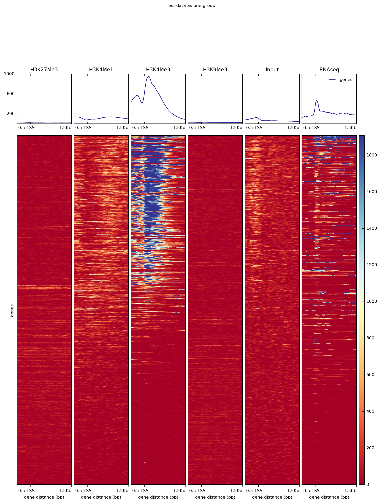
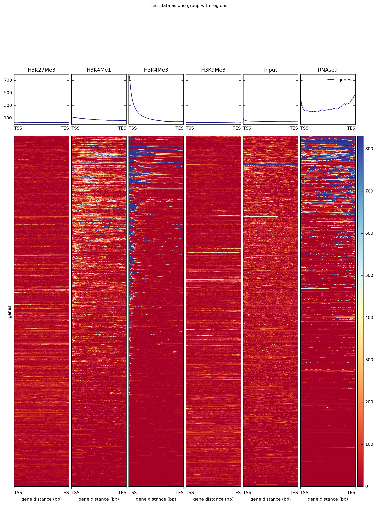
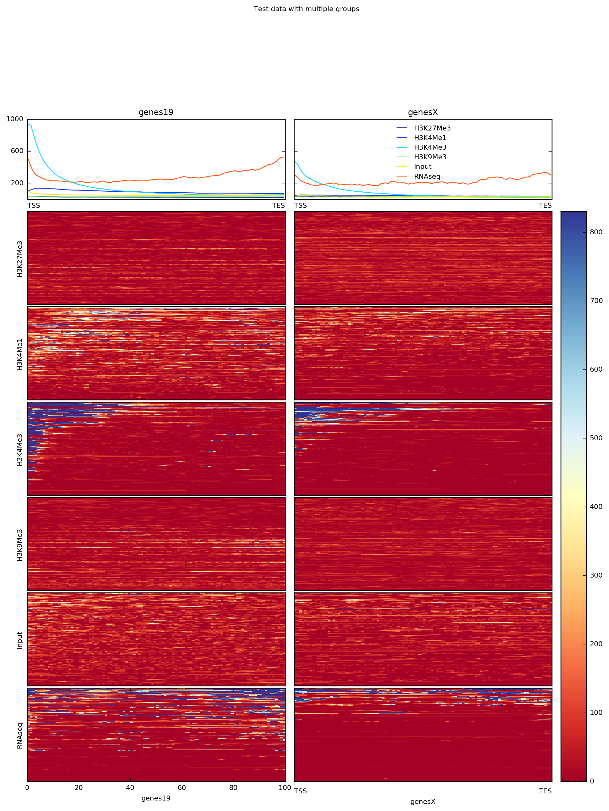

computeMatrix
=============

.. argparse::
   :ref: deeptools.computeMatrix.parse_arguments
   :prog: computeMatrix

Usage Example:
~~~~~~~~~~~~~~

computeMatrix has two main modes of use: for computing the signal distribution relative to a point ("reference-point") and for computing the signal over a region ("scale-regions"). The "reference-point" method is commonly used before plotting the signal around the transcription start site. An example of that with our test ENCODE dataset is depicted below:

.. code:: bash

    $ computeMatrix reference-point \
        -q --skipZeros \
        -S *.bigWig \
        -R genes.bed \
        -out matrix_one_group_TSS.gz
    
    $ plotHeatmap -m matrix_one_group_TSS.gz \
        -out ExampleComputeMatrix1.png \
        --plotTitle "Test data as one group"

Alternatively, for RNAseq and many other ChIP signals it's more informative to plot the signal distribution over exons or other feature types. For such cases, one can use the "scale-regions" method.

.. code:: bash

    $ computeMatrix scale-regions \
        -q --skipZeros \
        -S *.bigWig \
        -R genes.bed \
        -out matrix_one_group.gz
    
    $ plotHeatmap -m matrix_one_group.gz \
        -out ExampleComputeMatrix2.png \
        --plotTitle "Test data as one group with regions"

It's often the case that one has multiple groups of regions to consider per sample. For such cases, you can simply specify multiple BED files (in this case, we've split the BED file by chromosome).

.. code:: bash

    computeMatrix scale-regions \
        -q --skipZeros \
        -S *.bigWig \
        -R genes19.bed genesX.bed \
        -out matrix_two_groups.gz
    
    plotHeatmap -m matrix_two_groups.gz \
        -out ExampleComputeMatrix3.png \
        --perGroup \
        --plotTitle "Test data with multiple groups"

Note that computeMatrix can use multiple threads, which significantly decreases the time required.
