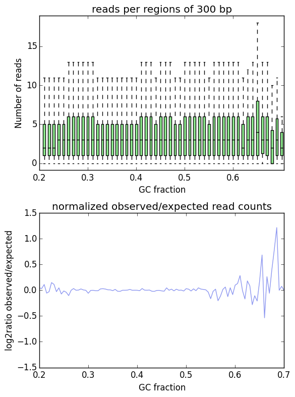

correctGCBias
=============

.. argparse::
   :ref: deeptools.correctGCBias.parse_arguments
   :prog: correctGCBias

   
Usage Example:
~~~~~~~~~~~~~~
::
	
   $ correctGCBias -b H3K27Me3.bam  
      --effectiveGenomeSize 2695000000 
      --genome genome.2bit  
      --GCbiasFrequenciesFile freq_test.txt 
      -o gc_corrected.bam

Example output plot:
~~~~~~~~~~~~~~~~~~~~

The example shows the GC-bias of a corrected BAM file (output from computeGCBias). 

