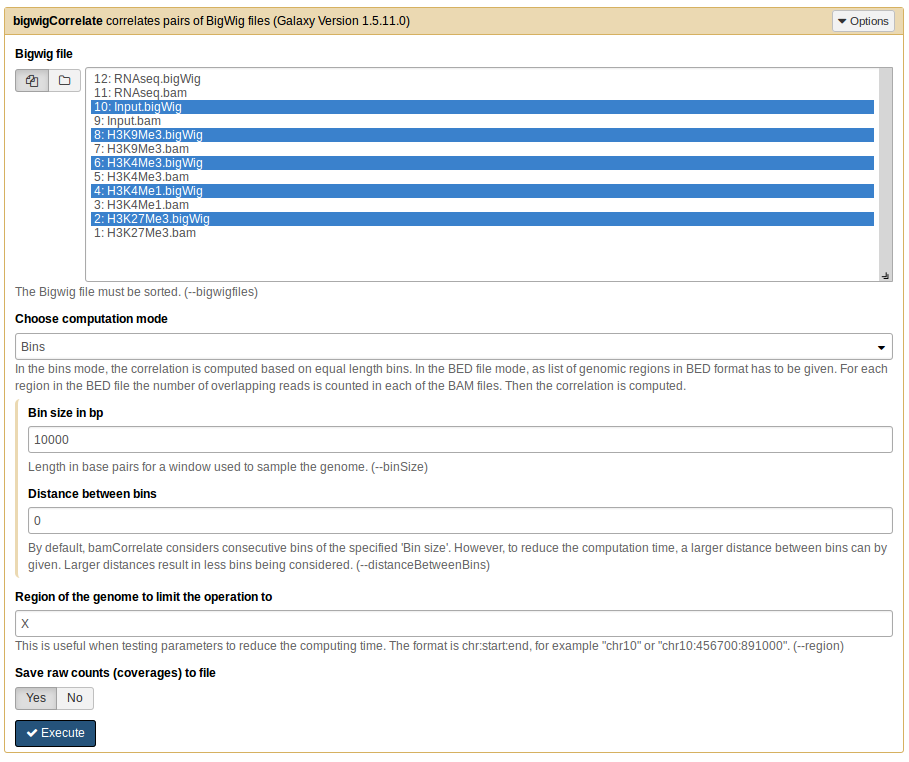

multiBigwigSummary
==================

.. contents:: 
    :local:

.. argparse::
   :ref: deeptools.multiBigwigSummary.parse_arguments
   :prog: multiBigwigSummary
   :nodefault:

Example
~~~~~~~

In the following example, the average values for our test ENCODE
ChIP-Seq datasets are computed for consecutive genome bins (default size: 10kb) by using the `bins` mode.

.. code:: bash

    $ deepTools2.0/bin/multiBigwigSummary bins \
     -b testFiles/H3K4Me1.bigWig testFiles/H3K4Me3.bigWig testFiles/H3K27Me3.bigWig testFiles/Input.bigWig \
     --labels H3K4me1 H3K4me3 H3K27me3 input \
     -out scores_per_bin.npz --outRawCounts scores_per_bin.tab
     
    $ head scores_per_bin.tab 
        #'chr'	'start'	'end'	'H3K4me1'	'H3K4me3'	'H3K27me3'	'input'
        19	0	10000	0.0	0.0	0.0	0.0
        19	10000	20000	0.0	0.0	0.0	0.0
        19	20000	30000	0.0	0.0	0.0	0.0
        19	30000	40000	0.0	0.0	0.0	0.0
        19	40000	50000	0.0	0.0	0.0	0.0
        19	50000	60000	0.0221538461538	0.0	0.00482142857143	0.0522717391304
        19	60000	70000	4.27391282051	1.625	0.634116071429	1.29124347826
        19	70000	80000	13.0891675214	24.65	1.8180625	2.80073695652
        19	80000	90000	1.74591965812	0.29	4.35576785714	0.92987826087

To compute the average values for a set of genes, use the `BED-file` mode.

.. code:: bash

    $ deepTools2.0/bin/multiBigwigSummary BED-file \
     --bwfiles testFiles/*bigWig \
     --BED testFiles/genes.bed \
     --labels H3K27me3 H3K4me1 H3K4me3 HeK9me3 input \
     -out scores_per_transcript.npz --outRawCounts scores_per_transcript.tab
     
     $ head scores_per_transcript.tab
     #'chr'	'start'	'end'	'H3K27me3'	'H3K4me1'	'H3K4me3'	'HeK9me3'	'input'
    19	60104	70951	0.663422099099	4.37103606574	14.9609108509	0.596631607217	1.34274297191
    19	60950	70966	0.714223982699	4.54650763906	16.2336261981	0.62173674295	1.41719308888
    19	62114	70944	0.747578769617	4.84009060023	18.2951302378	0.648723472352	1.51324474371
    19	63820	70951	0.781816722009	5.30500631048	22.5579862572	0.682862029229	1.55490104062
    19	65057	66382	0.528301886792	5.45886792453	0.523018867925	0.555471698113	1.97056603774
    19	65821	66416	0.411764705882	3.0	0.636974789916	0.168067226891	1.67226890756
    19	65821	70945	0.844600775761	4.79176424668	31.1346604215	0.693073728066	1.47911787666
    19	66319	66492	0.774566473988	1.59537572254	0.0	0.0	0.578034682081
    19	66345	71535	0.877430197151	5.49036608863	43.978805395	0.746026011561	1.43545279383

The default output of ``multiBamSummary`` (a compressed ``numpy`` array: `*.npz`) can be visualized using :doc:`plotCorrelation` or :doc:`plotPCA`.

The optional output (``--outRawCounts``) is a simple tab-delimited file that can be used with any other program. The first three columns define the region of the genome for which the reads were summarized.

multiBigwigSummary in Galaxy
~~~~~~~~~~~~~~~~~~~~~~~~~~~~

Below is the screenshot showing how to use multiBigwigSummary on the deeptools galaxy.

