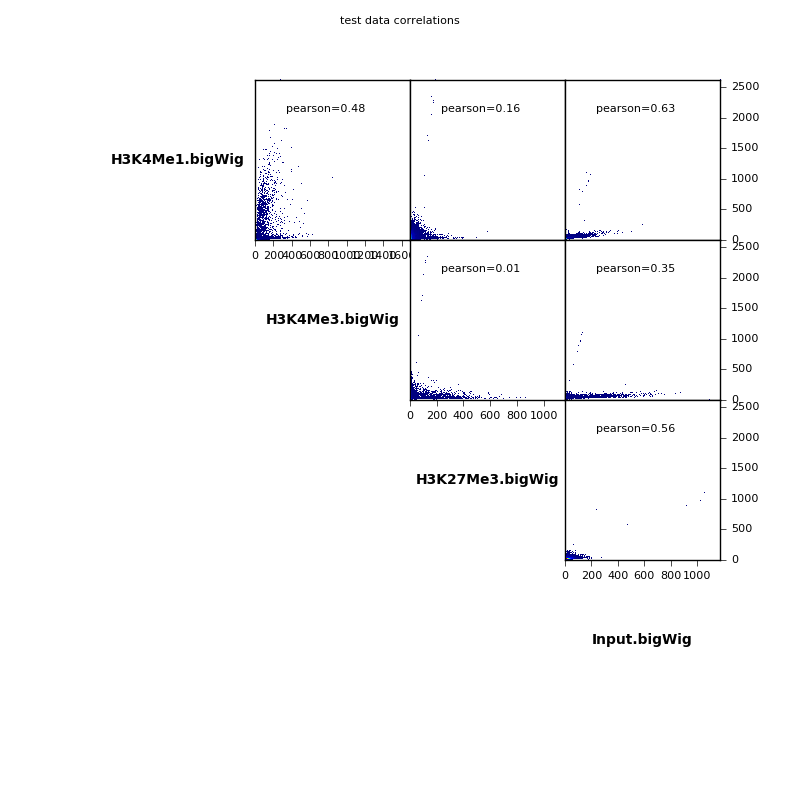
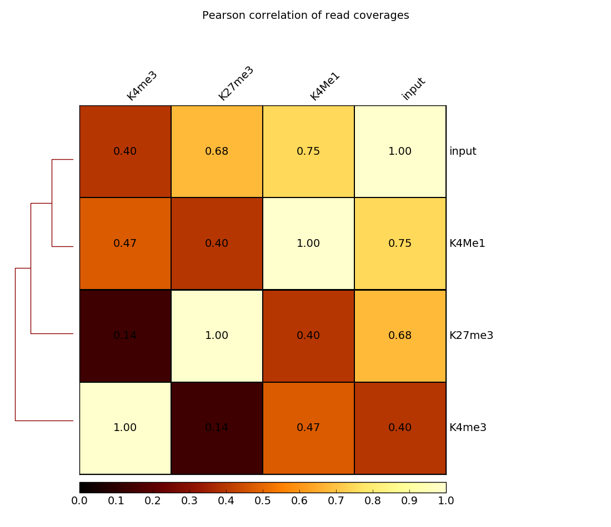

plotCorrelation
===============

.. argparse::
   :ref: deeptools.plotCorrelation.parse_arguments
   :prog: plotCorrelation

Usage Example:
~~~~~~~~~~~~~~

The following example performs a correlation analysis based on the coverage file computed by :doc:`bamCorrelate` for our test ENCODE Chip-Seq datasets.

**Scatterplot**

Here we make a scatterplot and include pearson correlation coefficients.

.. code:: bash

    plotCorrelation -in testDatset-results/histoneMarks_bigwig_corr.npz \
        -o histoneMarks_corr-scatter.png \
        -T "test data correlations" \
        -p scatterplot --removeOutliers -c pearson

**Heatmap**

Here we plot a heatmap, this time of the spearman correlation coefficients.

.. code:: bash

   plotCorrelation -in testDatset-results/histoneMarks_bigwig_corr.npz \
      -o histoneMarks_corr-heatmap.png \
      -T "test data correlations" \
      -p heatmap --removeOutliers -c spearman

plotCorrelation on Galaxy:
~~~~~~~~~~~~~~~~~~~~~~~~~

Below is the screenshot showing how to use plotCorrelation with deepTools Galaxy.

.. image:: ../../images/plotCorrelation_galaxy.png
