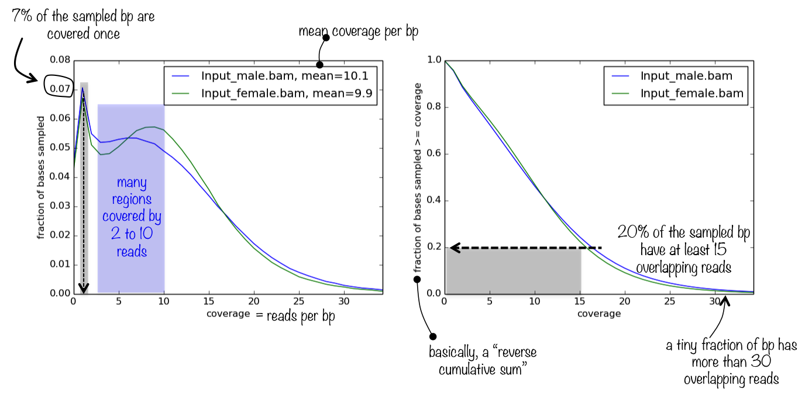
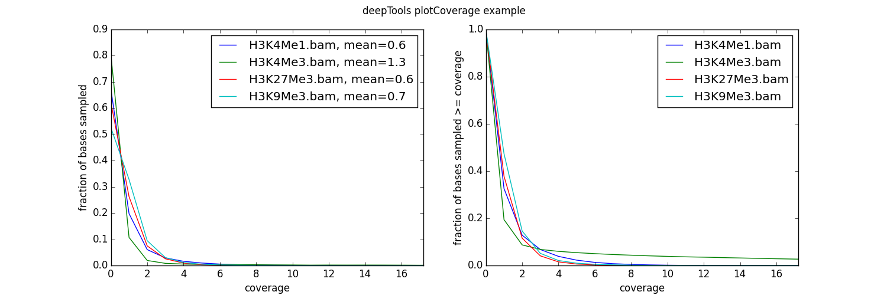

plotCoverage
============

.. contents:: 
    :local:

.. argparse::
   :ref: deeptools.plotCoverage.parse_arguments
   :prog: plotCoverage
   :nodefault:

What the plots tell you
^^^^^^^^^^^^^^^^^^^^^^^^

The tool generates a panel of two plots.
The first one simply represents the frequencies of the found read coverages, which helps you judge how relevant the mean coverage value (printed next to the sample name) is. If the distribution of read coverages is more or less homoskedatic and, ideally, normally distributed (most likely it won't be), then the mean is a very appropriate proxy for sequencing depth. 

The second plot helps you answer the question *what is the fraction of the genome that has a depth of sequencing of 2?*

Usage example
^^^^^^^^^^^^^^

.. code:: bash
	
   $ plotCoverage -b H3K4Me1.bam H3K4Me3.bam H3K27Me3.bam H3K9Me3.bam
      --plotFile example_coverage
      -n 1000000
      --plotTitle "example_coverage" \ 
      --outRawCounts coverage.tab \
      --ignoreDuplicates \
      --minMappingQuality 10 \ 
      --region 19

  # have a look at the optional tabular output: each row represents the number of reads overlapping with a sampled bp
  $ head coverage.tab
      'H3K27me3'	'H3K4me1'	'H3K4me3'	'H3K9me3'	
      0	0	0	0	
      0	0	0	0	
      0	0	0	0	
      0	0	0	0	
      0	0	0	0	
      0	0	0	0	
      0	0	0	0	
      0	0	0	0	
      0	0	0	0	
      
  $ cut -f1 coverage.tab | sort -n | uniq -c
      1 'H3K27me3'
      548190 0 # the vast majority of sampled bp had 0 overlapping reads
      127914 1
      35703 2
      12271 3
      4584 4
      1717 5
       659 6
       251 7
       106 8
        49 9
        16 10
         6 11
         3 12
         2 13
         3 14
         1 15
         1 16
         2 17
         1 19
         1 21
         2 22
         1 23
         1 24
         2 28
         1 35
         1 40 # there was one bp with 40 overlapping reads!
         1 44
      

As you can see, the coverage of our test data sets is very poor -- on average, there is fewer than 1 read per bp! 
