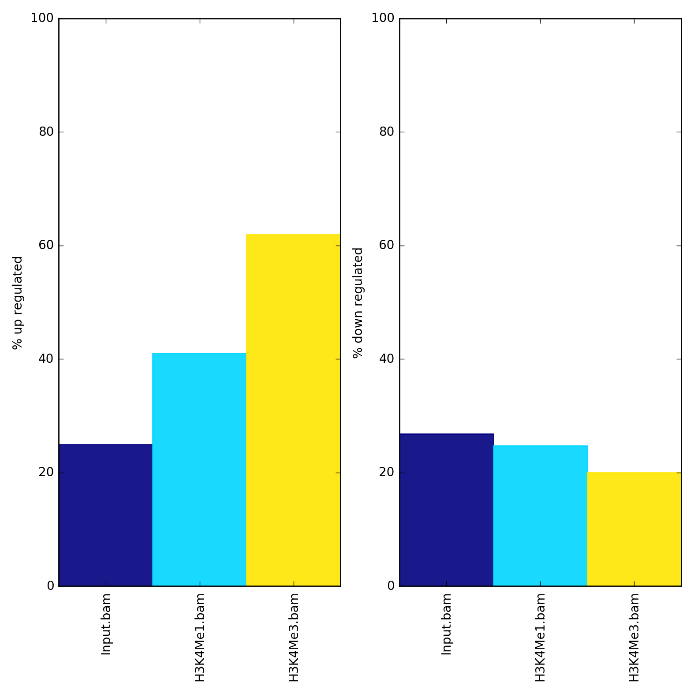

plotEnrichment
==============

.. contents:: 
    :local:

.. argparse::
   :ref: deeptools.plotEnrichment.parse_arguments
   :prog: plotEnrichment
   :nodefault:

Background
^^^^^^^^^^

It's often useful to know what percentage of alignments or fragments overlap one or more groups of regions. For example, "fragment of reads in peaks" or FRiP scores are a common QC metric for ChIPseq data that asks such a question. Another example would be seeing what fraction of RNAseq reads are in exons, or genes, since both of these should be high. ``plotEnrichment`` allows efficiently answering these sorts of questions.

Usage example
^^^^^^^^^^^^^

``plotEnrichment`` needs one or more sorted and indexed BAM files and one or more BED and/or GTF files. For GTF files, feature labels are given according to the 3rd column ('feature'). For BED files, labels are given by the file name, though this can be overriden with the ``--regionLabels`` option.

.. code:: bash

    $ plotEnrichment -b Input.bam H3K4Me1.bam H3K4Me3.bam \
    --BED up.bed down.bed \
    --regionLabels "up regulated" "down regulated" \
    -o enrichment.png

The values underlying the plot can also be output with the ``--outRawCounts`` option and the y-axis can be auto-adjusted with the ``--variableScales`` option.

