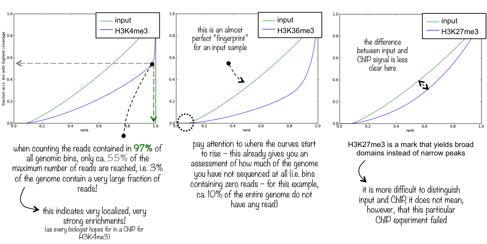

plotFingerprint
===============

This quality control will most likely be of interest for you if you are dealing with ChIP-seq samples as a pressing question in ChIP-seq experiments is "Did my ChIP work?", i.e. did the antibody-treatment enrich sufficiently so that the ChIP signal can be separated from the background signal? (After all, around 90% of all DNA fragments in a ChIP experiment will represent the genomic background).

.. note:: We've termed the plots described here "fingerprints" because we feel that they help us judging individual ChIP-seq files, but the original idea came from `Diaz et al. <https://github.com/songlab/chance/wiki/CHANCE-Manual#checking-the-strength-of-enrichment-in-the-ip>`__

.. contents:: 
   :local:

.. argparse::
   :ref: deeptools.plotFingerprint.parse_arguments
   :prog: plotFingerprint
   :nodefault:

Background
^^^^^^^^^^^

This tool is based on a method developed by `Diaz et al. <http://www.ncbi.nlm.nih.gov/pubmed/22499706>`__.
It determines how well the signal in the ChIP-seq sample can be differentiated from the background distribution of reads in the control sample.
For factors that will enrich well-defined, rather narrow regions (e.g. transcription factors such as p300), the resulting plot can be used to assess the strength of a ChIP, but the broader the enrichments are to be expected, the less clear the plot will be.
Vice versa, if you do not know what kind of signal to expect, the fingerprint plot will give you a straight-forward indication of how careful you will have to be during your downstream analyses to separate biological noise from meaningful signal.

Similar to ``multiBamSummary``, ``plotFingerprint`` randomly samples genome regions (bins) of a specified length and sums the per-base coverage in indexed [BAM][] (or bigWig) files that overlap with those regions.
These values are then sorted according to their rank and the cumulative sum of read counts is plotted. 

What the plots tell you
~~~~~~~~~~~~~~~~~~~~~~~~

An ideal [input][] with perfect uniform distribution of reads along the genome (i.e. without enrichments in open chromatin etc.) and infinite sequencing coverage should generate a straight diagonal line. A very specific and strong ChIP enrichment will be indicated by a prominent and steep rise of the cumulative sum towards the highest rank. This means that a big chunk of reads from the ChIP sample is located in few bins which corresponds to high, narrow enrichments typically seen for transcription factors.

Here you see 3 different fingerprint plots.
We chose these examples to show you how the nature of the ChIP signal (narrow and high vs. wide and not extremely high) is reflected in the "fingerprint" plots. 

Quality control metrics
~~~~~~~~~~~~~~~~~~~~~~~

For a detailed explanation of the QC metrics, please see: :doc:`../feature/plotFingerprint_QC_metrics`.

Usage example
^^^^^^^^^^^^^^^^

The following example generates the fingerprints for the invididual ENCODE histone mark ChIP-seq data sets and their corresponding input (focusing on chromosome 19 and thus adjusting the number of 500 bp bins that are being sampled using ``--numberOfSamples`` to avoid overlapping bins).

.. code:: bash

    $ deepTools2.0/bin/plotFingerprint \
     -b testFiles/*bam \
    --labels H3K27me3 H3K4me1 H3K4me3 H3K9me3 input \
    --minMappingQuality 30 --skipZeros \
    --region 19 --numberOfSamples 50000 \
    -T "Fingerprints of different samples"  \
    --plotFile fingerprints.png \
    --outRawCounts fingerprints.tab

.. image:: ../../images/test_plots/fingerprints.png

The table that you can obtain via ``--outRawCounts`` simply contains the sum of the per-base coverage inside each sampled genome bin. For the plot above, each column is sorted in increasing order and then the cumulative sum is plotted.

.. code:: bash

  $ head fingerprints.tab 
    #plotFingerprint --outRawCounts
    'H3K27me3'	'H3K4me1'	'H3K4me3'	'H3K9me3'	'input'
        1	0	0	0	0
        0	0	0	0	1
        0	1	0	0	0
        12	0	0	3	3
        3	0	1	1	0
        6	4	0	1	0
        1	0	0	0	0
        4	1	1	1	0
        1	0	0	0	0
