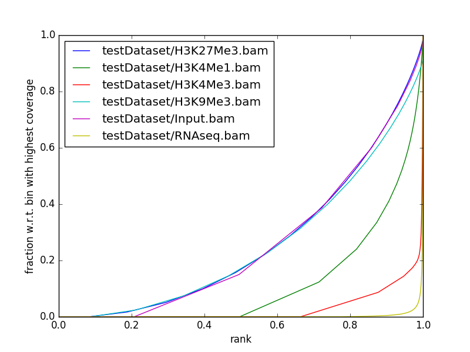
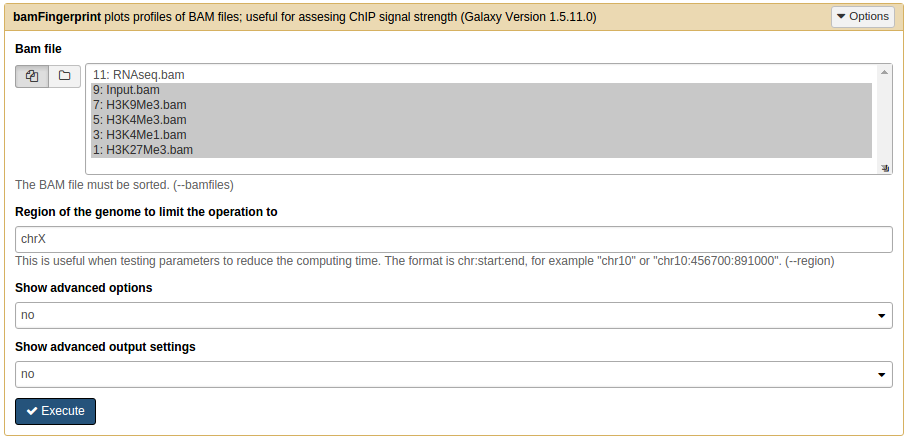

plotFingerprint
===============

.. contents:: 
    :local:

.. argparse::
   :ref: deeptools.plotFingerprint.parse_arguments
   :prog: plotFingerprint

Usage Example:
~~~~~~~~~~~~~~

The following example,  plots the the fingerprint for our test ENCODE
Chip-Seq datasets, for chromosome X. Here we are skipping the regions
with zero reads using the *--skipZeros* option.

.. code:: bash

    plotFingerprint -p 25 -b testDataset/H3K27Me3.bam testDataset/H3K4Me1.bam testDataset/H3K4Me3.bam testDataset/H3K9Me3.bam testDataset/Input.bam testDataset/RNAseq.bam -r X --skipZeros -plot test_plots/bamFP_chrX.png

plotFingerprint on Galaxy:
~~~~~~~~~~~~~~~~~~~~~~~~~~

Below is the screenshot showing how to use plotFingerprint on the deeptools galaxy.

