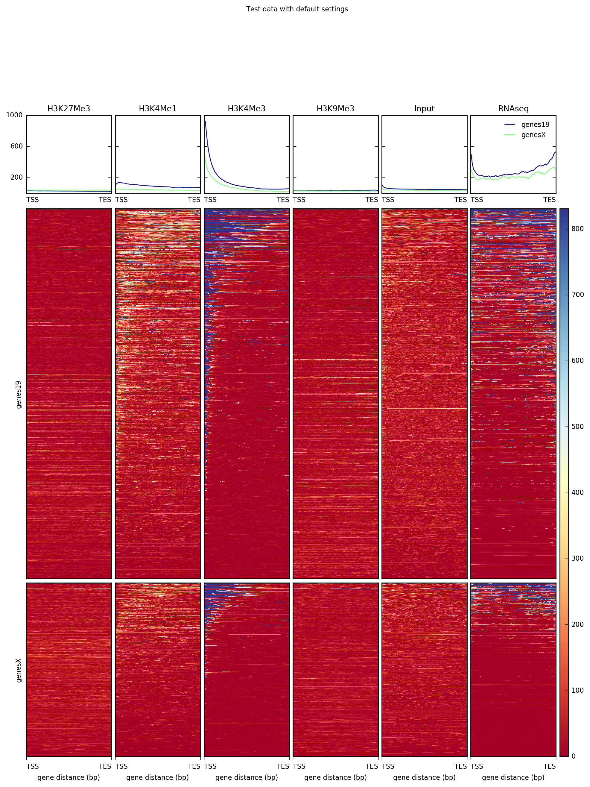
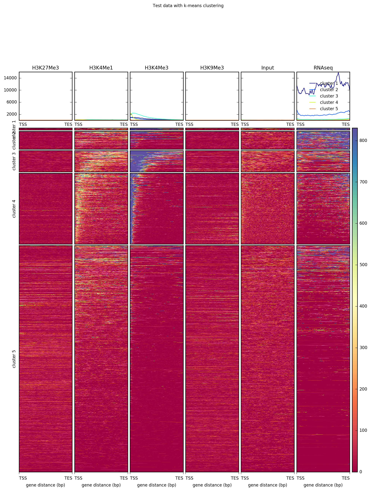
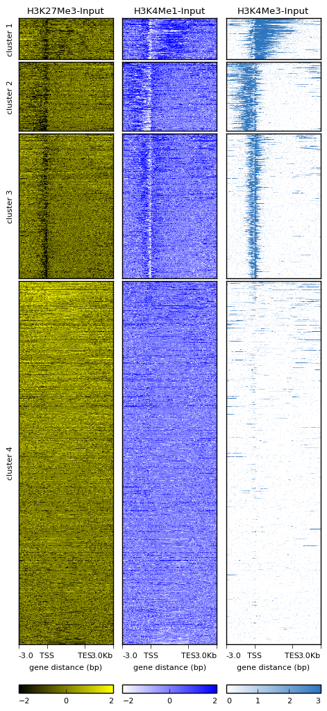
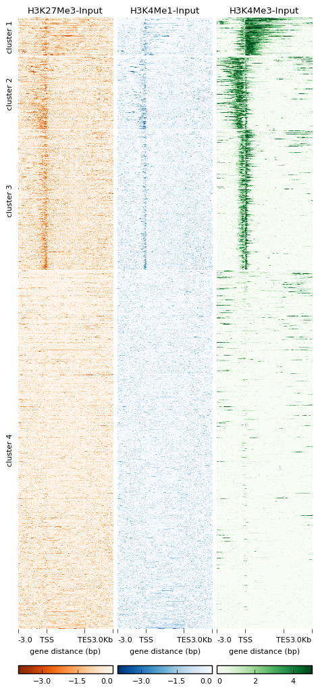

plotHeatmap
===========

.. contents:: 
    :local:

.. argparse::
   :ref: deeptools.plotHeatmap.parse_arguments
   :prog: plotHeatmap
   :nodefault:

Details
^^^^^^^

.. note:: With the release of deepTools 2.3 is is now possible to set the color and scale of each heatmap
    individually. Also, we added the option to remove the boxes around the heatmaps.

``plotHeatmap`` does not change the values that ``computeMatrix`` calculated, it simply translates them into heatmaps and summary plots.
It offers a large variety of parameters to explore various visualizations and customize the resulting image (see the commands above).

In addition, you can retrieve all the data tables underlying the various plots including the regions that were used to generate the final plot. 
The following tables summarizes the kinds of optional outputs that are available with the three tools.

+-----------------------------------+--------------------------------+-------------------+-----------------+-----------------+
|  **optional output type**         | **command**                    | **computeMatrix** | **plotHeatmap** | **plotProfile** |
+-----------------------------------+--------------------------------+-------------------+-----------------+-----------------+
| values underlying the heatmap     | ``--outFileNameMatrix``        | yes               | yes             | no              |
+-----------------------------------+--------------------------------+-------------------+-----------------+-----------------+
| values underlying the profile     | ``--outFileNameData``          | no                | yes             | yes             |
+-----------------------------------+--------------------------------+-------------------+-----------------+-----------------+
| sorted and/or filtered regions    | ``--outFileSortedRegions``     | yes               | yes             | yes             |
+-----------------------------------+--------------------------------+-------------------+-----------------+-----------------+

.. tip:: For more details on the optional output, see the examples for :doc:`computeMatrix`.

Usage examples
^^^^^^^^^^^^^^

The following example creates a heatmap over hg19 transcripts for our test ENCODE datasets. Note that the matrix contains multiple groups of regions (in this case, one for each chromosome used).

.. code:: bash

   # run compute matrix to collect the data needed for plotting
   $ computeMatrix scale-regions -S H3K27Me3-input.bigWig \
                                    H3K4Me1-Input.bigWig  \
                                    H3K4Me3-Input.bigWig \
                                 -R genes19.bed genesX.bed \
                                 --beforeRegionStartLength 3000 \
                                 --regionBodyLength 5000 \
                                 --afterRegionStartLength 3000
                                 --skipZeros -o matrix.mat.gz

   $ plotHeatmap -m matrix.mat.gz \
         -out ExampleHeatmap1.png \

As mentioned above, ``plotHeatmap`` has many options, including the ability to do k-means clustering and change the color map.

.. code:: bash

   $ plotHeatmap -m matrix_two_groups.gz \
        -out ExampleHeatmap2.png \
        --colorMap RdBu \
        --whatToShow 'heatmap and colorbar' \
        --zMin -3 --zMax 3 \
        --kmeans 4

.. tip:: **More examples** can be found in our `Gallery <http://deeptools.readthedocs.org/en/latest/content/example_gallery.html#normalized-chip-seq-signals-and-peak-regions>`_.

Multiple colors for heatmaps
++++++++++++++++++++++++++++

Since deepTools version 2.3 it is now possible to adjust the color and scale of each heatmap. There are two ways
to adjust the colors, one by specifying each of the colormaps (e.g. `--colorMap RdBlGr winter terrain`) and the
other is by giving each of the colors in the heatmap (e.g. `--colorList 'red,blue' 'white,green', 'white, blue, red'`).
For the second example, the number of transitions between the colors is given by the `--colorNumber` which by default
is 256.

The following is an example using the `--colorList` method is used. Also the scale of each heatmap is modified
using `--zMin` and `--zMax`.

.. code:: bash

   $ plotHeatmap -m matrix_two_groups.gz \
        -out ExampleHeatmap3.png \
        --colorList 'black, yellow' 'white,blue' '#ffffff,orange,#000000'
        --whatToShow 'heatmap and colorbar' \
        --zMin -2 -2 0 --zMax 2 2 3
        --kmeans 4
        --dpi 100

No box around heatmaps
++++++++++++++++++++++

In version 2.3 we also added the option to remove the box around heatmaps. In the following example
we combine different colormap colors, different scales and the new  `--boxAroundHeatmaps` option.

.. code:: bash

   $ plotHeatmap -m matrix_two_groups.gz \
        -out ExampleHeatmap4.png \
        --colorMap Oranges_r Blues_r Greens
        --whatToShow 'heatmap and colorbar' \
        --zMin -4 -4 0 --zMax 0 0 5
        --kmeans 4
        --dpi 100
        --boxAroundHeatmaps no

.. tip:: **More examples** can be found in our `Gallery <http://deeptools.readthedocs.org/en/latest/content/example_gallery.html#normalized-chip-seq-signals-and-peak-regions>`_.
