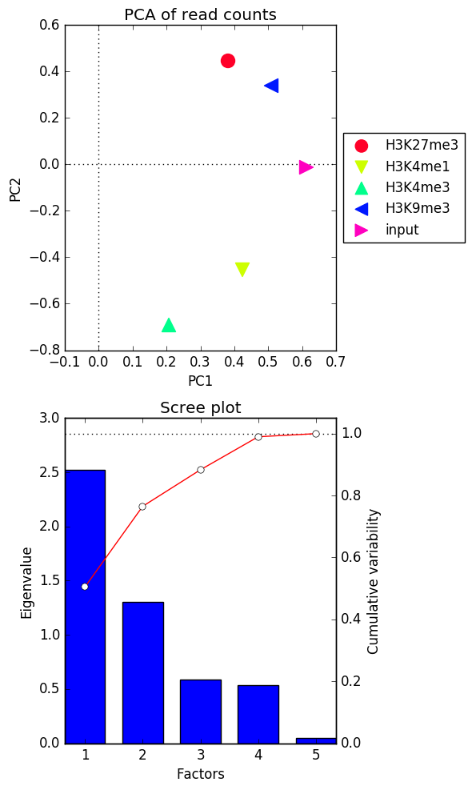

plotPCA
=======

.. contents:: 
    :local:

.. argparse::
   :ref: deeptools.plotPCA.parse_arguments
   :prog: plotPCA
   :nodefault:

Background
^^^^^^^^^^^

Principal component analysis (PCA) can be used, for example, to determine whether **samples display greater variability** between experimental conditions than between replicates of the same treatment. PCA is also useful to identify unexpected patterns, such as those caused by batch effects or outliers.
Principal components represent the directions along which the variation in the data is maximal, so that the information (e.g., read coverage values) from thousands of regions can be represented by just a few dimensions.

.. note:: PCA is not designed to identify unknown groupings or clustering and given an unexpected result, it is up to the researcher to determine the experimental or technical reason underlying the principal components.

Usage example
^^^^^^^^^^^^^^^

``plotPCA`` needs the compressed ``numpy array`` output from either :doc:`multiBamSummary` or :doc:`multiBigwigSummary`

.. code:: bash

    $ deepTools2.0/bin/plotPCA -in readCounts.npz \
    -o PCA_readCounts.png \
    -T "PCA of read counts"

After perfoming the PCA on the values supplied as the input, ``plotPCA`` will sort the principal components according to the amount of variability of the data that they explain. Based on this, you will obtain two plots:

* the eigenvalues of the **top two principal components**
* the **Scree plot** for the top five principal components where the bars represent the amount of variability explained by the individual factors and the red line traces the amount of variability is explained by the individual components in a cumulative manner

