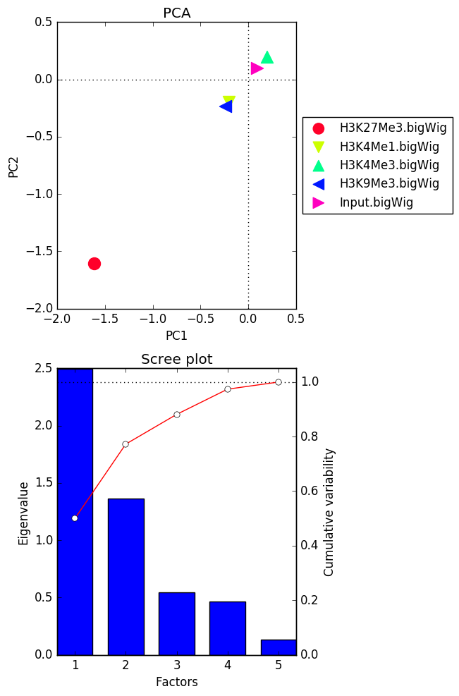

plotPCA
=======

.. argparse::
   :ref: deeptools.plotPCA.parse_arguments
   :prog: plotCorrelation

Usage example
~~~~~~~~~~~~~~

* First do a bigwig correlate :

.. code:: bash
      bigwigCorrelate bins -b testDataset/H3K27Me3.bigWig testDataset/H3K4Me1.bigWig testDataset/H3K4Me3.bigWig \
        testDataset/H3K9Me3.bigWig testDataset/Input.bigWig -p 20 -o testDatset-results/correlation_testBigwigs.matrix

* Then plot PCA of the output :

.. code:: bash
    plotPCA -in testDatset-results/correlation_testBigwigs.matrix -o testData_PCAplot.png

