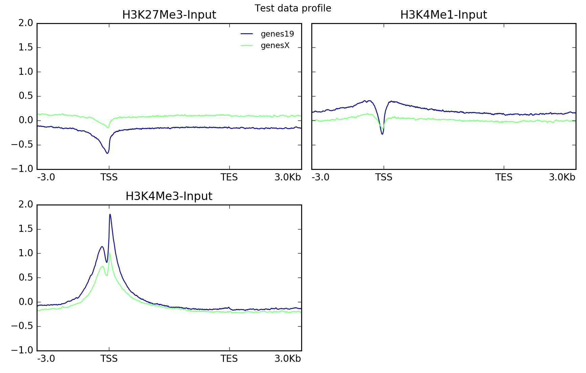
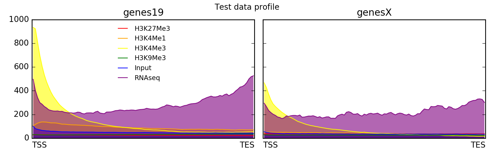
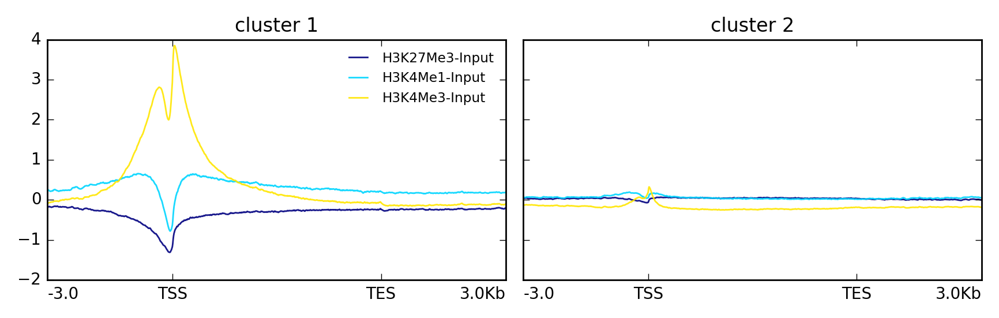
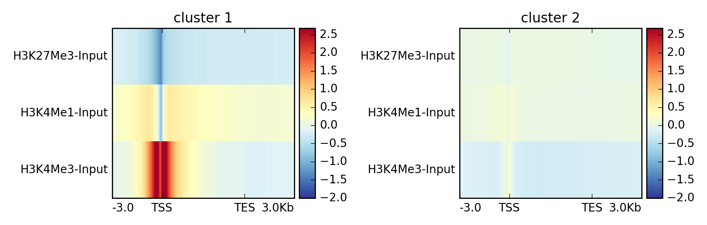

plotProfile
===========

.. argparse::
   :ref: deeptools.plotProfile.parse_arguments
   :prog: plotProfile
   :nodefault:

Details
^^^^^^^^

Like :doc:`plotHeatmap`, ``plotProfile`` simply takes the compressed matrix produced by ``computeMatrix`` and turns it into summary plots.

In addition to a large range of parameters for optimizing the visualization, you can also export the values underlying the profiles as tables.

+-----------------------------------+--------------------------------+-------------------+-----------------+-----------------+
|  **optional output type**         | **command**                    | **computeMatrix** | **plotHeatmap** | **plotProfile** |
+-----------------------------------+--------------------------------+-------------------+-----------------+-----------------+
| values underlying the heatmap     | ``--outFileNameMatrix``        | yes               | yes             | no              |
+-----------------------------------+--------------------------------+-------------------+-----------------+-----------------+
| values underlying the profile     | ``--outFileNameData``          | no                | yes             | yes             |
+-----------------------------------+--------------------------------+-------------------+-----------------+-----------------+
| sorted and/or filtered regions    | ``--outFileSortedRegions``     | yes               | yes             | yes             |
+-----------------------------------+--------------------------------+-------------------+-----------------+-----------------+

.. tip:: For more details on the optional output, see the examples for :doc:`computeMatrix`.

Usage example
^^^^^^^^^^^^^^

The following example plots the signal profile over hg19 transcripts for our test ENCODE datasets. Note that
the matrix contains multiple groups of regions (in this case, one for each present chromosome).

.. code:: bash

   # run compute matrix to collect the data needed for plotting
   $ computeMatrix scale-regions -S H3K27Me3-input.bigWig \
                                    H3K4Me1-Input.bigWig  \
                                    H3K4Me3-Input.bigWig \
                                 -R genes19.bed genesX.bed \
                                 --beforeRegionStartLength 3000 \
                                 --regionBodyLength 5000 \
                                 --afterRegionStartLength 3000
                                 --skipZeros -o matrix.mat.gz

   $ plotProfile -m matrix.mat.gz \
                 -out ExampleProfile1.png \
                 --numPlotsPerRow 2 \
                 --plotTitle "Test data profile"

``plotProfile`` has many options, including the ability to change the type of lines plotted and to plot by group rather than sample.

Here's the same data set, but plotted with a different set of parameters.

.. code:: bash

   $ plotProfile -m matrix.mat.gz \
        -out ExampleProfile2.png \
        --plotType=fill \ # add color between the x axis and the lines
        --perGroup \ # make one image per BED file instead of per bigWig file
        --colors red yellow blue \
        --plotTitle "Test data profile"

In this other example the data is clustered using k-means into two groups.

.. code:: bash

   $ plotProfile -m matrix.mat.gz \
         --perGroup \
         --kmeans 2 \
         -out ExampleProfile3.png

This is the same data but visualized using `--plotType heatmap`

.. code:: bash

   $ plotProfile -m matrix.mat.gz \
         --perGroup \
         --kmeans 2 \
         -plotType heatmap \
         -out ExampleProfile3.png

