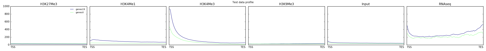

plotProfile
===========

.. argparse::
   :ref: deeptools.plotProfile.parse_arguments
   :prog: computeMatrix

Usage Example:
~~~~~~~~~~~~~~

The following example plots the signal profile over hg19 transcript start sites (TSS) for our test ENCODE datasets. Note that the matrix contains multiple groups of regions (in this case, one for each chromosome used).

.. code:: bash

    plotProfile -m matrix_two_groups.gz \
        -out ExampleProfile1.png \
        --plotTitle "Test data profile"

`plotProfile` has many options, including the ability to change the type of lines plotted and to plot by group rather than sample.

.. code:: bash

    plotProfile -m matrix_two_groups.gz \
        -out ExampleProfile2.png \
        --plotType=fill \
        --perGroup \
        --colors red orange yellow green blue purple \
        --plotTitle "Test data profile"

