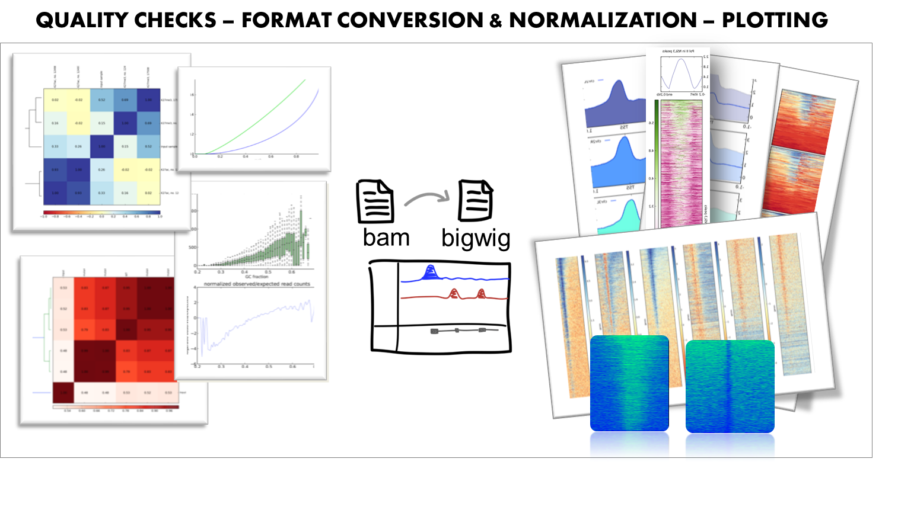

=====================================================
deepTools: *tools for exploring deep sequencing data*
=====================================================

deepTools is a **suite of python tools** particularly developed for the
efficient analysis of high-throughput sequencing data, such as ChIP-seq, RNA-seq or MNase-seq.

There are 3 ways for using deepTools:

* **Galaxy usage** --  our public `deepTools Galaxy server <http://deeptools.ie-freiburg.mpg.de>`_ let's you use the deepTools within the familiar Galaxy framework without the need to master the command line
* **command line usage** -- simply download and install the tools (see :doc:`content/installation` and :doc:`content/list_of_tools`)
* **API** -- make use of your favorite deepTools modules in your own python programs (see :doc:`content/api`)

The flow chart below depicts the different tool modules that are
currently available.

.. image:: images/start_workflow.png

If the file names in the figure mean nothing to you,
please make sure to check our :doc:`content/help_glossary`.

Contents:
---------
.. toctree::
   :maxdepth: 1

   content/installation
   content/list_of_tools
   content/advanced_features
   content/example_usage
   content/changelog
   content/help_galaxy_intro
   content/help_faq
   content/help_faq_galaxy
   content/help_glossary
   content/api
   content/about

While developing deepTools, we continuously strive to create software
that fulfills the following criteria:

-  **efficiently extract reads from BAM files** and perform various
   computations on them
-  **turn BAM files of aligned reads into bigWig files** using different
   normalization strategies
-  make use of **multiple processors** (speed!)
-  generation of **highly customizable images** (change colours, size,
   labels, file format, etc.)
-  enable **customized down-stream analyses**, meaning that every
   data set created can be stored by the user
-  **modular approach** - compatibility, flexibility, scalability (i.e.
   we can add more and more modules and make use of established methods)

.. tip:: For support or questions please post to `Biostars <http://biostars.org>`__. For bug reports and feature requests please open an issue `<on github <http://github.com/deeptools/deeptools>`__.

Please cite deepTools2 as follows:

Ramírez, Fidel, Devon P. Ryan, Björn Grüning, Vivek Bhardwaj, Fabian Kilpert, Andreas S. Richter,
Steffen Heyne, Friederike Dündar, and Thomas Manke.
**"deepTools2: a next generation web server for deep-sequencing data analysis." Nucleic Acids Research (2016): gkw257.**

.. image:: images/logo_mpi-ie.jpg

This tool suite is developed by the `Bioinformatics Facility <http://www1.ie-freiburg.mpg.de/bioinformaticsfac>`_ at the
`Max Planck Institute for Immunobiology and Epigenetics,
Freiburg <http://www1.ie-freiburg.mpg.de/>`_.
